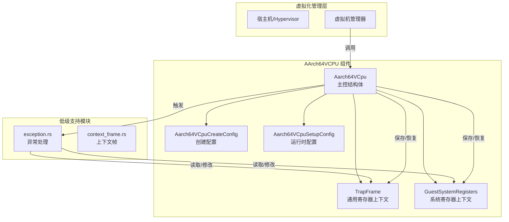
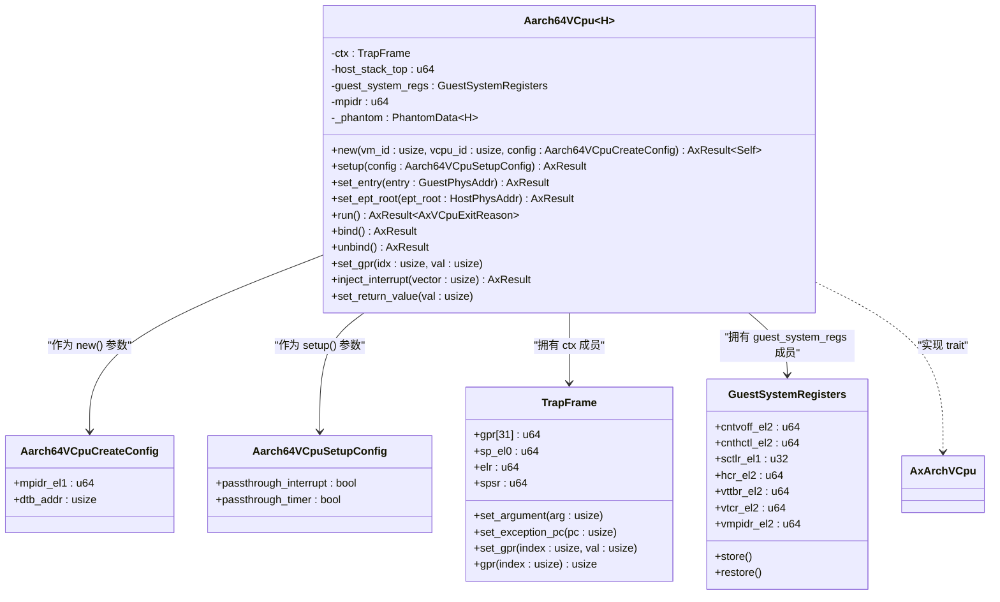
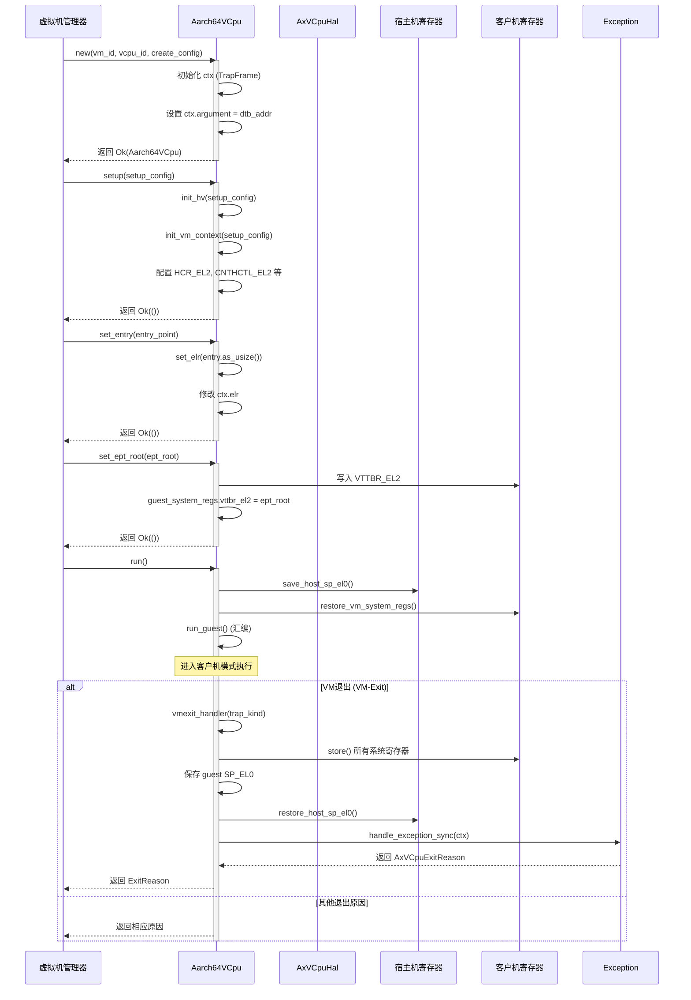
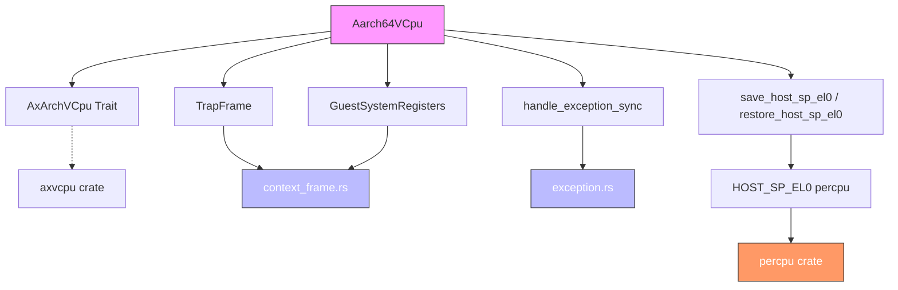

<cite>
**本文档中引用的文件**
- [lib.rs](file://src/lib.rs)
- [vcpu.rs](file://src/vcpu.rs)
- [context_frame.rs](file://src/context_frame.rs)
- [exception.rs](file://src/exception.rs)
</cite>

## 目录
1. [简介](#简介)
2. [核心组件](#核心组件)
3. [架构概述](#架构概述)
4. [详细组件分析](#详细组件分析)
5. [依赖关系分析](#依赖关系分析)
6. [性能考量](#性能考量)
7. [故障排除指南](#故障排除指南)
8. [结论](#结论)

## 简介

`Aarch64VCpu` 结构体是为 AArch64 架构设计的虚拟 CPU（vCPU）管理核心，提供创建、配置和运行虚拟机实例所需的关键功能。该组件作为底层硬件与上层虚拟化管理层之间的桥梁，封装了复杂的系统寄存器操作和上下文切换逻辑。

本 API 文档旨在全面解析 `Aarch64VCpu` 的公共接口，包括其构造函数 `new`、运行控制方法 `run`、入口点设置 `set_entry` 和页表根设置 `set_ept_root`。同时，文档将深入探讨两个关键的配置结构体：`Aarch64VCpuCreateConfig` 用于初始化 vCPU 实例，而 `Aarch64VCpuSetupConfig` 则用于定义其运行时行为。通过结合 `lib.rs` 中的公共导出声明与 `vcpu.rs` 中的具体实现，确保文档内容与代码完全一致。

此外，文档还将说明该组件在虚拟机生命周期管理中的角色，特别是其如何与上下文保存机制和异常处理模块进行交互，以实现安全、高效的虚拟化环境。

## 核心组件

`Aarch64VCpu` 是一个泛型结构体，其类型参数 `H: AxVCpuHal` 代表了一个符合 `AxVCpuHal` trait 的硬件抽象层实现，这使得该 vCPU 可以适配不同的底层平台。

- **`Aarch64VCpuCreateConfig`**: 此配置结构体在创建新的 vCPU 实例时使用。它包含 `mpidr_el1` 字段，用于指定多处理器系统中该 vCPU 的唯一标识符；以及 `dtb_addr` 字段，用于设置设备树二进制文件（DTB）的地址。
- **`Aarch64VCpuSetupConfig`**: 此配置结构体在 vCPU 初始化后进行设置时使用。它包含 `passthrough_interrupt` 和 `passthrough_timer` 两个布尔标志，分别控制是否将物理中断和定时器事件直接透传给客户机操作系统。

主要方法包括：
- `new`: 根据提供的 `Aarch64VCpuCreateConfig` 创建一个新的 vCPU 实例。
- `setup`: 使用 `Aarch64VCpuSetupConfig` 配置 vCPU 的运行时环境。
- `set_entry`: 设置客户机操作系统的启动入口点地址。
- `set_ept_root`: 设置第二阶段转换（EPT）的页表根地址，这是内存虚拟化的关键。
- `run`: 启动或恢复 vCPU 的执行，进入客户机模式。

**Section sources**
- [vcpu.rs](file://src/vcpu.rs#L50-L444)
- [lib.rs](file://src/lib.rs#L12-L13)

## 架构概述

**Diagram sources**
- [vcpu.rs](file://src/vcpu.rs#L50-L444)
- [context_frame.rs](file://src/context_frame.rs#L1-L303)
- [exception.rs](file://src/exception.rs#L1-L363)

## 详细组件分析

### Aarch64VCpu 分析

#### 类图

**Diagram sources**
- [vcpu.rs](file://src/vcpu.rs#L50-L444)
- [context_frame.rs](file://src/context_frame.rs#L1-L303)

#### 方法调用序列图

**Diagram sources**
- [vcpu.rs](file://src/vcpu.rs#L150-L444)
- [exception.rs](file://src/exception.rs#L1-L363)

### 配置与上下文

`Aarch64VCpu` 的状态由两个主要的上下文结构体维护：
- **`TrapFrame`**: 定义于 `context_frame.rs`，负责保存和恢复客户机的通用寄存器（GPRs）、栈指针（SP_EL0）、异常链接寄存器（ELR）和程序状态寄存器（SPSR）。它是用户态和内核态之间上下文切换的基础。
- **`GuestSystemRegisters`**: 同样定义于 `context_frame.rs`，专门用于管理一系列 AArch64 特定的系统寄存器，如 `VTTBR_EL2` (页表基址), `HCR_EL2` (超类型控制), `CNTHCTL_EL2` (计数器控制) 等。`save()` 和 `restore()` 方法通过内联汇编直接与硬件交互。

当调用 `run()` 方法时，会执行一个精心设计的流程：首先保存宿主机的 `SP_EL0`，然后恢复客户机的所有系统寄存器，最后通过 `run_guest` 汇编函数跳转到客户机代码执行。一旦发生 VM-Exit，控制流会返回到 `vmexit_handler`，在此处会保存客户机的系统寄存器并恢复宿主机的 `SP_EL0`，从而完成一次完整的上下文切换。

**Section sources**
- [vcpu.rs](file://src/vcpu.rs#L50-L444)
- [context_frame.rs](file://src/context_frame.rs#L1-L303)

## 依赖关系分析

`Aarch64VCpu` 组件高度依赖于项目内的其他模块来实现其完整功能：

**Diagram sources**
- [vcpu.rs](file://src/vcpu.rs#L1-L444)
- [context_frame.rs](file://src/context_frame.rs#L1-L303)
- [exception.rs](file://src/exception.rs#L1-L363)

- **`context_frame.rs`**: 提供了 `TrapFrame` 和 `GuestSystemRegisters` 两个核心数据结构，`Aarch64VCpu` 直接持有它们的实例来管理客户机的完整 CPU 上下文。
- **`exception.rs`**: 提供了 `handle_exception_sync` 函数，`Aarch64VCpu` 在发生同步异常（如数据中止、系统调用）时会调用此函数进行处理，并根据返回的 `AxVCpuExitReason` 做出相应决策。
- **`pcpu.rs`**: 通过 `percpu` 宏定义了每个 CPU 核心的私有变量 `HOST_SP_EL0`，`Aarch64VCpu` 在 `run` 前后通过 `save_host_sp_el0` 和 `restore_host_sp_el0` 函数来保存和恢复宿主机任务的栈指针，这对于在多核环境下正确调度至关重要。
- **外部依赖**: `Aarch64VCpu` 实现了来自 `axvcpu` crate 的 `AxArchVCpu` trait，并使用了 `aarch64_cpu` crate 来访问特定的系统寄存器。

**Section sources**
- [vcpu.rs](file://src/vcpu.rs#L1-L444)
- [context_frame.rs](file://src/context_frame.rs#L1-L303)
- [exception.rs](file://src/exception.rs#L1-L363)
- [pcpu.rs](file://src/pcpu.rs)

## 性能考量

`Aarch64VCpu` 的设计对性能有直接影响，尤其是在上下文切换的开销方面。

- **上下文切换成本**: 每次 `run()` 和 VM-Exit 都涉及大量的寄存器保存和恢复操作。`GuestSystemRegisters::store()` 和 `restore()` 方法需要读写数十个系统寄存器，这是一个相对昂贵的操作。优化方向可以是惰性上下文切换，即只在必要时才保存/恢复某些不常修改的寄存器。
- **内存虚拟化**: `set_ept_root` 设置的二级页表（EPT）直接影响内存访问性能。启用 4 级 EPT 分页（通过 `"4-level-ept"` feature）可以支持更大的物理地址空间（48位），但可能会增加 TLB 未命中的概率。代码中通过检查 `ID_AA64MMFR0_EL1` 寄存器来确保硬件支持，避免了在不兼容的平台上运行时崩溃。
- **中断与定时器透传**: `Aarch64VCpuSetupConfig` 中的 `passthrough_interrupt` 和 `passthrough_timer` 配置项允许绕过 hypervisor 的模拟，直接将物理事件传递给客户机，这能显著降低延迟，提高 I/O 和定时器的性能。

## 故障排除指南

在使用 `Aarch64VCpu` 时可能遇到以下常见问题：

- **`panic!` 在 `init_vm_context`**: 如果启用了 `"4-level-ept"` feature 但 CPU 不支持足够的物理地址范围（PA < 44位），代码会主动 panic。解决方案是禁用该 feature 或更换支持更宽物理地址的 CPU。
- **`panic!` 在 `handle_exception_sync`**: 当遇到未处理的异常类（EC）时，此函数会 panic 并打印详细的调试信息，包括故障地址（@ipa）、ESR 寄存器值等。这通常表明客户机尝试执行了 hypervisor 无法模拟的指令或访问了无效内存。应检查客户机代码和内存映射配置。
- **`run_guest_panic`**: 如果控制流意外地从 `run_guest` 函数返回，会触发此 panic。这通常是由于底层汇编代码或硬件问题导致的严重错误，表明上下文切换流程被破坏。
- **数据中止 (Data Abort)**: 当 `handle_data_abort` 处理非翻译故障或权限故障时，可能会返回错误或 panic。这提示客户机访问了未映射或受保护的内存区域，需要检查 EPT 配置和客户机的内存分配。

**Section sources**
- [vcpu.rs](file://src/vcpu.rs#L300-L444)
- [exception.rs](file://src/exception.rs#L1-L363)

## 结论

`Aarch64VCpu` 结构体为 AArch64 架构提供了一个强大且灵活的虚拟 CPU 抽象。通过清晰分离创建配置 (`Aarch64VCpuCreateConfig`) 和运行时配置 (`Aarch64VCpuSetupConfig`)，它实现了高内聚、低耦合的设计。其核心方法 `new`, `set_entry`, `set_ept_root`, `setup` 和 `run` 构成了一个完整的 vCPU 生命周期管理 API。

该组件巧妙地利用了 `TrapFrame` 和 `GuestSystemRegisters` 来管理客户机的完整 CPU 状态，并通过与 `exception.rs` 模块的紧密协作来处理各种异常情况。尽管上下文切换存在固有的性能开销，但通过合理的配置（如中断透传）和硬件特性支持（如 4 级 EPT），可以在性能和功能性之间取得良好平衡。对于开发者而言，理解其内部的上下文切换机制和异常处理流程是有效使用和调试此组件的关键。