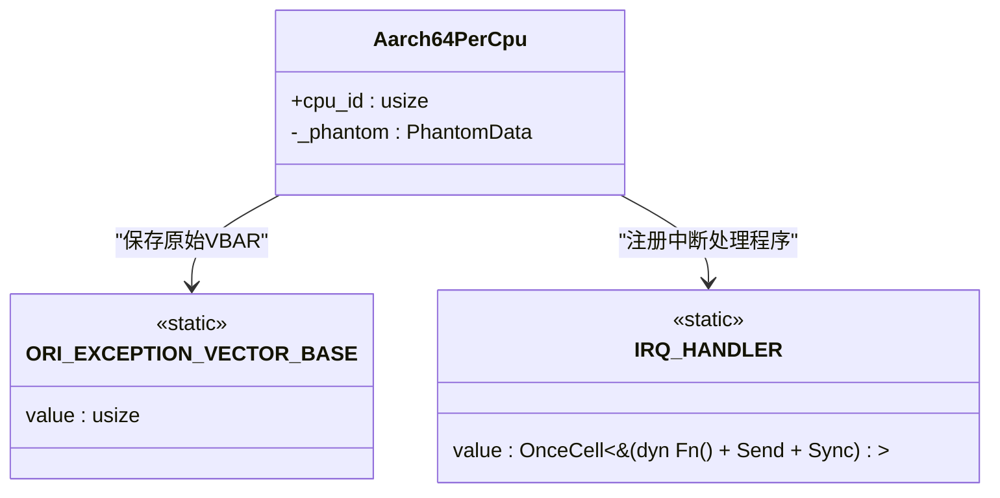
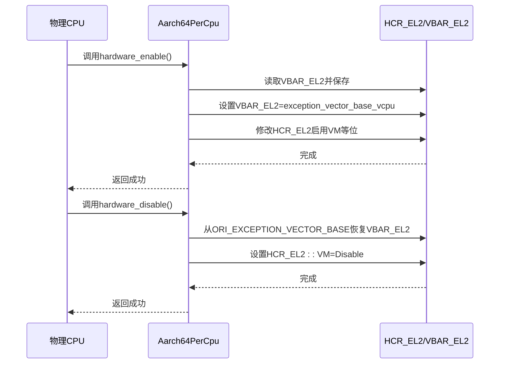
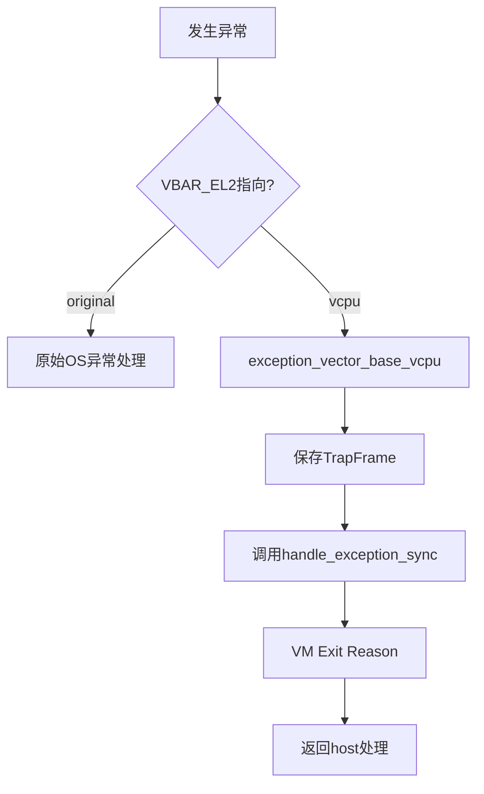

# 每CPU管理API

<cite>
**本文档引用的文件**  
- [pcpu.rs](file://src/pcpu.rs)
- [exception.rs](file://src/exception.rs)
- [exception.S](file://src/exception.S)
- [vcpu.rs](file://src/vcpu.rs)
- [Cargo.toml](file://Cargo.toml)
</cite>

## 目录
1. [简介](#简介)
2. [Aarch64PerCpu结构体设计意图](#aarch64percpu结构体设计意图)
3. [硬件启用与禁用方法详解](#硬件启用与禁用方法详解)
4. [异常向量表切换机制](#异常向量表切换机制)
5. [多核同步与每CPU数据管理](#多核同步与每cpu数据管理)
6. [系统初始化与虚拟化激活流程](#系统初始化与虚拟化激活流程)
7. [典型使用场景：SMP系统中逐个启用物理核虚拟化](#典型使用场景smp系统中逐个启用物理核虚拟化)
8. [依赖库分析：aarch64-cpu在EL2寄存器配置中的作用](#依赖库分析aarch64-cpu在el2寄存器配置中的作用)
9. [总结](#总结)

## 简介
`Aarch64PerCpu` 是 Arceos 虚拟化子系统中用于管理每个物理 CPU 核心状态的核心数据结构。该类型实现了 `AxArchPerCpu` trait，负责在 EL2 特权级别下控制虚拟化的启用和禁用，通过操作 HCR_EL2 和 VBAR_EL2 等关键系统寄存器来实现对虚拟机环境的支持。

本文档详细记录了 `Aarch64PerCpu` 的 `hardware_enable` 和 `hardware_disable` 方法，包括其调用时机、底层寄存器操作、对异常向量表的影响以及多核同步机制。同时解释了该类型作为每 CPU 数据容器的设计意图，并关联到 `pcpu.rs` 中定义的状态管理逻辑，说明其在系统初始化和虚拟化环境激活过程中的关键作用。

**Section sources**
- [pcpu.rs](file://src/pcpu.rs#L1-L91)

## Aarch64PerCpu结构体设计意图
`Aarch64PerCpu<H: AxVCpuHal>` 结构体被设计为每个 CPU 核心的私有数据容器，其主要职责是封装与特定 CPU 相关的虚拟化状态信息。该结构体使用 `#[repr(C)]` 和 `#[repr(align(4096))]` 进行内存布局控制，确保其在 TPIDR_EL2 寄存器中加载时具有正确的对齐方式。

结构体包含两个核心字段：
- `cpu_id`: 标识当前 CPU 的唯一编号。
- `_phantom`: 用于携带泛型参数 `H` 的类型信息，不占用实际存储空间。

通过 `percpu::def_percpu` 宏定义的静态变量 `ORI_EXCEPTION_VECTOR_BASE` 和 `IRQ_HANDLER` 实现了真正的每 CPU 变量存储，避免了使用 `OnceLock` 带来的开销和复杂性。



**Diagram sources**
- [pcpu.rs](file://src/pcpu.rs#L1-L91)

**Section sources**
- [pcpu.rs](file://src/pcpu.rs#L1-L91)

## 硬件启用与禁用方法详解
`Aarch64PerCpu` 实现了 `AxArchPerCpu` trait 提供的 `hardware_enable` 和 `hardware_disable` 方法，这两个方法直接操控底层硬件寄存器以开启或关闭虚拟化支持。

### hardware_enable 方法
`hardware_enable` 方法用于在指定 CPU 上启用虚拟化功能。其执行流程如下：

1. **保存原始异常向量基址**：将当前 `VBAR_EL2` 寄存器的值保存到每 CPU 静态变量 `ORI_EXCEPTION_VECTOR_BASE` 中，以便后续恢复。
2. **设置新的异常向量基址**：将 `VBAR_EL2` 设置为指向本 crate 定义的 `exception_vector_base_vcpu` 符号地址，从而接管所有异常处理。
3. **配置 HCR_EL2 寄存器**：修改 `HCR_EL2` 寄存器，启用以下关键位：
   - `VM`: 启用虚拟化模式
   - `RW`: 设置 EL1 执行 AArch64 指令集
   - `IMO`: 启用虚拟 IRQ
   - `FMO`: 启用虚拟 FIQ
   - `TSC`: 捕获 EL1 的 SMC 指令到 EL2

此方法成功后，该 CPU 即进入可运行虚拟机的状态。

### hardware_disable 方法
`hardware_disable` 方法用于禁用当前 CPU 的虚拟化功能，恢复到非虚拟化状态：

1. **恢复原始异常向量基址**：从 `ORI_EXCEPTION_VECTOR_BASE` 读取之前保存的值，并写回 `VBAR_EL2` 寄存器。
2. **禁用虚拟化模式**：将 `HCR_EL2` 寄存器的 `VM` 位设置为 `Disable`，从而退出虚拟化模式。

这两个方法共同构成了虚拟化开关的核心机制，确保虚拟化环境可以安全地启动和关闭。



**Diagram sources**
- [pcpu.rs](file://src/pcpu.rs#L45-L75)

**Section sources**
- [pcpu.rs](file://src/pcpu.rs#L45-L75)

## 异常向量表切换机制
当 `hardware_enable` 被调用时，最关键的步骤之一是切换异常向量表。这一机制允许 hypervisor 接管所有来自虚拟机的异常和中断。

### 切换流程
1. **保存原始向量表地址**：在修改 `VBAR_EL2` 之前，先通过 `VBAR_EL2.get()` 获取当前异常向量表的基地址，并将其存储在每 CPU 变量 `ORI_EXCEPTION_VECTOR_BASE` 中。
2. **安装新向量表**：将 `VBAR_EL2` 设置为 `exception_vector_base_vcpu` 的地址。这个符号在汇编文件 `exception.S` 中定义，指向一组专为虚拟化设计的异常处理入口。
3. **异常重定向**：此后，任何同步异常（如数据中止、系统调用）、IRQ、FIQ 或 SError 都会跳转到新的向量表进行处理，由 hypervisor 决定如何响应。

### 汇编层实现
`exception_vector_base_vcpu` 在 `src/exception.S` 文件中定义，提供了一组完整的异常处理向量。这些向量通常会保存上下文，然后跳转到 Rust 层的处理函数，如 `handle_exception_sync`。



**Diagram sources**
- [pcpu.rs](file://src/pcpu.rs#L53-L55)
- [exception.S](file://src/exception.S#L105-L106)

**Section sources**
- [pcpu.rs](file://src/pcpu.rs#L50-L60)
- [exception.S](file://src/exception.S#L105-L106)

## 多核同步与每CPU数据管理
在 SMP（对称多处理）系统中，`Aarch64PerCpu` 的设计必须考虑多核并发访问的安全性和独立性。

### 每CPU数据隔离
通过 `percpu::def_percpu` 宏，`ORI_EXCEPTION_VECTOR_BASE` 和 `IRQ_HANDLER` 被声明为真正的每 CPU 变量。这意味着每个 CPU 核心都有自己独立的副本，无需加锁即可安全访问，极大提升了性能。

### 初始化同步
在系统启动过程中，每个 CPU 核心都会独立执行自己的初始化流程。`Aarch64PerCpu::new` 方法会在每个 CPU 上被调用一次，完成以下工作：
- 注册该 CPU 的 IRQ 处理程序
- 初始化 `cpu_id`
- 准备 `hardware_enable` 的执行条件

这种设计保证了多核环境下的初始化是并行且独立的。

### 并发控制注意事项
尽管每 CPU 数据天然避免了竞争，但在某些全局状态变更时仍需注意同步。代码注释中提到 "Todo: take care of `preemption`"，表明在抢占式调度环境下，直接操作每 CPU 变量可能存在风险，未来可能需要引入更严格的同步机制。

**Section sources**
- [pcpu.rs](file://src/pcpu.rs#L25-L35)
- [pcpu.rs](file://src/pcpu.rs#L50-L55)

## 系统初始化与虚拟化激活流程
`Aarch64PerCpu` 在整个系统的虚拟化启动流程中扮演着至关重要的角色。

### 初始化阶段
1. **创建 Per-CPU 实例**：在每个 CPU 启动时，调用 `Aarch64PerCpu::new(cpu_id)` 创建实例。
2. **注册中断处理程序**：通过 `IRQ_HANDLER.set(&|| H::irq_hanlder())` 将底层主机操作系统的 IRQ 处理程序绑定到当前 CPU。
3. **准备虚拟化环境**：此时虚拟化尚未启用，但已准备好所有必要的状态。

### 虚拟化激活阶段
1. **调用 hardware_enable**：当需要运行虚拟机时，调用 `hardware_enable` 方法。
2. **切换异常向量**：如前所述，异常向量表被切换到 `exception_vector_base_vcpu`。
3. **配置 HCR_EL2**：启用虚拟化相关标志位，使能 VM 模式。
4. **开始运行 vCPU**：随后可以调用 `Aarch64VCpu::run` 方法，进入客户机代码执行。

这一流程确保了从裸金属环境到虚拟化环境的平滑过渡。


**Diagram sources**
- [pcpu.rs](file://src/pcpu.rs#L37-L75)
- [vcpu.rs](file://src/vcpu.rs#L100-L150)

**Section sources**
- [pcpu.rs](file://src/pcpu.rs#L37-L75)
- [vcpu.rs](file://src/vcpu.rs#L100-L150)

## 典型使用场景：SMP系统中逐个启用物理核虚拟化
在一个多核 SMP 系统中，`Aarch64PerCpu` 的典型使用场景是逐个启用各个物理核的虚拟化支持。

### 使用流程
1. **主核初始化**：Boot CPU 首先完成基本系统初始化。
2. **启动从核**：通过 PSCI 调用或其他机制唤醒其他 CPU 核心。
3. **从核初始化**：每个从核启动后，独立执行 `Aarch64PerCpu::new` 完成本地初始化。
4. **按需启用虚拟化**：hypervisor 可以根据负载情况，选择性地在某些 CPU 上调用 `hardware_enable` 来运行虚拟机，而其他 CPU 继续运行宿主操作系统任务。

### 优势
- **灵活性**：可以根据工作负载动态分配虚拟化资源。
- **性能隔离**：未启用虚拟化的 CPU 不受 VM-exit 开销影响。
- **热插拔支持**：理论上可以实现 CPU 级别的虚拟化热插拔。

这种模式特别适用于混合工作负载场景，其中部分 CPU 用于运行实时任务，而其他 CPU 用于托管虚拟机。

**Section sources**
- [pcpu.rs](file://src/pcpu.rs#L37-L75)
- [vcpu.rs](file://src/vcpu.rs#L200-L250)

## 依赖库分析：aarch64-cpu在EL2寄存器配置中的作用
`Aarch64PerCpu` 的实现严重依赖 `aarch64-cpu` 库来安全地访问和操作 EL2 系统寄存器。

### 关键依赖
在 `Cargo.toml` 中明确列出了对 `aarch64-cpu = "10.0"` 的依赖，该库提供了对 AArch64 架构特定寄存器的安全抽象。

### 寄存器操作示例
在 `hardware_enable` 方法中，以下操作均依赖 `aarch64-cpu` 库：
- `VBAR_EL2.get()` 和 `VBAR_EL2.set(...)`：获取和设置异常向量基址寄存器。
- `HCR_EL2.modify(...)`：原子性地修改 Hypervisor 控制寄存器，设置多个功能位。

### 安全抽象
该库通过 Rust 类型系统提供了对寄存器字段的安全访问：
- 字段级类型安全（如 `HCR_EL2::VM::Enable`）
- 编译时检查位域合法性
- 避免直接的内联汇编错误

这使得复杂的底层寄存器操作变得既安全又易于理解。

```toml
[dependencies]
aarch64-cpu = "10.0"
tock-registers = "0.9"
```

**Diagram sources**
- [Cargo.toml](file://Cargo.toml#L20-L21)
- [pcpu.rs](file://src/pcpu.rs#L2-L3)

**Section sources**
- [Cargo.toml](file://Cargo.toml#L20-L21)
- [pcpu.rs](file://src/pcpu.rs#L2-L3)

## 总结
`Aarch64PerCpu` 是 Arceos hypervisor 中实现 per-CPU 虚拟化管理的核心组件。它通过精心设计的数据结构和寄存器操作，在每个物理 CPU 上独立地启停虚拟化功能。其 `hardware_enable` 和 `hardware_disable` 方法通过操作 `VBAR_EL2` 和 `HCR_EL2` 等关键寄存器，实现了异常向量表的切换和虚拟化模式的控制。

该设计充分利用了每 CPU 变量机制，确保了多核环境下的高效和安全。结合 `aarch64-cpu` 库提供的安全寄存器访问抽象，整个实现既强大又可靠。在系统初始化和虚拟机调度过程中，`Aarch64PerCpu` 扮演着不可或缺的角色，为构建高性能、可扩展的虚拟化平台奠定了坚实基础。

**Section sources**
- [pcpu.rs](file://src/pcpu.rs#L1-L91)
- [Cargo.toml](file://Cargo.toml#L20-L21)