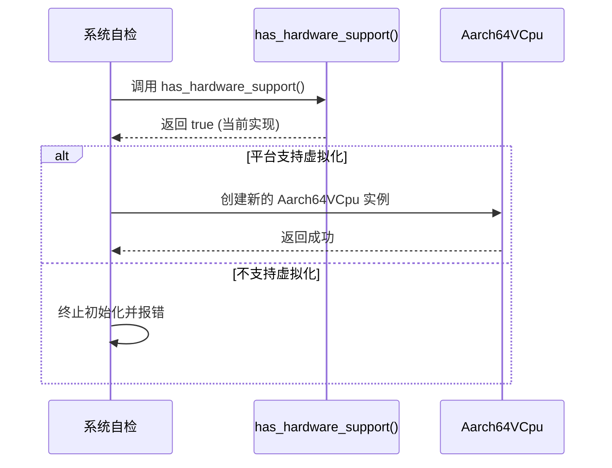
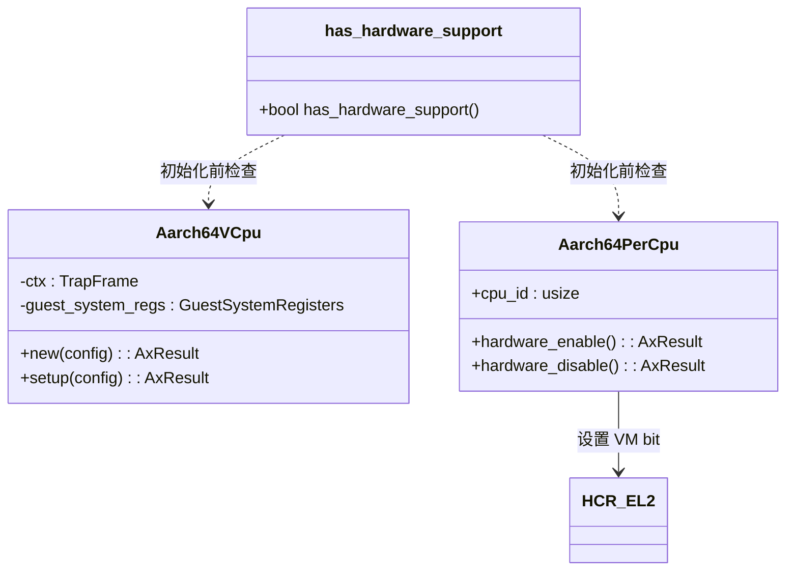

<cite>
**本文档中引用的文件**
- [lib.rs](file://src/lib.rs)
- [vcpu.rs](file://src/vcpu.rs)
- [pcpu.rs](file://src/pcpu.rs)
</cite>

## 目录
1. [简介](#简介)
2. [功能概述](#功能概述)
3. [实现逻辑分析](#实现逻辑分析)
4. [使用场景与调用流程](#使用场景与调用流程)
5. [系统架构关联](#系统架构关联)
6. [未来扩展建议](#未来扩展建议)

## 简介
本文档旨在全面说明 `arm_vcpu` 项目中的全局辅助函数 `has_hardware_support()` 的设计目的、当前实现状态及其在虚拟化环境初始化过程中的关键作用。该函数用于检测底层硬件平台是否支持ARMv8虚拟化扩展，是Hypervisor启动流程中的重要决策点。

## 功能概述
`has_hardware_support()` 函数的核心功能是判断当前运行平台是否具备ARMv8架构的虚拟化扩展能力。根据其文档注释，该函数的设计预期是通过读取特定的系统寄存器（如 `ID_AA64MMFR1_EL1`）来获取CPU特性信息，并据此做出准确判断。

然而，目前的实现是一个占位符，直接返回 `true`，表示默认认为平台支持虚拟化。这种简化实现便于在开发和测试阶段快速推进，但并不反映真实的硬件探测逻辑。

**Section sources**
- [lib.rs](file://src/lib.rs#L22-L30)

## 实现逻辑分析
### 当前实现
当前的 `has_hardware_support()` 函数实现极其简单，仅包含一条 `return true;` 语句。这表明该功能尚未完成真实硬件探测的集成。

### 设计预期
函数内部的注释明确指出了其未来的实现方向：应读取 `ID_AA64MMFR1_EL1` 寄存器。该寄存器是AArch64内存模型特性寄存器1，位于EL1级别，其中包含了关于虚拟化主机扩展（Virtualization Host Extensions）的支持信息。通过解析该寄存器的特定位域，可以确定CPU是否原生支持所需的虚拟化功能。

尽管代码库中其他部分（如 `vcpu.rs` 中的 `init_vm_context` 方法）提到了 `ID_AA64MMFR0_EL1` 寄存器的使用，但 `ID_AA64MMFR1_EL1` 尚未在现有代码中被实际访问，证实了该探测机制仍待实现。

```mermaid
flowchart TD
Start([has_hardware_support() 调用]) --> CheckHardware["检查 ID_AA64MMFR1_EL1 寄存器<br/>(当前未实现)"]
CheckHardware --> |支持虚拟化| ReturnTrue["返回 true"]
CheckHardware --> |不支持虚拟化| ReturnFalse["返回 false"]
Default[默认返回 true] --> ReturnTrue
style Default stroke:#f96,stroke-width:2px
style CheckHardware stroke:#ccc,stroke-dasharray:5 5
style ReturnFalse stroke:#ccc,stroke-dasharray:5 5
```

**Diagram sources**
- [lib.rs](file://src/lib.rs#L22-L30)

**Section sources**
- [lib.rs](file://src/lib.rs#L22-L30)

## 使用场景与调用流程
`has_hardware_support()` 函数预计将在Hypervisor的初始化阶段被调用，作为创建虚拟CPU（VCPU）实例前的安全性检查。

### 决策作用
该函数的返回值将直接影响系统能否继续进行虚拟化环境的搭建：
- **返回 `true`**: Hypervisor将继续执行后续的初始化步骤，包括为虚拟机分配资源、配置VCPU实例等。
- **返回 `false`**: Hypervisor应终止初始化流程并报告错误，避免在不支持的硬件上尝试运行虚拟机，从而防止不可预知的行为或系统崩溃。

### 调用流程示例
虽然具体的调用代码不在当前分析范围内，但可以推断其典型的调用序列如下：



**Diagram sources**
- [lib.rs](file://src/lib.rs#L22-L30)
- [vcpu.rs](file://src/vcpu.rs#L74-L76)

## 系统架构关联
`has_hardware_support()` 函数与系统的其他核心组件紧密相连，共同构成了虚拟化的基础。

### 与 Aarch64VCpu 的关系
`Aarch64VCpu` 结构体是虚拟CPU的具体实现。它的 `new` 和 `setup` 方法负责初始化VCPU的状态。`has_hardware_support()` 可以被视为这些方法能够安全执行的前提条件。

### 与 Aarch64PerCpu 的关系
`Aarch64PerCpu` 结构体管理着每个物理CPU核心的状态。其 `hardware_enable` 方法会设置 `HCR_EL2` 寄存器来启用虚拟化模式（VM bit）。`has_hardware_support()` 的检查应在 `hardware_enable` 被调用之前完成，以确保底层硬件有能力响应这些寄存器操作。



**Diagram sources**
- [lib.rs](file://src/lib.rs#L22-L30)
- [vcpu.rs](file://src/vcpu.rs#L40-L76)
- [pcpu.rs](file://src/pcpu.rs#L40-L90)

**Section sources**
- [vcpu.rs](file://src/vcpu.rs#L40-L76)
- [pcpu.rs](file://src/pcpu.rs#L40-L90)

## 未来扩展建议
为了使 `has_hardware_support()` 函数从一个占位符转变为一个可靠的功能，建议进行以下扩展：

1.  **实现真实硬件探测**:
    *   引入对 `aarch64_cpu::registers::ID_AA64MMFR1_EL1` 的依赖。
    *   在函数体内调用 `ID_AA64MMFR1_EL1.get()` 来读取寄存器值。
    *   解析返回值，检查与“虚拟化主机扩展”相关的位域（具体位域需查阅ARM官方文档）。
    *   根据解析结果返回 `true` 或 `false`。

2.  **增强健壮性**:
    *   添加适当的错误处理和日志记录，以便在探测失败时提供调试信息。
    *   考虑到不同CPU厂商可能存在的差异，确保探测逻辑的兼容性。

3.  **单元测试**:
    *   为该函数编写单元测试，模拟不同的寄存器返回值，以验证其判断逻辑的正确性。

通过以上改进，`has_hardware_support()` 将成为一个坚实可靠的基石，确保Hypervisor只在真正支持的硬件平台上运行。