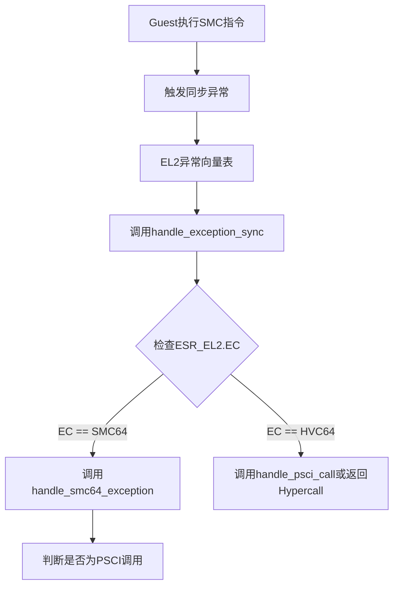
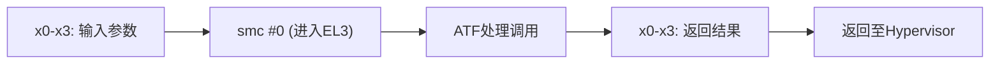
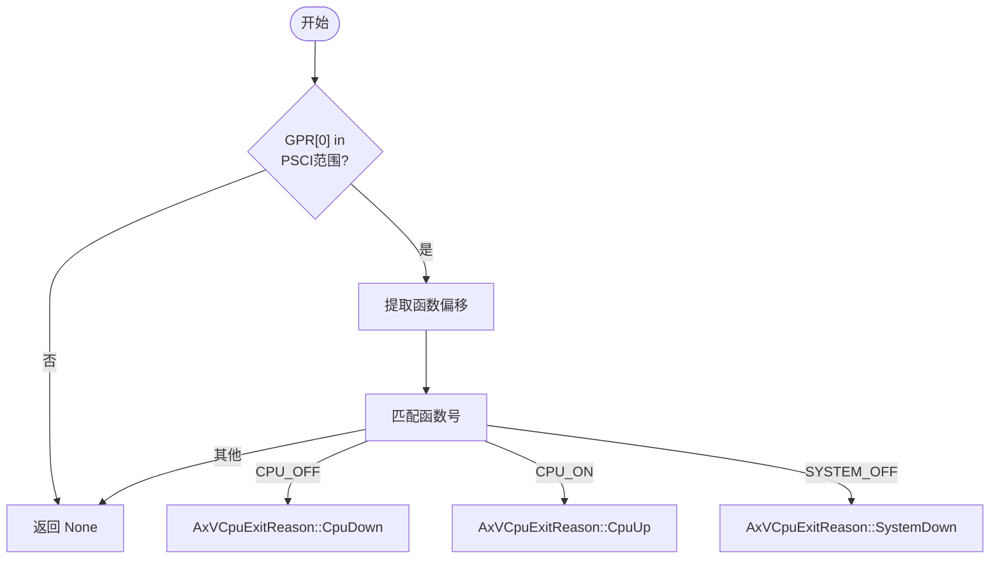

# SMC与PSCI支持

<cite>
**本文档中引用的文件**
- [exception.rs](file://src/exception.rs)
- [smc.rs](file://src/smc.rs)
- [vcpu.rs](file://src/vcpu.rs)
- [context_frame.rs](file://src/context_frame.rs)
- [exception_utils.rs](file://src/exception_utils.rs)
</cite>

## 目录
1. [引言](#引言)
2. [SMC64异常处理流程](#smc64异常处理流程)
3. [smc_call内联汇编机制](#smc_call内联汇编机制)
4. [PSCI电源管理接口识别逻辑](#psci电源管理接口识别逻辑)
5. [handle_psci_call函数分析](#handle_psci_call函数分析)
6. [HVC与SMC触发PSCI的设计考量](#hvc与smc触发psci的设计考量)
7. [Guest触发PSCI调用示例](#guest触发psci调用示例)
8. [总结](#总结)

## 引言
本文详细说明在ARM虚拟化环境中，SMC（Secure Monitor Call）与PSCI（Power State Coordination Interface）的支持机制。重点解析从ESR_EL2寄存器的EC值识别到调用`handle_smc64_exception`函数的完整异常处理流程，深入剖析`smc_call`内联汇编如何实现安全监控调用并转发至ATF（Trusted Firmware），以及PSCI电源管理接口的识别与响应机制。

**Section sources**
- [exception.rs](file://src/exception.rs#L73-L362)
- [vcpu.rs](file://src/vcpu.rs#L9-L443)

## SMC64异常处理流程
当Guest OS执行SMC指令时，会触发同步异常，CPU跳转至EL2处理该异常。异常入口由汇编代码`exception.S`定义，并通过`handle_exception_sync`函数进行分发处理。

`handle_exception_sync`函数首先读取`ESR_EL2`寄存器中的异常类（Exception Class, EC）字段，判断异常类型。若EC值为`SMC64`，则调用`handle_smc64_exception`函数进行处理。此过程确保了对SMC指令的精确捕获与响应。



**Diagram sources**
- [exception.rs](file://src/exception.rs#L73-L109)
- [exception_utils.rs](file://src/exception_utils.rs#L35-L45)

**Section sources**
- [exception.rs](file://src/exception.rs#L73-L109)

## smc_call内联汇编机制
`smc_call`函数位于`smc.rs`文件中，使用Rust的`core::arch::asm!`宏实现内联汇编，直接发出`smc #0`指令以触发安全监控调用。

该函数接收四个输入参数（x0-x3），并通过`inout`约束将这些寄存器的值传递给ATF。调用完成后，ATF的返回值同样通过x0-x3寄存器传回，并作为元组`(u64, u64, u64, u64)`返回给调用者。`options(nomem, nostack)`确保编译器不会因该内联汇编而插入不必要的内存屏障或栈操作。



**Diagram sources**
- [smc.rs](file://src/smc.rs#L9-L26)

**Section sources**
- [smc.rs](file://src/smc.rs#L9-L26)

## PSCI电源管理接口识别逻辑
PSCI调用可通过HVC或SMC指令触发。系统通过检查通用寄存器GPR[0]中的函数号来识别PSCI调用。根据ARM SMC Calling Convention，PSCI函数号有特定的范围：
- 32位调用约定：`0x8400_0000..=0x8400_001F`
- 64位调用约定：`0xC400_0000..=0xC400_001F`

`handle_psci_call`函数首先检查GPR[0]是否落在上述范围内。若是，则进一步提取函数偏移量，用于判断具体的操作类型（如CPU_ON、SYSTEM_OFF等）。

**Section sources**
- [exception.rs](file://src/exception.rs#L225-L258)

## handle_psci_call函数分析
`handle_psci_call`函数根据GPR[0]的函数号映射到相应的`AxVCpuExitReason`：

- **PSCI_FN_CPU_OFF**: 返回 `AxVCpuExitReason::CpuDown`，表示请求关闭当前CPU。
- **PSCI_FN_CPU_ON**: 返回 `AxVCpuExitReason::CpuUp`，包含目标CPU ID、入口点地址和参数。
- **PSCI_FN_SYSTEM_OFF**: 返回 `AxVCpuExitReason::SystemDown`，表示请求关机。
- 其他PSCI调用（如版本查询）则返回`None`，表示由ATF直接处理。

该函数被`handle_exception_sync`（针对HVC64）和`handle_smc64_exception`（针对SMC64）共同调用，实现了统一的PSCI处理入口。



**Diagram sources**
- [exception.rs](file://src/exception.rs#L225-L264)

**Section sources**
- [exception.rs](file://src/exception.rs#L225-L264)

## HVC与SMC触发PSCI的设计考量
允许PSCI调用通过HVC或SMC触发的设计具有以下优势：

1. **兼容性**: 不同操作系统可能偏好不同的调用方式（如Linux常用HVC，某些固件用SMC），此设计保证了广泛的兼容性。
2. **灵活性**: Hypervisor可以根据运行环境选择最合适的虚拟化策略。例如，在QEMU上可统一使用HVC简化模拟。
3. **安全性**: SMC指令天然导向EL3（ATF），适合需要最高权限的安全操作；而HVC在EL2即可拦截，便于Hypervisor进行审计或修改。

在本实现中，无论是HVC还是SMC触发的PSCI调用，都优先由Hypervisor处理关键电源管理请求（如CPU上下线），而非透明转发，从而增强了对虚拟机状态的控制力。

**Section sources**
- [exception.rs](file://src/exception.rs#L94-L98)
- [exception.rs](file://src/exception.rs#L265-L275)

## Guest触发PSCI调用示例
Guest OS可通过标准的内联汇编触发PSCI调用。以下是一个请求关闭当前CPU的C语言风格伪代码示例：

```c
void psci_cpu_off() {
    register uint64_t x0 asm("x0") = 0xC4000002; // PSCI_FN_CPU_OFF
    register uint64_t x1 asm("x1") = 0;          // Power state
    asm volatile("hvc #0" : "+r"(x0) : "r"(x1) : "memory");
}
```

或使用SMC：
```c
asm volatile("smc #0" : "+r"(x0) : "r"(x1), "r"(x2), "r"(x3) : "memory");
```

Hypervisor会拦截这些调用，解析出`AxVCpuExitReason::CpuDown`，并据此执行相应的虚拟CPU停用逻辑。

**Section sources**
- [exception.rs](file://src/exception.rs#L225-L264)
- [smc.rs](file://src/smc.rs#L9-L26)

## 总结
本文档系统地阐述了ARM vCPU中SMC与PSCI支持的核心机制。从异常的捕获（ESR_EL2 EC值识别）、处理（`handle_smc64_exception`），到具体的实现细节（`smc_call`内联汇编、`handle_psci_call`逻辑），展示了Hypervisor如何高效、安全地管理Guest OS的电源状态请求。通过统一处理HVC和SMC两种调用方式，系统实现了良好的兼容性与灵活性。