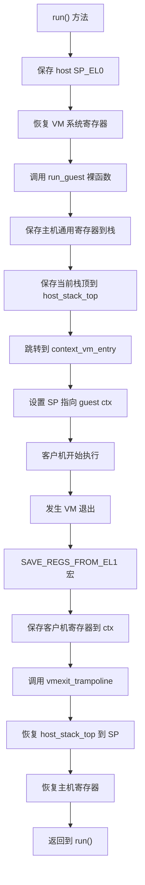

<cite>
**本文档中引用的文件**
- [vcpu.rs](file://src/vcpu.rs)
- [context_frame.rs](file://src/context_frame.rs)
- [exception.rs](file://src/exception.rs)
- [exception.S](file://src/exception.S)
- [lib.rs](file://src/lib.rs)
</cite>

## 目录
1. [VCPU生命周期管理](#vcpu生命周期管理)
2. [执行控制与上下文切换](#执行控制与上下文切换)
3. [虚拟化系统寄存器配置](#虚拟化系统寄存器配置)
4. [VCPU标准使用流程](#vcpu标准使用流程)

## VCPU生命周期管理

本节详细解析Aarch64VCpu结构体的完整生命周期管理机制，涵盖从创建到配置的各个关键阶段。

### 创建(new)与配置(setup)

Aarch64VCpu的生命周期始于`new`方法的调用。该方法接收虚拟机ID、VCPU ID以及一个包含MPIDR_EL1值和设备树Blob地址的`Aarch64VCpuCreateConfig`配置对象。在实例化过程中，系统会初始化一个默认的`TrapFrame`作为来宾陷阱上下文，并将主机栈顶指针`host_stack_top`置零，为后续的上下文切换做准备。

[create_config](file://src/vcpu.rs#L58-L67)
[new_method](file://src/vcpu.rs#L79-L88)

### 入口点设置(set_entry)与页表根设置(set_ept_root)

在VCPU创建后，需要通过`set_entry`方法设置客户机的入口点地址。该方法将提供的客户机物理地址写入异常链接寄存器(ELR)，确保客户机能够从正确的指令位置开始执行。

同时，`set_ept_root`方法负责设置扩展页表(EPT)的根地址。该方法将主机物理地址转换为64位无符号整数，并赋值给`guest_system_regs`中的`vttbr_el2`字段，从而建立客户机内存的虚拟化映射基础。

[set_entry](file://src/vcpu.rs#L90-L95)
[set_ept_root](file://src/vcpu.rs#L97-L102)

**Section sources**
- [vcpu.rs](file://src/vcpu.rs#L58-L102)

## 执行控制与上下文切换

本节深入阐述`run()`方法如何实现从主机到客户机的上下文切换，并分析相关的寄存器状态保存与恢复流程。

### run()方法与裸函数run_guest

`run()`方法是VCPU执行控制的核心。它首先调用`save_host_sp_el0`保存当前主机的SP_EL0寄存器值，然后恢复虚拟机的系统寄存器，最后通过调用裸函数`run_guest`进入客户机执行模式。

`run_guest`是一个使用`naked_asm!`宏定义的裸函数，它直接嵌入汇编代码以精确控制硬件行为。该函数首先使用`save_regs_to_stack!`宏将主机的通用寄存器保存到栈上，然后将当前栈指针(SP)的值存储到`Aarch64VCpu`结构体的`host_stack_top`字段中，为后续的上下文恢复提供关键信息。

[run_method](file://src/vcpu.rs#L104-L115)
[run_guest](file://src/vcpu.rs#L258-L275)

### TrapFrame与VmCpuRegisters：寄存器状态的保存与恢复

`TrapFrame`（即`Aarch64ContextFrame`）是AArch64架构下CPU上下文帧的核心数据结构，它包含了31个通用寄存器(GPRs)、SP_EL0栈指针、ELR异常链接寄存器和SPSR保存程序状态寄存器。当发生VM退出时，异常处理程序`SAVE_REGS_FROM_EL1`宏会将这些寄存器的值保存到`Aarch64VCpu.ctx`中。

`VmCpuRegisters`结构体则封装了更完整的VCPU寄存器状态，包括`trap_context_regs`（即`TrapFrame`）和`vm_system_regs`（即`GuestSystemRegisters`）。`GuestSystemRegisters`结构体通过`store`和`restore`方法，利用内联汇编读写一系列系统寄存器，实现了对客户机系统状态的完整保存与恢复。

[trapframe_struct](file://src/context_frame.rs#L10-L44)
[guest_system_registers](file://src/context_frame.rs#L146-L302)

### 上下文切换流程图解

**Diagram sources**
- [vcpu.rs](file://src/vcpu.rs#L104-L275)
- [exception.S](file://src/exception.S#L1-L140)

**Section sources**
- [vcpu.rs](file://src/vcpu.rs#L104-L275)
- [exception.S](file://src/exception.S#L1-L140)
- [context_frame.rs](file://src/context_frame.rs#L10-L302)

## 虚拟化系统寄存器配置

本节解释`init_vm_context`中关键系统寄存器的虚拟化配置策略，以及多核环境的支持机制。

### HCR_EL2与VTTBR_EL2配置策略

`init_vm_context`方法负责初始化客户机的虚拟化上下文。其中，`HCR_EL2`（Hypervisor Configuration Register）的配置至关重要：
- `VM::Enable`：启用虚拟内存系统。
- `RW::EL1IsAarch64`：指定EL1运行在AArch64状态。
- `FMO::EnableVirtualFIQ`：允许虚拟FIQ中断。
- `TSC::EnableTrapEl1SmcToEl2`：将EL1的SMC指令陷入到EL2。
- `IMO::EnableVirtualIRQ`：根据`passthrough_interrupt`配置决定是否将物理IRQ陷入到EL2，从而启用虚拟IRQ。

`VTTBR_EL2`（Virtualization Translation Table Base Register）则在`set_ept_root`方法中被设置，指向扩展页表的根节点，为第二阶段地址转换提供基础。

[hcr_el2_config](file://src/vcpu.rs#L188-L204)
[vttbr_el2_set](file://src/vcpu.rs#L97-L102)

### 多核环境支持：MPIDR_EL1

为了支持多核环境，每个`Aarch64VCpu`实例都拥有一个唯一的`mpidr`字段，该值来源于`Aarch64VCpuCreateConfig`。在`init_vm_context`中，此值被用于构建`VMPIDR_EL2`寄存器。`VMPIDR_EL2`提供了虚拟化的多处理器ID，当客户机在非安全EL1读取`MPIDR_EL1`时，实际返回的是`VMPIDR_EL2`的值，从而实现了对多核拓扑的虚拟化呈现。

[mpidr_field](file://src/vcpu.rs#L75)
[vmpidr_el2_setup](file://src/vcpu.rs#L238-L243)

**Section sources**
- [vcpu.rs](file://src/vcpu.rs#L158-L243)

## VCPU标准使用流程

本节提供VCPU的标准使用流程示例，并分析`host_stack_top`在上下文切换中的关键作用。

### 标准使用流程

一个典型的VCPU使用流程如下：
1.  **创建**：调用`Aarch64VCpu::new`并传入配置。
2.  **配置**：调用`setup`方法进行虚拟化特性配置。
3.  **设置入口**：调用`set_entry`指定客户机启动地址。
4.  **设置页表**：调用`set_ept_root`建立内存映射。
5.  **执行**：循环调用`run`方法来执行客户机代码，并处理返回的退出原因。

### host_stack_top的关键作用

`host_stack_top`是实现无缝上下文切换的核心。在`run_guest`裸函数中，它被用来记录主机上下文的栈顶位置。当发生VM退出时，`vmexit_trampoline`函数会读取这个值并将其恢复到SP寄存器，从而精确地重建了主机的栈环境。这使得`run()`方法可以像一个普通函数调用一样“返回”，保证了控制流的连贯性。

[host_stack_top_usage](file://src/vcpu.rs#L265-L275)
[vmexit_trampoline](file://src/exception.rs#L305-L325)

**Section sources**
- [vcpu.rs](file://src/vcpu.rs#L79-L115)
- [exception.rs](file://src/exception.rs#L305-L325)