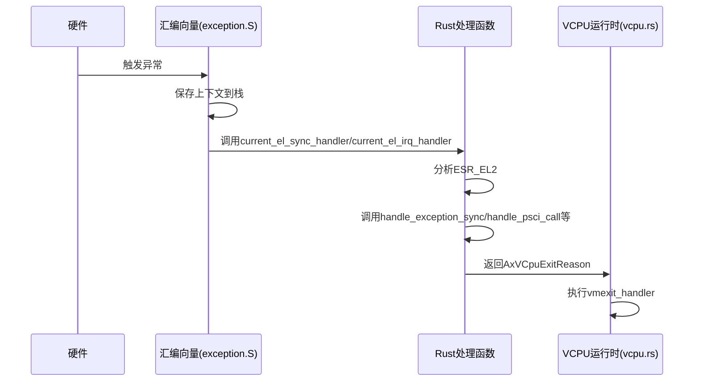
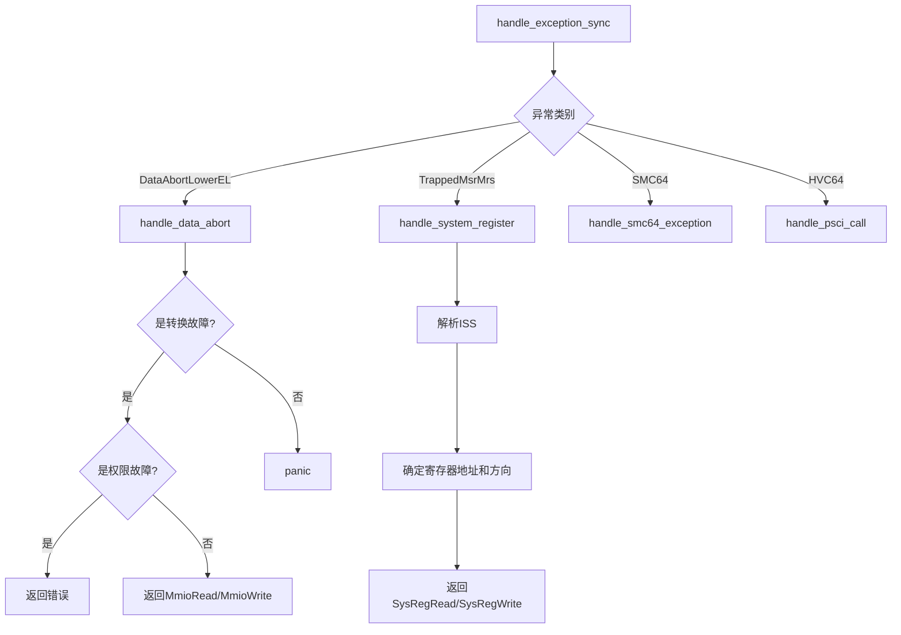

# 功能详解

<cite>
**Referenced Files in This Document**   
- [vcpu.rs](file://src/vcpu.rs)
- [exception.rs](file://src/exception.rs)
- [smc.rs](file://src/smc.rs)
- [pcpu.rs](file://src/pcpu.rs)
- [context_frame.rs](file://src/context_frame.rs)
- [exception_utils.rs](file://src/exception_utils.rs)
</cite>

## 目录
1. [VCPU创建与启动流程](#vcpu创建与启动流程)
2. [异常处理机制](#异常处理机制)
3. [同步异常处理路径](#同步异常处理路径)
4. [异步异常(IRQ)处理](#异步异常irq处理)
5. [SMC安全监控调用转发](#smc安全监控调用转发)
6. [PSCI电源管理指令实现](#psci电源管理指令实现)
7. [每CPU状态管理与多核行为](#每cpu状态管理与多核行为)

## VCPU创建与启动流程

`Aarch64VCpu`结构体是虚拟CPU的核心表示，通过`AxArchVCpu` trait提供标准化接口。VCPU的创建始于`new`方法，该方法接收`Aarch64VCpuCreateConfig`配置参数，初始化包含DTB地址的`TrapFrame`上下文，并设置MPIDR_EL1值以标识多处理器系统中的CPU。

在创建后，`setup`方法被调用以完成VCPU的初始化配置。此过程包括设置HCR_EL2寄存器的关键位，如VM（启用虚拟化）、RW（指定EL1为AArch64模式）和IMO（使能虚拟IRQ）。当启用了中断透传功能时，IMO位不会被设置，从而将物理IRQ陷阱到EL2进行处理。

VCPU启动的关键步骤由`run`方法协调。该方法首先保存主机的SP_EL0寄存器到每CPU区域，然后通过`restore_vm_system_regs`恢复虚拟机的系统控制寄存器。最后，执行`run_guest`裸函数，该函数使用内联汇编保存主机上下文并跳转到`context_vm_entry`汇编标签，从而进入客户机执行模式。

**Section sources**
- [vcpu.rs](file://src/vcpu.rs#L89-L150)

## 异常处理机制

ARM vCPU的异常处理机制建立在硬件向量表和软件处理函数的协同之上。当客户机发生异常时，控制流根据HCR_EL2的配置被重定向到EL2。汇编代码`exception.S`定义了异常向量表，它根据异常类型（同步、IRQ等）跳转到相应的Rust处理函数。

核心的同步异常处理入口是`handle_exception_sync`函数。该函数分析ESR_EL2寄存器中的异常类别(EC)，并分发到不同的处理路径。对于数据中止、系统寄存器访问和SMC调用等可处理的异常，会调用专门的处理函数。如果遇到未处理的异常类别，则会触发panic。

从汇编向量到Rust函数的跳转通过全局汇编宏`core::arch::global_asm!`实现，该宏将`exception.S`文件的内容直接嵌入到二进制中。当异常发生时，硬件自动跳转到向量表中的相应条目，执行必要的上下文保存后，最终调用`current_el_sync_handler`或`current_el_irq_handler`等Rust函数。

**Diagram sources**
- [exception.rs](file://src/exception.rs#L65-L75)
- [vcpu.rs](file://src/vcpu.rs#L270-L350)

**Section sources**
- [exception.rs](file://src/exception.rs#L50-L100)

## 同步异常处理路径

同步异常处理的核心是`handle_exception_sync`函数，它根据ESR_EL2中的异常类别(EC)进行分发。主要处理三种类型的同步异常：数据中止、系统寄存器访问和SMC调用。

对于数据中止异常(`DataAbortLowerEL`)，`handle_data_abort`函数负责处理。它首先通过`exception_fault_addr`工具函数计算出错的客户机物理地址(GPA)。该函数结合FAR_EL2和HPFAR_EL2寄存器的值，能够准确地确定翻译故障的地址。处理逻辑区分读写操作，对于写操作返回`MmioWrite`退出原因，对于读操作返回`MmioRead`，两者都包含了MMIO访问所需的宽度、地址和寄存器信息。

系统寄存器访问异常(`TrappedMsrMrs`)由`handle_system_register`处理。该函数解析ISS字段以确定被访问的系统寄存器地址和方向（读/写）。如果是写操作，返回`SysRegWrite`退出原因；如果是读操作，返回`SysRegRead`，以便hypervisor可以模拟寄存器行为。

**Diagram sources**
- [exception.rs](file://src/exception.rs#L105-L200)

**Section sources**
- [exception.rs](file://src/exception.rs#L105-L200)

## 异步异常(IRQ)处理

异步异常，特别是IRQ的处理，依赖于`pcpu.rs`中定义的每CPU状态。`Aarch64PerCpu`结构体在初始化时，通过`new`方法注册一个IRQ处理程序到`IRQ_HANDLER`每CPU静态变量中。这个处理程序通常包装了底层主机操作系统的中断服务例程(ISR)。

当客户机产生IRQ且HCR_EL2.IMO位被设置时，异常会被陷阱到EL2。汇编向量表会跳转到`current_el_irq_handler`函数。该函数通过`IRQ_HANDLER.current_ref_raw().get()`获取当前CPU上注册的处理程序并立即调用它，从而将中断分发给主机操作系统进行处理。

这种设计允许hypervisor灵活地决定是否拦截中断。如果`passthrough_interrupt`配置为false，在`init_vm_context`中会设置HCR_EL2.IMO位，从而拦截IRQ；否则，IRQ将直接传递给EL1的客户机操作系统。

**Section sources**
- [pcpu.rs](file://src/pcpu.rs#L40-L55)
- [exception.rs](file://src/exception.rs#L300-L315)

## SMC安全监控调用转发

SMC（安全监控调用）异常由`handle_smc64_exception`函数处理。该函数首先检查SMC调用是否为PSCI电源管理调用。如果是，则调用`handle_psci_call`进行处理，而不是将其转发。

对于非PSCI的SMC调用，系统会通过`smc_call`内联汇编函数直接转发给ATF（ARM Trusted Firmware）。`smc_call`函数使用`asm!("smc #0")`指令执行底层的SMC操作，并将x0-x3寄存器作为参数传递。调用完成后，ATF的返回值会被写回这些寄存器，然后`handle_smc64_exception`返回`AxVCpuExitReason::Nothing`，指示VCPU可以继续执行。

这种设计确保了对安全世界调用的透明处理，同时保留了hypervisor对PSCI等特定调用的控制权。

**Section sources**
- [exception.rs](file://src/exception.rs#L250-L270)
- [smc.rs](file://src/smc.rs#L10-L25)

## PSCI电源管理指令实现

PSCI（Power State Coordination Interface）指令的实现集中在`handle_psci_call`函数中。该函数检查x0寄存器中的函数号，判断其是否落在32位或64位的PSCI调用范围内。

支持的关键PSCI指令包括：
- **CPU_ON**: 当函数号匹配时，返回`AxVCpuExitReason::CpuUp`，包含目标CPU ID、入口点和参数，通知hypervisor启动一个新VCPU。
- **CPU_OFF**: 返回`AxVCpuExitReason::CpuDown`，请求关闭当前VCPU。
- **SYSTEM_OFF**: 返回`AxVCpuExitReason::SystemDown`，请求关闭整个虚拟系统。

对于版本查询等其他PSCI调用，函数返回`None`，表示这些请求应被直接转发给ATF处理。这种设计使得hypervisor既能处理关键的电源管理事件，又能将其他标准调用委托给更合适的固件层。

**Section sources**
- [exception.rs](file://src/exception.rs#L205-L245)

## 每CPU状态管理与多核行为

多核环境下的行为由`pcpu.rs`中的`Aarch64PerCpu`结构体和相关每CPU变量管理。`ORI_EXCEPTION_VECTOR_BASE`每CPU变量用于保存原始的异常向量基址，而`IRQ_HANDLER`每CPU变量则存储了每个CPU核心上注册的中断处理程序。

`hardware_enable`方法在激活VCPU时被调用，它会将VBAR_EL2（向量基址寄存器）指向本crate提供的`exception_vector_base_vcpu`，从而安装自定义的异常向量表。同时，它会设置HCR_EL2寄存器以启用虚拟化功能。

`vmexit_trampoline`是一个关键的裸函数，用于在VM退出时切换堆栈。当有活动VCPU运行时，该函数会从`Aarch64VCpu`结构体中恢复之前保存的主机堆栈指针，然后恢复主机的寄存器上下文，最终通过`ret`指令将控制权交还给`Aarch64VCpu.run()`方法，完成从客户机到主机的上下文切换。

**Section sources**
- [pcpu.rs](file://src/pcpu.rs#L1-L90)
- [exception.rs](file://src/exception.rs#L320-L350)