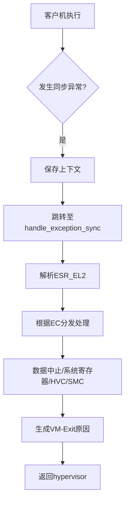
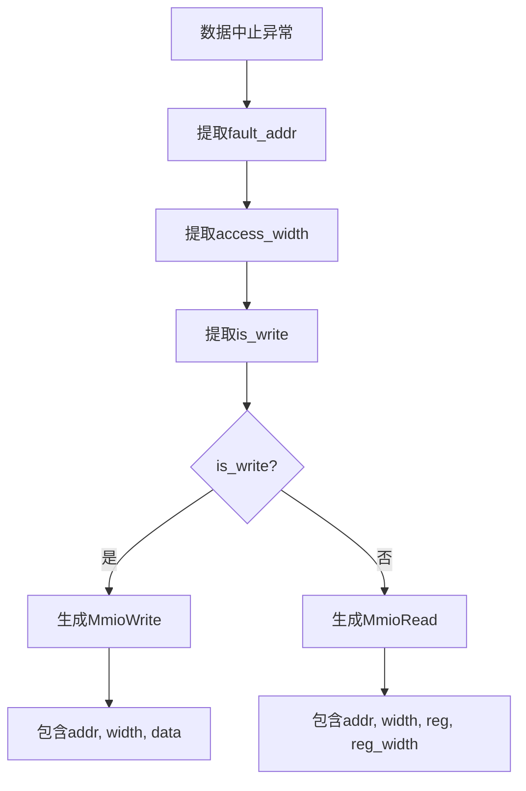
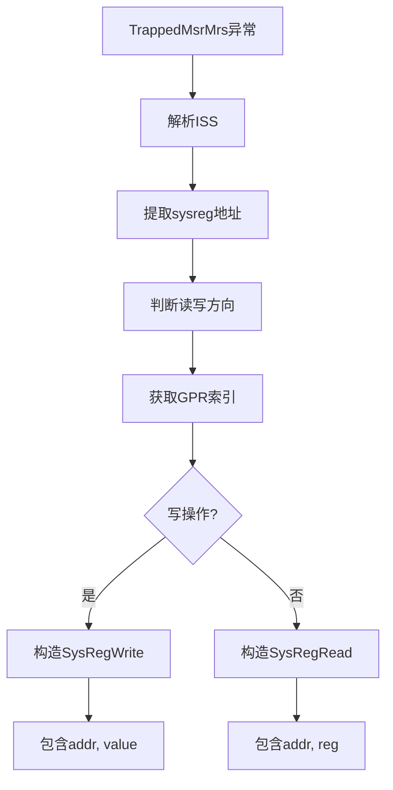
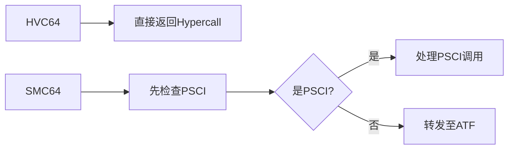
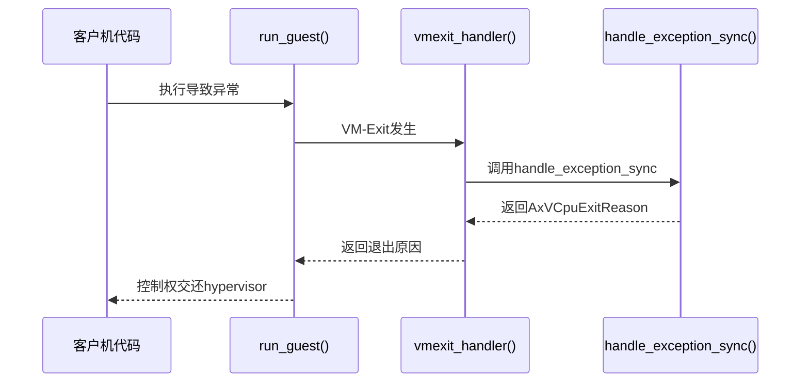
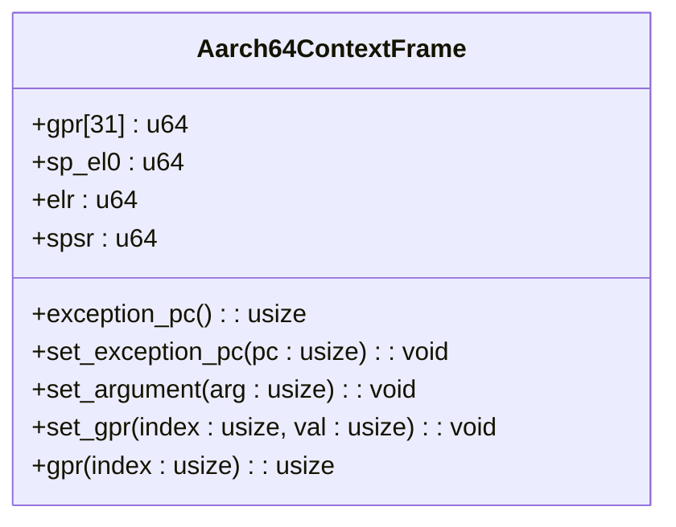
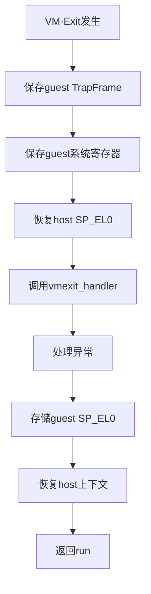

# 同步异常处理

<cite>
**Referenced Files in This Document**   
- [vcpu.rs](file://src/vcpu.rs)
- [exception.rs](file://src/exception.rs)
- [exception_utils.rs](file://src/exception_utils.rs)
- [context_frame.rs](file://src/context_frame.rs)
- [smc.rs](file://src/smc.rs)
</cite>

## 目录
1. [同步异常处理流程概述](#同步异常处理流程概述)
2. [数据中止异常处理机制](#数据中止异常处理机制)
3. [系统寄存器访问异常处理](#系统寄存器访问异常处理)
4. [HVC/SMC调用处理差异](#hvcsmc调用处理差异)
5. [VM-Exit触发与返回机制](#vm-exit触发与返回机制)
6. [TrapFrame状态传递与恢复](#trapframe状态传递与恢复)

## 同步异常处理流程概述

当ARM虚拟CPU在执行过程中发生同步异常时，控制流会从汇编向量跳转至`handle_exception_sync`函数进行处理。该函数通过分析ESR_EL2（Exception Syndrome Register）中的异常类（EC）字段来确定异常类型，并分发到相应的处理程序。

整个处理流程始于`vcpu.rs`中的`run`方法，该方法调用`run_guest`进入客户机执行模式。当发生VM-Exit时，控制流通过`vmexit_trampoline`返回至`vmexit_handler`，进而调用`handle_exception_sync`进行同步异常处理。

**Diagram sources**
- [vcpu.rs](file://src/vcpu.rs#L100-L150)
- [exception.rs](file://src/exception.rs#L50-L80)

**Section sources**
- [vcpu.rs](file://src/vcpu.rs#L90-L170)
- [exception.rs](file://src/exception.rs#L45-L90)

## 数据中止异常处理机制

### 异常识别与字段提取

数据中止异常（DataAbortLowerEL）的识别依赖于ESR_EL2寄存器中的异常类字段。当检测到此类异常时，系统会提取以下关键信息：

- **fault_addr**: 通过FAR_EL2和HPFAR_EL2寄存器组合计算得出的故障地址
- **access_width**: 从ISS字段第22-23位提取的访问宽度（1、2、4或8字节）
- **is_write**: 从ISS字段第6位提取的写操作标志
- **reg**: 从ISS字段第16-20位提取的参与访问的寄存器索引

这些字段的提取由`exception_utils.rs`中的内联函数完成，确保了高效的数据访问。

### MMIO退出原因生成

根据提取的信息，系统生成相应的AxVCpuExitReason::MmioRead/Write退出原因：

对于写操作，生成`AxVCpuExitReason::MmioWrite`，包含地址、宽度和来自指定GPR的数据值；对于读操作，则生成`AxVCpuExitReason::MmioRead`，包含地址、宽度以及目标寄存器信息。

**Diagram sources**
- [exception.rs](file://src/exception.rs#L120-L150)
- [exception_utils.rs](file://src/exception_utils.rs#L200-L250)

**Section sources**
- [exception.rs](file://src/exception.rs#L115-L160)
- [exception_utils.rs](file://src/exception_utils.rs#L180-L270)

## 系统寄存器访问异常处理

### ISS解码逻辑

系统寄存器访问异常（TrappedMsrMrs）的处理核心在于ESR_EL2中ISS字段的解码。ISS字段包含了访问的详细信息：

- **地址解析**: 通过`exception_sysreg_addr`函数从ISS中提取系统寄存器地址
- **方向解析**: 通过`exception_sysreg_direction_write`判断是读还是写操作
- **GPR索引**: 通过`exception_sysreg_gpr`获取参与操作的通用寄存器索引

### SysReg读写构造

基于解码结果，系统构造相应的退出原因：

写操作生成`AxVCpuExitReason::SysRegWrite`，包含寄存器地址和要写入的值；读操作生成`AxVCpuExitReason::SysRegRead`，包含寄存器地址和目标GPR索引。

**Diagram sources**
- [exception.rs](file://src/exception.rs#L155-L175)
- [exception_utils.rs](file://src/exception_utils.rs#L250-L300)

**Section sources**
- [exception.rs](file://src/exception.rs#L150-L180)
- [exception_utils.rs](file://src/exception_utils.rs#L240-L310)

## HVC/SMC调用处理差异

### 调用机制对比

HVC（Hypercall）和SMC（Secure Monitor Call）虽然都用于陷入更高特权级，但在处理上存在显著差异：

HVC调用通常直接返回`AxVCpuExitReason::Hypercall`供hypervisor处理，而SMC调用需要先判断是否为PSCI电源管理调用。

### PSCI调用识别与转发

PSCI（Power State Coordination Interface）调用的识别基于功能号范围：
- 32位约定：0x8400_0000–0x8400_001F
- 64位约定：0xC400_0000–0xC400_001F

特定功能号对应不同操作：
- `CPU_ON`: 激活指定CPU
- `CPU_OFF`: 关闭当前CPU  
- `SYSTEM_OFF`: 关闭整个系统

非PSCI的SMC调用则通过`smc_call`函数直接转发至ATF（Arm Trusted Firmware）。

**Diagram sources**
- [exception.rs](file://src/exception.rs#L180-L240)
- [smc.rs](file://src/smc.rs#L1-L20)

**Section sources**
- [exception.rs](file://src/exception.rs#L175-L250)
- [smc.rs](file://src/smc.rs#L1-L27)

## VM-Exit触发与返回机制

### vcpu.rs中的调用链

同步异常触发VM-Exit的完整调用链如下：

`run_guest`使用naked汇编保存主机上下文后进入客户机执行，异常发生后通过`vmexit_trampoline`恢复主机栈并返回至`vmexit_handler`。

### 上下文切换流程

上下文切换涉及两个关键步骤：
1. **保存**: 在`run_guest`中保存主机callee-saved寄存器
2. **恢复**: 在`vmexit_trampoline`中恢复主机上下文

这一机制确保了hypervisor能够安全地接管控制权。

**Diagram sources**
- [vcpu.rs](file://src/vcpu.rs#L170-L250)
- [exception.rs](file://src/exception.rs#L250-L300)

**Section sources**
- [vcpu.rs](file://src/vcpu.rs#L165-L260)
- [exception.rs](file://src/exception.rs#L245-L310)

## TrapFrame状态传递与恢复

### TrapFrame结构分析

`TrapFrame`（即`Aarch64ContextFrame`）是异常处理的核心数据结构，包含：

该结构保存了通用寄存器、SP_EL0、ELR和SPSR等关键状态。

### 寄存器恢复过程

完整的寄存器恢复流程包括：

`GuestSystemRegisters`负责保存和恢复所有相关的系统寄存器状态，确保虚拟机能够正确恢复执行。

**Diagram sources**
- [context_frame.rs](file://src/context_frame.rs#L1-L100)
- [vcpu.rs](file://src/vcpu.rs#L250-L300)

**Section sources**
- [context_frame.rs](file://src/context_frame.rs#L1-L303)
- [vcpu.rs](file://src/vcpu.rs#L245-L310)