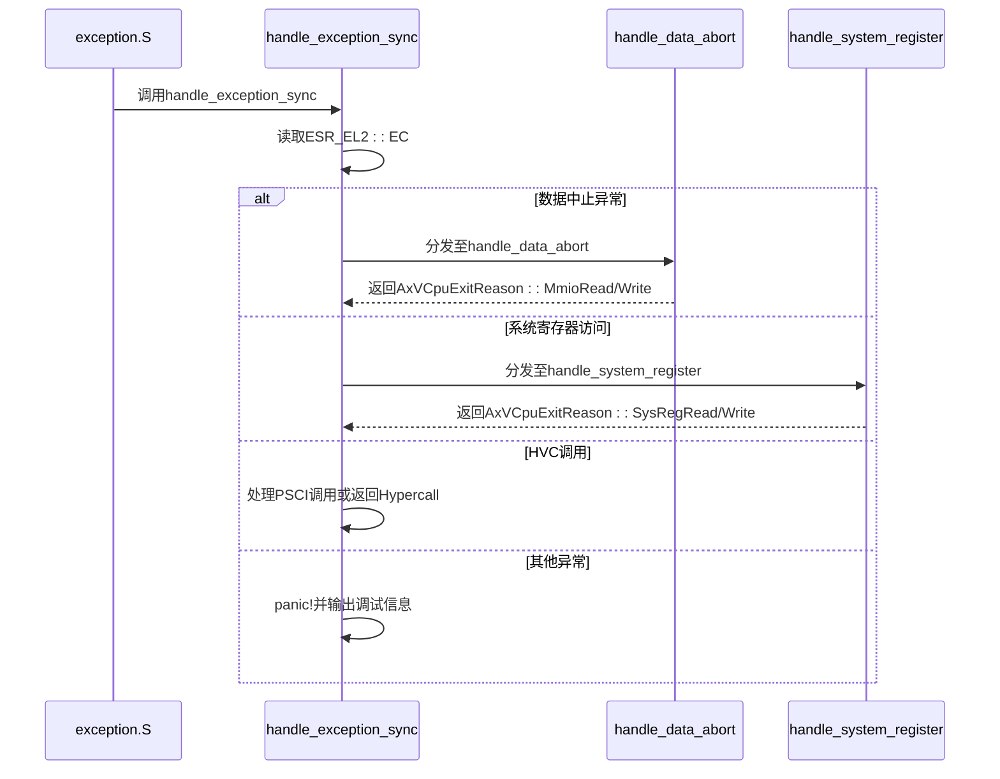
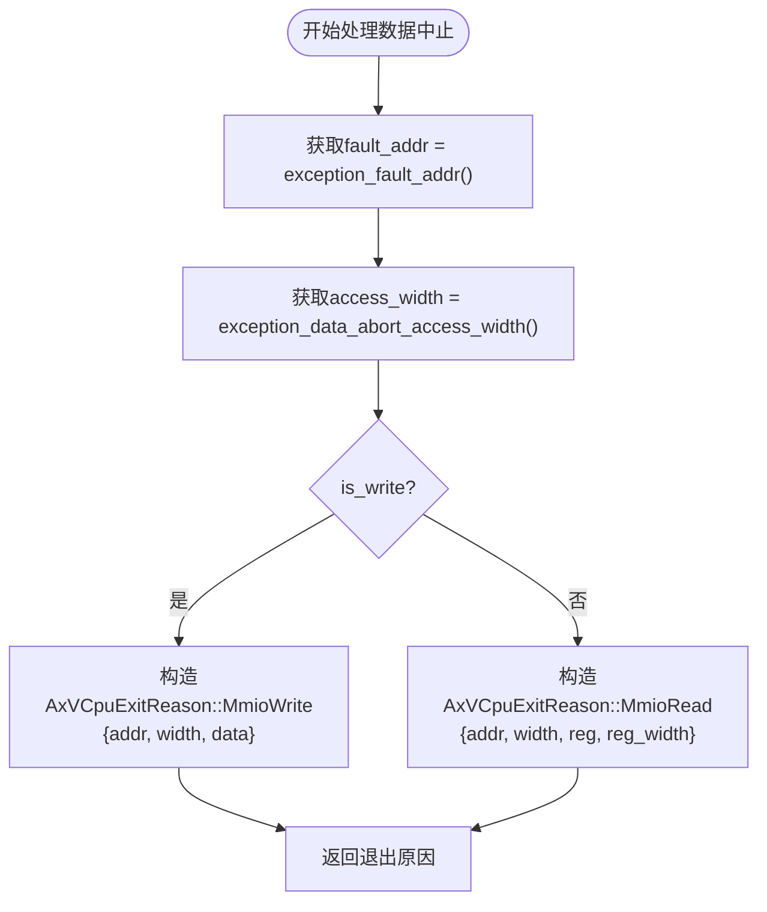
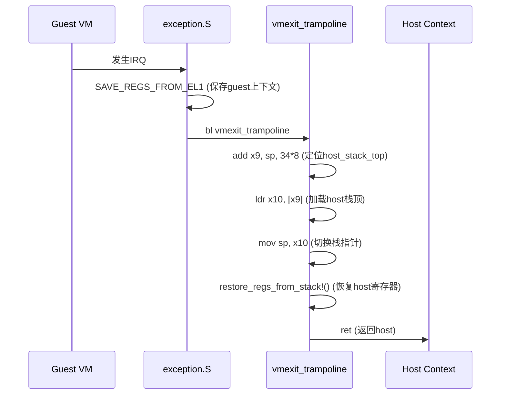
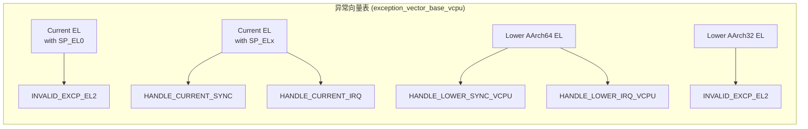

<cite>
**本文档中引用的文件**
- [exception.rs](file://src/exception.rs)
- [exception_utils.rs](file://src/exception_utils.rs)
- [exception.S](file://src/exception.S)
- [vcpu.rs](file://src/vcpu.rs)
- [context_frame.rs](file://src/context_frame.rs)
</cite>

## 目录
1. [异常与中断处理机制概述](#异常与中断处理机制概述)
2. [同步异常处理流程](#同步异常处理流程)
3. [数据中止异常处理](#数据中止异常处理)
4. [系统寄存器访问异常处理](#系统寄存器访问异常处理)
5. [IRQ异步异常分发机制](#irq异步异常分发机制)
6. [VM-Exit上下文恢复](#vm-exit上下文恢复)
7. [异常向量表布局设计](#异常向量表布局设计)

## 异常与中断处理机制概述

本节概述了ARM虚拟CPU（vCPU）中的异常与中断处理架构。系统通过汇编级异常向量跳转至Rust实现的处理函数，实现了从底层硬件异常到高层虚拟机监控器（Hypervisor）的完整处理链路。核心组件包括异常向量表、同步异常处理器、IRQ分发器以及VM-Exit上下文切换机制。

**Section sources**
- [exception.rs](file://src/exception.rs#L1-L50)
- [exception.S](file://src/exception.S#L1-L20)

## 同步异常处理流程

当虚拟机（VM）执行过程中发生同步异常时，控制流首先通过汇编代码`exception_vector_base_vcpu`进入预定义的异常向量入口。该向量表根据异常来源和类型调用相应的宏进行初步处理，最终将控制权转移至Rust语言实现的`handle_exception_sync`函数。

此函数作为同步异常的核心调度器，通过解析异常综合征寄存器（ESR_EL2）中的异常类（EC）字段来识别异常类型，并据此分发至不同的处理分支。当前支持的主要异常类型包括数据中止（DataAbortLowerEL）、超空间调用（HVC64）和系统寄存器访问陷阱（TrappedMsrMrs）。



**Diagram sources**
- [exception.S](file://src/exception.S#L100-L110)
- [exception.rs](file://src/exception.rs#L50-L100)

**Section sources**
- [exception.rs](file://src/exception.rs#L50-L150)

## 数据中止异常处理

### 异常识别与MMIO请求生成

数据中止异常由`DataAbortLowerEL`异常类标识，通常发生在虚拟机尝试访问内存映射I/O（MMIO）区域时。`handle_data_abort`函数负责解析此类异常并生成相应的MMIO操作请求。

#### 关键字段提取过程

- **fault_addr**: 故障地址通过`exception_fault_addr()`函数获取。该函数结合FAR_EL2（故障地址寄存器）和HPFAR_EL2（超空间故障地址寄存器）的值，计算出真实的客户物理地址（Guest Physical Address）。
- **access_width**: 访问宽度由ISS（指令特定综合征）字段的第22-23位决定，通过`exception_data_abort_access_width()`函数解析，可能为1、2、4或8字节。
- **is_write**: 写操作标志由ISS的第6位确定，通过`exception_data_abort_access_is_write()`函数提取。
- **reg & reg_width**: 源/目标寄存器索引及其宽度分别由ISS的第16-20位和第15位决定，通过`exception_data_abort_access_reg()`和`exception_data_abort_access_reg_width()`函数获取。



**Diagram sources**
- [exception_utils.rs](file://src/exception_utils.rs#L100-L150)
- [exception.rs](file://src/exception.rs#L150-L200)

**Section sources**
- [exception.rs](file://src/exception.rs#L150-L200)
- [exception_utils.rs](file://src/exception_utils.rs#L50-L200)

## 系统寄存器访问异常处理

### ISS解码逻辑与退出原因构造

当虚拟机尝试访问受控的系统寄存器时，会触发`TrappedMsrMrs`异常。`handle_system_register`函数负责处理此类异常，其核心在于对ISS字段的精确解码。

#### ISS字段解码

- **地址提取**: 系统寄存器地址由ISS的特定比特位组合而成，遵循`<op0><op2><op1><CRn>00000<CRm>`格式，通过`exception_sysreg_addr()`函数提取。
- **方向判断**: 访问方向（读/写）由ISS的最低位决定，`exception_sysreg_direction_write()`函数将其转换为布尔值。
- **GPR索引**: 涉及的通用寄存器索引由ISS的第5-9位指定，通过`exception_sysreg_gpr()`函数获取。

#### AxVCpuExitReason构造

根据解码结果，函数构造相应的退出原因：
- **读操作**: 返回`AxVCpuExitReason::SysRegRead`，包含寄存器地址和目标GPR索引。
- **写操作**: 返回`AxVCpuExitReason::SysRegWrite`，包含寄存器地址和待写入的值。

```mermaid
classDiagram
class handle_system_register {
+exception_sysreg_addr(iss) SysRegAddr
+exception_sysreg_direction_write(iss) bool
+exception_sysreg_gpr(iss) u64
+handle_system_register(context_frame) AxResult~AxVCpuExitReason!
}
class AxVCpuExitReason {
+SysRegRead { addr : SysRegAddr, reg : usize }
+SysRegWrite { addr : SysRegAddr, value : u64 }
}
handle_system_register --> AxVCpuExitReason : "构造"
```

**Diagram sources**
- [exception.rs](file://src/exception.rs#L200-L250)
- [exception_utils.rs](file://src/exception_utils.rs#L200-L250)

**Section sources**
- [exception.rs](file://src/exception.rs#L200-L250)
- [exception_utils.rs](file://src/exception_utils.rs#L200-L250)

## IRQ异步异常分发机制

### current_el_irq_handler分发流程

当发生IRQ异步异常且源自当前异常级别时，控制流被引导至`current_el_irq_handler`函数。该函数作为IRQ的统一入口点，其主要职责是调用预先注册的中断处理器。

中断处理器通过`crate::pcpu::IRQ_HANDLER`全局变量存储，该变量在`Aarch64PerCpu::new()`初始化期间被设置。`current_el_irq_handler`直接解引用此指针并调用实际的中断服务例程（ISR），从而实现灵活的中断分发机制。

### vmexit_trampoline栈指针协调

当来自较低异常级别的IRQ导致VM-Exit时，控制流经由`HANDLE_LOWER_IRQ_VCPU`宏进入`vmexit_trampoline`函数。此函数的关键作用是协调栈指针切换，以完成从guest上下文到host上下文的平滑过渡。

#### 栈切换步骤

1. **调整SP指向host_stack_top**: 当前SP指向`Aarch64VCpu.ctx`（保存的guest TrapFrame），通过`add x9, sp, 34 * 8`将其调整至`host_stack_top`字段。
2. **加载host栈顶**: 使用`ldr x10, [x9]`从`host_stack_top`字段加载原始host栈顶地址。
3. **切换SP**: 执行`mov sp, x10`将栈指针切换回host栈。
4. **恢复host上下文**: 调用`restore_regs_from_stack!()`宏恢复之前保存的host函数调用帧（callee-saved registers）。
5. **返回host**: 最终通过`ret`指令返回至`Aarch64VCpu.run()`，模拟`run_guest`函数的正常返回。



**Diagram sources**
- [exception.S](file://src/exception.S#L70-L90)
- [exception.rs](file://src/exception.rs#L300-L350)

**Section sources**
- [exception.rs](file://src/exception.rs#L300-L350)
- [exception.S](file://src/exception.S#L50-L100)

## VM-Exit上下文恢复

### run_guest与context_vm_entry协同

`vmexit_trampoline`的逆向过程由`run_guest`和`context_vm_entry`两个函数共同完成。当Hypervisor决定重新运行虚拟机时，它会调用`Aarch64VCpu.run()`，进而调用`run_guest`。

`run_guest`首先使用`save_regs_to_stack!()`宏保存当前host的函数调用帧，然后将当前栈顶（SP）保存到`Aarch64VCpu.host_stack_top`字段中。最后，它跳转至`context_vm_entry`标签。

`context_vm_entry`负责恢复guest上下文：
1. 将`x0`（持有`host_stack_top`）加载到SP。
2. 调用`RESTORE_REGS_INTO_EL1`宏，将之前保存在`Aarch64VCpu.ctx`中的guest寄存器状态恢复到物理CPU上。
3. 执行`eret`指令，返回到guest的执行流中。

这一机制确保了guest和host上下文之间的安全、可逆切换。

**Section sources**
- [vcpu.rs](file://src/vcpu.rs#L300-L400)
- [exception.S](file://src/exception.S#L120-L140)

## 异常向量表布局设计

### exception.S汇编代码结构

`exception.S`文件定义了完整的异常向量表，其基地址由符号`exception_vector_base_vcpu`导出。该向量表采用标准的ARMv8 256字节对齐布局，分为四个主要部分：

1. **Current EL with SP_EL0**: 处理当前异常级别下使用SP_EL0的异常。
2. **Current EL with SP_ELx**: 处理当前异常级别下使用SP_ELx的异常。
3. **Lower AArch64 EL**: 处理来自较低AArch64异常级别的异常。
4. **Lower AArch32 EL**: 处理来自较低AArch32异常级别的异常。

每个条目都使用宏（如`INVALID_EXCP_EL2`, `HANDLE_CURRENT_SYNC`, `HANDLE_LOWER_SYNC_VCPU`）来填充，这些宏封装了上下文保存、参数传递和函数调用的标准化流程。这种设计既保证了代码的复用性，又确保了异常处理路径的清晰和高效。



**Diagram sources**
- [exception.S](file://src/exception.S#L1-L140)

**Section sources**
- [exception.S](file://src/exception.S#L1-L140)