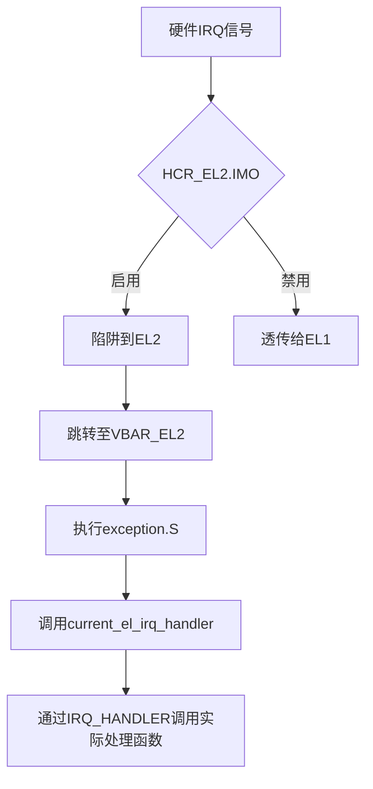
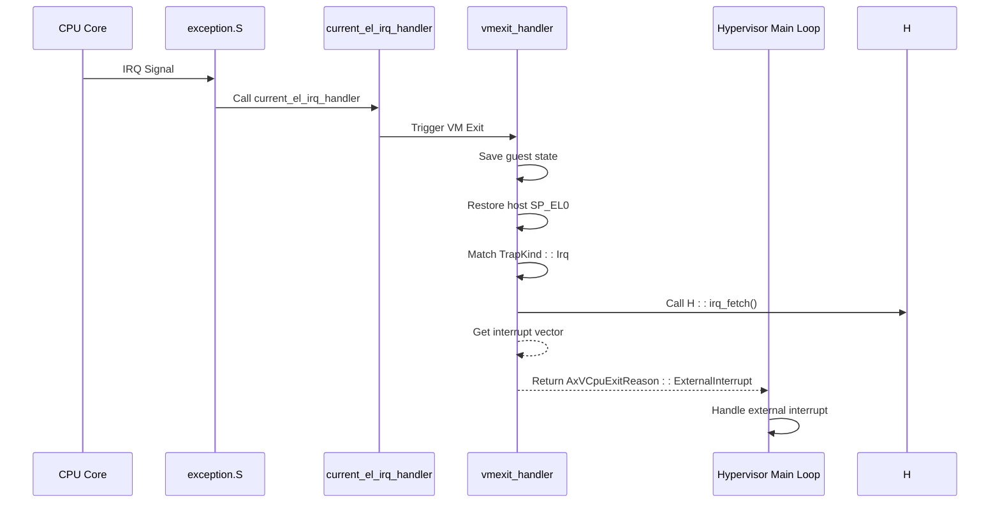

<cite>
**本文档中引用的文件**
- [exception.rs](file://src/exception.rs)
- [vcpu.rs](file://src/vcpu.rs)
- [pcpu.rs](file://src/pcpu.rs)
- [exception_utils.rs](file://src/exception_utils.rs)
</cite>

## 目录
1. [异步异常与中断分发](#异步异常与中断分发)
2. [IRQ处理机制总览](#irq处理机制总览)
3. [硬件中断到处理器调用流程](#硬件中断到处理器调用流程)
4. [每CPU变量注册与获取机制](#每cpu变量注册与获取机制)
5. [中断向量获取与退出原因生成](#中断向量获取与退出原因生成)
6. [hypervisor捕获与处理逻辑](#hypervisor捕获与处理逻辑)
7. [上下文切换中的trampoline作用](#上下文切换中的trampoline作用)
8. [安全性要求与性能考量](#安全性要求与性能考量)

## IRQ处理机制总览

本文详细阐述了基于Aarch64架构的虚拟化环境中，从硬件中断触发到hypervisor处理的完整异步异常处理机制。系统通过精心设计的汇编级入口、Rust语言实现的高级处理函数以及每CPU数据结构的协同工作，实现了高效且安全的中断分发。

该机制的核心组件包括：`current_el_irq_handler`作为低级中断入口点，`Aarch64PerCpu`中定义的`IRQ_HANDLER`每CPU变量用于动态绑定中断处理器，`vmexit_trampoline`负责在VM退出时进行上下文恢复，以及`vcpu.rs`中的`vmexit_handler`完成最终的事件匹配与处理。整个流程确保了物理中断能够被正确截获并转化为虚拟机可理解的外部中断事件。

**Section sources**
- [exception.rs](file://src/exception.rs#L1-L362)
- [vcpu.rs](file://src/vcpu.rs#L1-L443)
- [pcpu.rs](file://src/pcpu.rs#L1-L91)

## 硬件中断到处理器调用流程

当硬件产生一个IRQ（中断请求）时，ARM处理器会根据当前的异常级别和配置，跳转到相应的异常向量表。在本系统中，通过设置VBAR_EL2寄存器指向`exception_vector_base_vcpu`，将异常处理向量重定向至hypervisor提供的处理程序。

对于来自当前异常级别的IRQ，处理器会执行`current_el_irq_handler`函数。该函数是一个使用`#[unsafe(no_mangle)]`标记的裸函数，确保其符号名不会被Rust编译器修饰，从而能被汇编代码直接调用。此函数不接收任何参数，而是直接通过全局访问`crate::pcpu::IRQ_HANDLER`来获取并调用已注册的中断处理闭包。



**Diagram sources**
- [exception.rs](file://src/exception.rs#L290-L300)
- [pcpu.rs](file://src/pcpu.rs#L25-L30)

**Section sources**
- [exception.rs](file://src/exception.rs#L290-L300)
- [pcpu.rs](file://src/pcpu.rs#L25-L30)

## 每CPU变量注册与获取机制

`Aarch64PerCpu`结构体为每个物理CPU核心维护独立的状态信息。其中，`IRQ_HANDLER`是一个使用`#[percpu::def_percpu]`宏定义的每CPU静态变量，其类型为`OnceCell<&(dyn Fn() + Send + Sync)>`，确保每个CPU上只能安全地初始化一次中断处理函数。

在`Aarch64PerCpu::new()`方法中，系统通过`IRQ_HANDLER.current_ref_mut_raw().set()`将主机操作系统的中断处理函数`H::irq_hanlder()`注册到当前CPU的`IRQ_HANDLER`变量中。这里的`H`是泛型参数，代表实现了`AxVCpuHal` trait的主机HAL（硬件抽象层）。这种设计允许不同的主机操作系统提供各自的中断处理逻辑，实现了良好的解耦。

获取机制则通过`current_el_irq_handler`中的`IRQ_HANDLER.current_ref_raw().get().unwrap()()`完成。`current_ref_raw()`返回指向当前CPU实例的原始指针，`get()`获取其中存储的函数引用，最后进行调用。这一过程保证了中断总是由正确的CPU上的正确处理函数来响应。

```mermaid
classDiagram
class Aarch64PerCpu {
+cpu_id : usize
+_phantom : PhantomData~H~
}
class IRQ_HANDLER {
<<static>>
+OnceCell~&Fn() + Send + Sync~
}
Aarch64PerCpu "1" *-- "1" IRQ_HANDLER : contains
note right of Aarch64PerCpu
每个CPU实例拥有自己的
IRQ_HANDLER副本
end note
```

**Diagram sources**
- [pcpu.rs](file://src/pcpu.rs#L25-L30)
- [pcpu.rs](file://src/pcpu.rs#L40-L45)

**Section sources**
- [pcpu.rs](file://src/pcpu.rs#L25-L30)
- [pcpu.rs](file://src/pcpu.rs#L40-L45)

## 中断向量获取与退出原因生成

当异步异常发生并进入`vmexit_handler`后，系统首先检查`exit_reason`是否为`TrapKind::Irq`。如果是，则进入中断处理分支。

在此分支中，系统调用泛型类型`H`的关联函数`H::irq_fetch()`来获取具体的中断向量号。`irq_fetch()`的具体实现由主机操作系统提供，通常涉及读取GIC（通用中断控制器）的寄存器以确定哪个中断线被触发。

获取到中断向量后，系统构造一个`AxVCpuExitReason::ExternalInterrupt`枚举值，并将中断向量作为其`vector`字段。这个`AxVCpuExitReason`是hypervisor与虚拟机监控逻辑之间的契约，明确告知上层发生了何种类型的VM退出事件。`ExternalInterrupt`表示这是一个来自外部设备的中断，需要hypervisor介入处理或转发。

**Section sources**
- [vcpu.rs](file://src/vcpu.rs#L310-L320)

## hypervisor捕获与处理逻辑

`vmexit_handler`是`Aarch64VCpu`结构体中的核心方法，负责处理所有类型的VM退出事件。它接收一个`TrapKind`类型的参数，该参数由底层汇编代码根据ESR_EL2寄存器的内容确定。

在`match exit_reason`表达式中，当模式匹配到`TrapKind::Irq`时，即表明发生了IRQ异常。此时，如前所述，系统会调用`H::irq_fetch()`并生成`AxVCpuExitReason::ExternalInterrupt`。这个返回值会被`run()`方法接收，并传递给hypervisor的主循环进行后续处理。

值得注意的是，在处理任何VM退出之前，`vmexit_handler`会先调用`guest_system_regs.store()`保存当前虚拟机的系统寄存器状态，并恢复主机的`SP_EL0`。这确保了无论发生何种异常，hypervisor都能在一个已知且安全的状态下继续执行。



**Diagram sources**
- [vcpu.rs](file://src/vcpu.rs#L310-L320)
- [exception.rs](file://src/exception.rs#L290-L300)

**Section sources**
- [vcpu.rs](file://src/vcpu.rs#L310-L320)

## 上下文切换中的trampoline作用

`vmexit_trampoline`是一个关键的汇编级函数，使用`#[unsafe(naked)]`属性定义，意味着它不包含标准的函数序言和尾声，完全由内联汇编控制。

当VM退出发生时，Guest的上下文已经被`SAVE_REGS_FROM_EL1`宏保存在`Aarch64VCpu.ctx`中。此时栈指针`sp`指向`ctx`的基地址。`vmexit_trampoline`的首要任务是恢复Host的执行环境。

其工作流程如下：
1. **调整栈指针**：执行`add x9, sp, 34 * 8`，跳过已保存的`TrapFrame`，使`x9`指向`host_stack_top`字段。
2. **恢复栈顶指针**：通过`ldr x10, [x9]`加载`host_stack_top`的值，并将其赋给`sp`，从而将栈切换回Host的栈空间。
3. **恢复寄存器**：调用`restore_regs_from_stack!()`宏，该宏展开为一系列`ldp`指令，从Host栈中恢复`x19-x30`等被调用者保存的寄存器。
4. **返回控制流**：执行`ret`指令，这将弹出`run_guest`函数调用时压入的返回地址，从而将控制流无缝地交还给`Aarch64VCpu.run()`方法，模拟了一次正常的函数返回。

这一机制巧妙地利用了栈的特性，避免了复杂的寄存器保存/恢复开销，实现了高效的上下文切换。

```mermaid
flowchart LR
A[sp points to ctx] --> B[Add offset to skip TrapFrame]
B --> C[Load host_stack_top value]
C --> D[Set sp to host stack top]
D --> E[Restore callee-saved registers]
E --> F[Return control to run()]
```

**Diagram sources**
- [exception.rs](file://src/exception.rs#L305-L320)

**Section sources**
- [exception.rs](file://src/exception.rs#L305-L320)

## 安全性要求与性能考量

本中断处理机制在设计上充分考虑了安全性和性能两大关键因素。

**安全性方面**：
- 使用`percpu`变量确保了中断处理的CPU局部性，防止了跨CPU的数据竞争。
- `OnceCell`保证了`IRQ_HANDLER`的单次初始化，避免了重复注册导致的安全漏洞。
- 在`vmexit_handler`中优先保存Guest状态并恢复Host的`SP_EL0`，确保了hypervisor始终运行在受控的内存环境中，防止了潜在的栈溢出攻击。
- 所有与硬件交互的代码（如MSR/MRS指令）都被标记为`unsafe`，提醒开发者注意其潜在风险。

**性能方面**：
- `current_el_irq_handler`和`vmexit_trampoline`均采用裸函数和内联汇编实现，最大限度地减少了函数调用开销和不必要的寄存器保存。
- `vmexit_trampoline`的设计避免了在C/Rust层面进行复杂的上下文管理，直接通过汇编指令完成栈切换和寄存器恢复，效率极高。
- 将中断处理分为快速路径（`current_el_irq_handler`）和慢速路径（`vmexit_handler`），使得最频繁的中断入口尽可能轻量。
- 利用`HCR_EL2`寄存器的IMO位精确控制中断行为，只有在需要时才将中断陷阱到EL2，否则直接透传，减少了不必要的VM退出。

这些设计共同确保了系统能够在保证安全隔离的前提下，提供接近原生的中断处理性能。

**Section sources**
- [exception.rs](file://src/exception.rs#L290-L320)
- [vcpu.rs](file://src/vcpu.rs#L310-L320)
- [pcpu.rs](file://src/pcpu.rs#L40-L45)