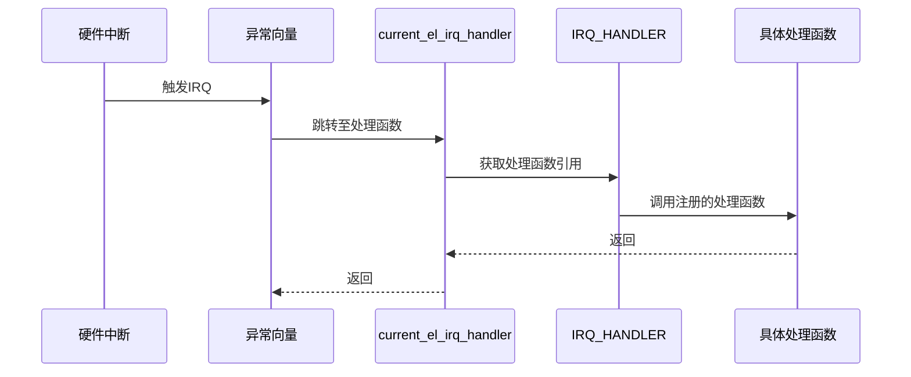
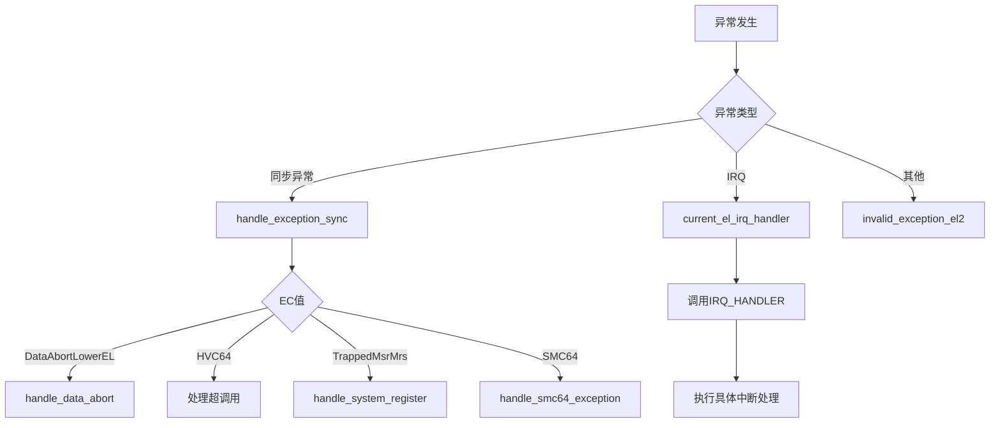

<cite>
**本文档引用的文件**
- [pcpu.rs](file://src/pcpu.rs)
- [exception.rs](file://src/exception.rs)
- [context_frame.rs](file://src/context_frame.rs)
- [exception_utils.rs](file://src/exception_utils.rs)
</cite>

## 目录
1. [中断处理定制](#中断处理定制)
2. [Per-CPU中断处理机制](#per-cpu中断处理机制)
3. [中断向量注册流程](#中断向量注册流程)
4. [上下文保存与异常处理集成](#上下文保存与异常处理集成)
5. [外设中断拦截示例](#外设中断拦截示例)
6. [中断延迟敏感场景最佳实践](#中断延迟敏感场景最佳实践)
7. [系统稳定性风险与调试方法](#系统稳定性风险与调试方法)

## 中断处理定制

本文深入讲解如何利用 per-CPU 的 `IRQ_HANDLER` 全局变量注册自定义中断处理程序。详细说明中断向量注册流程、上下文保存机制及其与异常处理路径的集成方式。通过实际示例演示如何拦截特定外设中断并执行客机透明的处理逻辑。分析中断延迟敏感场景下的最佳实践，包括最小化临界区、避免动态内存分配等。指出不当使用可能导致的系统不稳定风险，并提供调试和验证方法。

## Per-CPU中断处理机制

在ARM虚拟化环境中，每个CPU核心都维护独立的中断处理状态，通过 `Aarch64PerCpu` 结构体实现。该结构体包含CPU ID和类型标记，并通过 `#[percpu::def_percpu]` 宏定义了两个关键的每CPU变量：`ORI_EXCEPTION_VECTOR_BASE` 和 `IRQ_HANDLER`。

`IRQ_HANDLER` 是一个 `OnceCell` 类型的静态变量，用于存储指向中断处理函数的引用。这种设计避免了使用 `OnceLock` 所需的额外同步开销，提高了性能。中断处理函数必须同时满足 `Send` 和 `Sync` trait，确保跨线程安全访问。

当创建新的 `Aarch64PerCpu` 实例时，在 `new` 方法中会为当前CPU注册中断处理程序。这通过获取 `IRQ_HANDLER` 的可变引用并调用其 `set` 方法完成，将处理函数设置为 `H::irq_hanlder()` 的闭包形式。

**Section sources**
- [pcpu.rs](file://src/pcpu.rs#L1-L91)

## 中断向量注册流程

中断向量注册流程始于 `Aarch64PerCpu` 的初始化过程。在 `hardware_enable` 方法中，系统首先保存原始的异常向量基址到 `ORI_EXCEPTION_VECTOR_BASE` 变量中，然后将 `VBAR_EL2` 寄存器设置为指向本 crate 定义的 `exception_vector_base_vcpu` 符号。

这一操作将异常向量表切换到虚拟化环境专用的处理程序。`VBAR_EL2` 寄存器的设置使得所有异常（包括中断）都将跳转到新的向量表进行处理。同时，`HCR_EL2` 寄存器被配置为启用虚拟IRQ和FIQ中断，允许虚拟机接收中断信号。

中断处理的核心是 `current_el_irq_handler` 函数，它作为IRQ异常的入口点。该函数通过 `IRQ_HANDLER.current_ref_raw().get().unwrap()()` 调用注册的中断处理程序，实现了从底层硬件中断到上层软件处理的无缝衔接。

**Diagram sources**
- [pcpu.rs](file://src/pcpu.rs#L1-L91)
- [exception.rs](file://src/exception.rs#L1-L362)

**Section sources**
- [pcpu.rs](file://src/pcpu.rs#L1-L91)
- [exception.rs](file://src/exception.rs#L1-L362)

## 上下文保存与异常处理集成

上下文保存机制通过 `Aarch64ContextFrame` 结构体实现，该结构体包含了31个通用寄存器、EL0栈指针、异常链接寄存器和保存的程序状态寄存器。这个结构体采用C兼容的内存布局，确保与硬件交互的正确性。

异常处理路径的集成体现在 `handle_exception_sync` 函数中，该函数根据异常类别（EC）分发不同的处理逻辑。对于数据中止异常，系统会解析故障地址和访问属性；对于超调用（HVC64），则提取调用号和参数；对于系统寄存器访问异常，则确定读写方向和目标寄存器。

`vmexit_trampoline` 函数实现了VM退出时的上下文切换，通过调整栈指针跳过异常帧，恢复主机栈顶指针，并使用 `restore_regs_from_stack!` 宏恢复主机上下文。这种机制确保了虚拟机退出后能正确返回到 `Aarch64VCpu.run()` 函数继续执行。

**Diagram sources**
- [context_frame.rs](file://src/context_frame.rs#L1-L302)
- [exception.rs](file://src/exception.rs#L1-L362)

**Section sources**
- [context_frame.rs](file://src/context_frame.rs#L1-L302)
- [exception.rs](file://src/exception.rs#L1-L362)

## 外设中断拦截示例

要拦截特定外设中断并执行客机透明的处理逻辑，首先需要在 `AxVCpuHal` trait 的实现中定义 `irq_hanlder` 方法。该方法应返回一个闭包，其中包含对外设中断的检查和处理逻辑。

处理流程如下：当外设产生中断时，硬件触发IRQ异常，控制流进入 `current_el_irq_handler`。该函数调用 `IRQ_HANDLER` 注册的处理程序，后者检查中断源是否为目标外设。如果是，则执行相应的处理逻辑（如更新设备状态、清除中断标志），然后返回；否则，将中断转发给原始处理程序。

这种设计实现了客机透明性，因为虚拟机完全感知不到中断被拦截和处理的过程。所有操作都在虚拟化层完成，保持了虚拟机运行环境的完整性。

**Section sources**
- [pcpu.rs](file://src/pcpu.rs#L1-L91)
- [exception.rs](file://src/exception.rs#L1-L362)

## 中断延迟敏感场景最佳实践

在中断延迟敏感场景下，应遵循以下最佳实践：

1. **最小化临界区**：中断处理程序应尽可能短小精悍，避免长时间占用CPU。复杂的处理逻辑应推迟到下半部或工作队列中执行。

2. **避免动态内存分配**：中断上下文中禁止使用堆分配，所有数据结构应在编译时或初始化阶段预先分配。

3. **减少锁竞争**：尽量使用无锁数据结构或每CPU变量，避免在中断处理中获取全局锁。

4. **优先级管理**：合理配置中断优先级，确保高优先级中断能及时得到响应。

5. **批处理优化**：对于可能频繁触发的中断，考虑批量处理机制，减少上下文切换开销。

这些实践有助于降低中断延迟，提高系统的实时性和响应能力。

**Section sources**
- [pcpu.rs](file://src/pcpu.rs#L1-L91)
- [exception.rs](file://src/exception.rs#L1-L362)

## 系统稳定性风险与调试方法

不当使用中断处理机制可能导致严重的系统稳定性风险，包括：

- **死锁**：在中断处理中获取已被持有的锁
- **竞态条件**：多CPU环境下共享资源访问冲突
- **栈溢出**：中断嵌套过深导致栈空间耗尽
- **内存泄漏**：未能正确释放资源

调试和验证方法包括：

1. 使用 `panic!` 宏捕获未处理的异常，输出详细的寄存器状态和调用栈信息。
2. 通过 `log::error!` 记录关键错误信息，便于事后分析。
3. 利用 `axerrno` 模块的标准错误码进行统一的错误处理。
4. 在开发阶段启用完整的符号信息，便于定位问题根源。

定期进行压力测试和边界条件测试，确保系统在各种极端情况下的稳定运行。

**Section sources**
- [exception.rs](file://src/exception.rs#L1-L362)