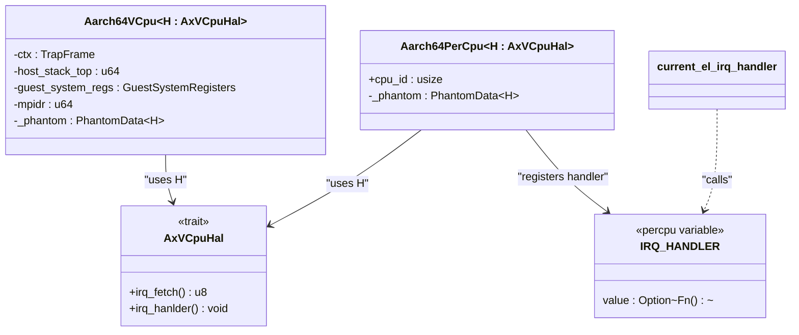

<cite>
**本文档中引用的文件**
- [src/lib.rs](file://src/lib.rs)
- [src/vcpu.rs](file://src/vcpu.rs)
- [src/exception.rs](file://src/exception.rs)
- [src/pcpu.rs](file://src/pcpu.rs)
- [src/context_frame.rs](file://src/context_frame.rs)
- [src/exception_utils.rs](file://src/exception_utils.rs)
- [src/smc.rs](file://src/smc.rs)
</cite>

# 扩展与定制

## 目录
1. [简介](#简介)
2. [核心扩展机制](#核心扩展机制)
3. [通过AxVCpuHal注入自定义硬件抽象层](#通过axvcpuhal注入自定义硬件抽象层)
4. [注册自定义中断处理程序](#注册自定义中断处理程序)
5. [增强异常处理逻辑](#增强异常处理逻辑)
6. [添加系统调用拦截](#添加系统调用拦截)
7. [最佳实践与警告](#最佳实践与警告)

## 简介

`arm_vcpu` 库为开发者提供了在 AArch64 架构上创建和管理虚拟 CPU (vCPU) 的基础功能。本指南旨在指导开发者如何扩展和定制 `arm_vcpu` 以满足特定需求，重点介绍其核心的可扩展性设计。

该库的核心设计理念是通过 trait 和每 CPU 变量（per-CPU variables）实现高度解耦和可定制化。开发者可以通过实现 `AxVCpuHal` trait 来注入自定义的硬件抽象层，从而完全控制底层的寄存器操作、内存管理和中断处理等关键行为。同时，利用 `IRQ_HANDLER` 这一 per-CPU 全局变量，可以灵活地注册自定义的中断处理程序。

本文将深入探讨这些机制，并提供实际代码示例，演示如何安全地进行修改，以及在保持兼容性的前提下进行扩展的最佳实践。

**Section sources**
- [src/lib.rs](file://src/lib.rs#L1-L31)
- [src/vcpu.rs](file://src/vcpu.rs#L1-L444)

## 核心扩展机制

`arm_vcpu` 的可扩展性主要依赖于两个核心机制：泛型 trait `AxVCpuHal` 和 per-CPU 静态变量 `IRQ_HANDLER`。

### AxVCpuHal Trait

`AxVCpuHal` 是一个由 `axvcpu` crate 定义的硬件抽象层（HAL）trait。`Aarch64VCpu<H: AxVCpuHal>` 结构体通过泛型参数 `H` 将此 trait 作为其依赖项。这意味着所有与底层硬件交互的操作都被抽象化，具体的实现由用户提供的类型决定。

这种设计允许开发者通过实现 `AxVCpuHal` trait 来完全替换 vCPU 的底层行为，例如：
- **寄存器操作**：自定义对物理寄存器的读写方式。
- **内存管理策略**：实现特定的地址转换或内存保护逻辑。
- **中断处理**：定义如何获取和处理中断向量。

### IRQ_HANDLER Per-CPU 变量

`IRQ_HANDLER` 是一个使用 `percpu::def_percpu` 宏定义的 per-CPU 静态变量。它存储了一个指向函数的指针，该函数负责处理从 EL1 到 EL2 的 IRQ 中断。

```rust
#[percpu::def_percpu]
pub static IRQ_HANDLER: OnceCell<&(dyn Fn() + Send + Sync)> = OnceCell::new();
```

在 `Aarch64PerCpu` 初始化时，会将一个包装了 `H::irq_hanlder()` 的闭包注册到 `IRQ_HANDLER` 中。当发生 IRQ 异常时，汇编代码会跳转到 `current_el_irq_handler`，后者直接调用当前 CPU 上注册的 `IRQ_HANDLER`。

这种设计使得中断处理逻辑完全可插拔，开发者只需在其实现的 `AxVCpuHal` 类型中提供 `irq_hanlder` 方法即可。



**Diagram sources**
- [src/vcpu.rs](file://src/vcpu.rs#L1-L444)
- [src/pcpu.rs](file://src/pcpu.rs#L1-L91)
- [src/exception.rs](file://src/exception.rs#L1-L362)

**Section sources**
- [src/vcpu.rs](file://src/vcpu.rs#L1-L444)
- [src/pcpu.rs](file://src/pcpu.rs#L1-L91)

## 通过AxVCpuHal注入自定义硬件抽象层

要扩展 `arm_vcpu` 的功能，首要步骤是实现 `AxVCpuHal` trait。这允许您完全控制 vCPU 与宿主硬件的交互方式。

### 实现步骤

1.  **定义您的 HAL 类型**：创建一个新的结构体来承载您的自定义逻辑。
2.  **实现 `AxVCpuHal` trait**：为您的结构体实现 `AxVCpuHal` trait，提供 `irq_fetch` 和 `irq_hanlder` 方法的具体实现。

### 示例：自定义中断处理

以下是一个实现自定义 `AxVCpuHal` 的示例，用于演示如何集成特定的中断处理逻辑。

```rust
use axvcpu::AxVCpuHal;

// Step 1: 定义您的 HAL 类型
struct MyCustomHal;

// Step 2: 实现 AxVCpuHal trait
impl AxVCpuHal for MyCustomHal {
    // 此方法应返回当前待处理的中断向量号。
    // 您可以在此处查询您的中断控制器（如 GIC）。
    fn irq_fetch() -> u8 {
        // 伪代码：查询 GIC 获取中断号
        // let interrupt_id = gic.read_current_interrupt();
        // interrupt_id as u8
        0 // 占位符
    }

    // 此方法是 IRQ 异常的实际处理程序。
    // 当发生 IRQ 时，控制流会跳转到这里。
    fn irq_hanlder() {
        // 1. 调用 irq_fetch 获取中断向量
        let vector = Self::irq_fetch();

        // 2. 在此处执行您的中断处理逻辑
        // 例如，根据中断向量分发到不同的处理函数
        match vector {
            0 => handle_timer_interrupt(),
            1 => handle_uart_interrupt(),
            _ => log::warn!("Unhandled IRQ vector: {}", vector),
        }

        // 3. 发送 EOI (End of Interrupt) 信号给中断控制器
        // gic.send_eoi(vector);
    }
}

// 辅助函数
fn handle_timer_interrupt() { /* ... */ }
fn handle_uart_interrupt() { /* ... */ }
```

### 使用自定义 HAL

一旦实现了 `MyCustomHal`，您就可以在创建 `Aarch64VCpu` 时使用它：

```rust
// 创建一个使用 MyCustomHal 的 vCPU
let mut vcpu = Aarch64VCpu::<MyCustomHal>::new(vm_id, vcpu_id, config)?;
```

通过这种方式，`arm_vcpu` 库中的所有 `H::irq_fetch()` 和 `H::irq_hanlder()` 调用都将被路由到您实现的版本，从而实现了完全的定制化。

**Section sources**
- [src/pcpu.rs](file://src/pcpu.rs#L1-L91)
- [src/exception.rs](file://src/exception.rs#L1-L362)

## 注册自定义中断处理程序

除了通过 `AxVCpuHal` trait 提供中断处理逻辑外，`arm_vcpu` 还通过 `IRQ_HANDLER` per-CPU 变量提供了一种更直接的中断处理程序注册机制。

### 工作原理

1.  **初始化注册**：在 `Aarch64PerCpu::new()` 方法中，会执行以下代码：
    ```rust
    unsafe { IRQ_HANDLER.current_ref_mut_raw() }.set(&|| H::irq_hanlder()).map(|_| {});
    ```
    这行代码的关键在于：
    - `H::irq_hanlder()` 是您在 `AxVCpuHal` 实现中定义的方法。
    - `&|| H::irq_hanlder()` 创建了一个闭包，该闭包在被调用时会执行 `H::irq_hanlder()`。
    - 这个闭包被设置为当前 CPU 的 `IRQ_HANDLER`。

2.  **异常处理**：当发生 IRQ 异常时，控制流会进入汇编代码，最终调用 `current_el_irq_handler` 函数。该函数的实现如下：
    ```rust
    unsafe fn current_el_irq_handler(_tf: &mut TrapFrame) {
        unsafe { crate::pcpu::IRQ_HANDLER.current_ref_raw() }.get().unwrap()()
    }
    ```
    这段代码会获取当前 CPU 的 `IRQ_HANDLER` 并立即调用它，从而执行您定义的中断处理逻辑。

### 自定义策略

虽然标准流程是通过 `H::irq_hanlder()`，但 `IRQ_HANDLER` 的存在为您提供了灵活性。理论上，您可以在 `Aarch64PerCpu::new()` 之后，甚至在运行时，动态地更改某个 CPU 的 `IRQ_HANDLER`，以适应不同的运行时条件或调试需求。

**Section sources**
- [src/pcpu.rs](file://src/pcpu.rs#L1-L91)
- [src/exception.rs](file://src/exception.rs#L1-L362)

## 增强异常处理逻辑

`arm_vcpu` 对同步异常（如数据中止、系统调用）的处理集中在 `handle_exception_sync` 函数中。您可以通过分析和扩展此函数来增强异常处理能力。

### 分析现有逻辑

`handle_exception_sync` 函数根据异常综合征寄存器（ESR_EL2）中的异常类（EC）来分派处理：

- **数据中止 (DataAbortLowerEL)**：调用 `handle_data_abort`，通常会导致 MMIO 读写请求发送给 VMM。
- **超调用 (HVC64)**：识别 PSCI 调用或将其作为普通超调用 (`Hypercall`) 返回给 VMM。
- **系统寄存器访问 (TrappedMsrMrs)**：返回 `SysRegRead` 或 `SysRegWrite` 请求给 VMM。
- **安全监控调用 (SMC64)**：转发给 ATF (ARM Trusted Firmware) 或处理为 PSCI 调用。

### 扩展点

您可以通过以下方式扩展此逻辑：

1.  **在 VMM 层拦截**：最常见的方式是在 VMM 接收到 `AxVCpuExitReason` 后进行拦截。例如，当 `handle_exception_sync` 返回 `AxVCpuExitReason::Hypercall` 时，VMM 可以检查 `nr` 字段，如果是一个自定义的系统调用号，则执行相应的内核功能，而不是将其传递给客户机操作系统。

2.  **修改 `handle_exception_sync`**：如果您需要在 vCPU 库内部处理某些异常，可以直接修改此函数。例如，您可以添加一个新的 `match` 分支来处理一个特定的、未被标准 ARM 架构定义的 EC。

**重要提示**：直接修改 `handle_exception_sync` 会影响所有使用此库的 vCPU，因此必须非常谨慎，确保不会破坏通用性。

**Section sources**
- [src/exception.rs](file://src/exception.rs#L1-L362)

## 添加系统调用拦截

系统调用拦截是 VMM 的一项关键功能，`arm_vcpu` 为此提供了天然的支持。

### HVC 拦截机制

AArch64 架构使用 `hvc #imm` 指令来触发超调用（Hypervisor Call）。`arm_vcpu` 会捕获这些指令并将其转换为 `AxVCpuExitReason::Hypercall`。

#### 拦截流程

1.  **客户机执行 `hvc #0`**：客户机操作系统或应用程序执行 `hvc` 指令。
2.  **VM Exit**：由于 `HCR_EL2.TSC` 位被设置，`hvc` 指令会触发 VM Exit，控制权转移到 EL2 的 `arm_vcpu`。
3.  **异常处理**：`handle_exception_sync` 函数检测到 `EC == HVC64`。
4.  **提取参数**：`x0` 寄存器中的值被视为系统调用号 (`nr`)，`x1` 到 `x6` 被视为参数。
5.  **返回给 VMM**：`arm_vcpu` 返回 `AxVCpuExitReason::Hypercall { nr, args }` 给 VMM。

#### 实现自定义拦截

在您的 VMM 代码中，您需要处理 `Hypercall` 事件：

```rust
match vcpu.run()? {
    AxVCpuExitReason::Hypercall { nr, args } => {
        match nr {
            // 标准 PSCI 调用，由 VMM 处理
            0x8400_0000..=0x8400_001F | 0xC400_0000..=0xC400_001F => {
                handle_psci_call(nr, args);
            }
            // 自定义系统调用号，例如 0xFFFF
            0xFFFF => {
                // 在这里执行您的自定义逻辑
                let result = my_custom_kernel_function(args[0], args[1]);
                // 将结果写回 x0 寄存器
                vcpu.set_return_value(result);
                // vCPU 继续运行，客户机看到系统调用返回
            }
            // 其他未知调用，可能传递给客户机或报错
            _ => {
                log::info!("Unknown hypercall: {}", nr);
                vcpu.set_return_value(-1); // 返回错误码
            }
        }
    }
    // 处理其他退出原因...
}
```

通过这种方式，您可以实现任何自定义的内核服务，而无需修改客户机操作系统的内核。

**Section sources**
- [src/exception.rs](file://src/exception.rs#L1-L362)
- [src/vcpu.rs](file://src/vcpu.rs#L1-L444)

## 最佳实践与警告

在扩展和定制 `arm_vcpu` 时，遵循最佳实践至关重要，以确保系统的稳定性和安全性。

### 最佳实践

1.  **优先使用 VMM 层拦截**：尽可能在 VMM 接收 `AxVCpuExitReason` 后进行逻辑处理，而不是修改 `arm_vcpu` 库本身的源代码。这能保持库的通用性，并使您的定制逻辑更易于维护和升级。
2.  **充分理解硬件规范**：在实现 `AxVCpuHal` 时，务必参考 ARM Architecture Reference Manual，确保对寄存器的读写符合规范。
3.  **线程安全**：`IRQ_HANDLER` 是 per-CPU 变量，但您实现的 `irq_hanlder` 方法可能会访问共享资源。请确保使用适当的同步原语（如自旋锁）来保证线程安全。
4.  **清晰的错误处理**：在您的自定义逻辑中加入详细的日志记录和错误处理，以便于调试。

### 警告：可能破坏稳定性的操作

1.  **修改 `run_guest` 汇编代码**：`run_guest` 函数是一个 naked 函数，包含关键的上下文保存和恢复逻辑。任何对此函数的修改都可能导致栈损坏、数据丢失或系统崩溃。除非您完全理解其工作原理，否则切勿修改。
2.  **忽略 `PhantomData`**：`Aarch64VCpu` 和 `Aarch64PerCpu` 中的 `_phantom: PhantomData<H>` 确保了泛型参数 `H` 在编译时被正确实例化。移除它会导致类型信息丢失。
3.  **不正确的寄存器恢复**：在 `GuestSystemRegisters::restore()` 方法中，必须严格按照正确的顺序恢复寄存器。顺序错误可能导致不可预测的行为。
4.  **禁用必要的陷阱**：在 `init_vm_context` 中，`HCR_EL2` 寄存器的配置决定了哪些事件会被陷入 EL2。随意禁用这些陷阱（如 `IMO`, `TSC`）会使 VMM 无法监控和控制客户机，导致安全漏洞或功能失效。

遵循这些指导原则，您就可以安全、有效地扩展 `arm_vcpu` 库，构建出满足您特定需求的强大虚拟化解决方案。