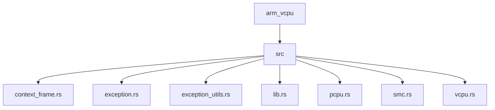
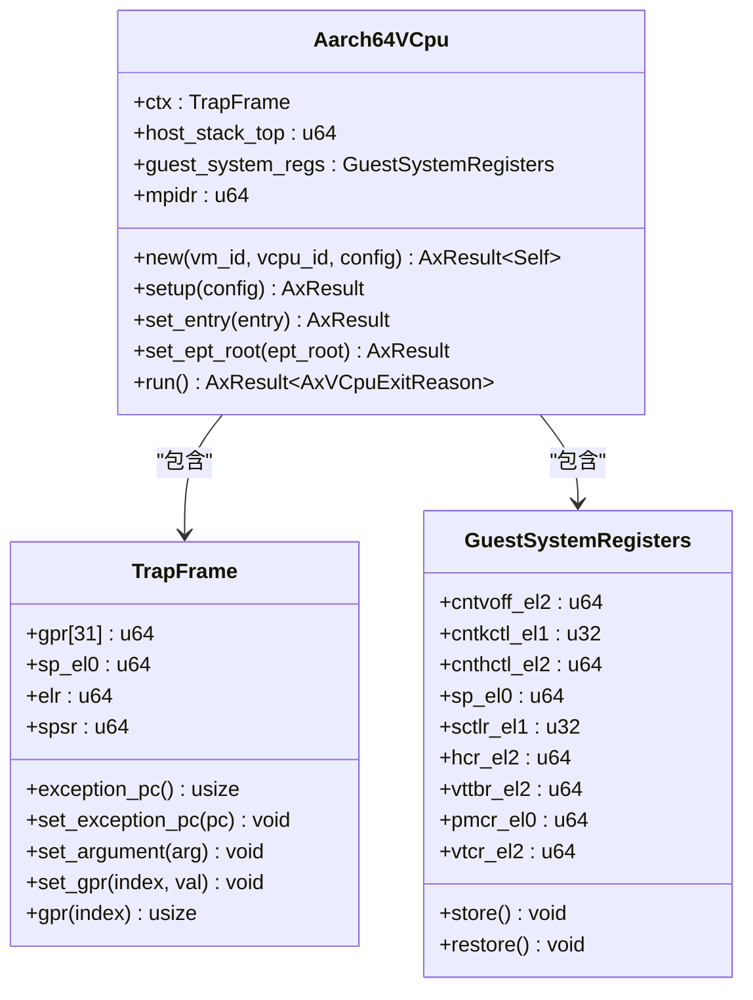
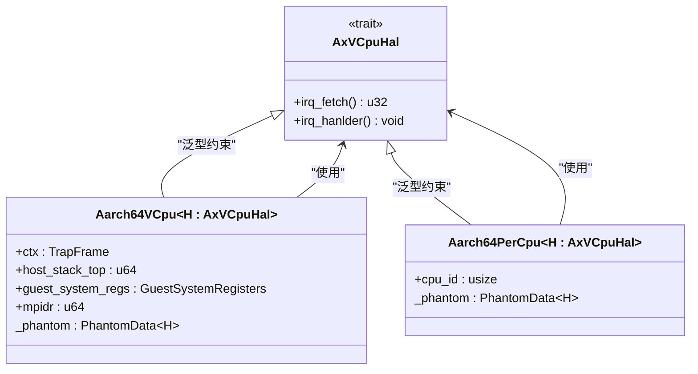
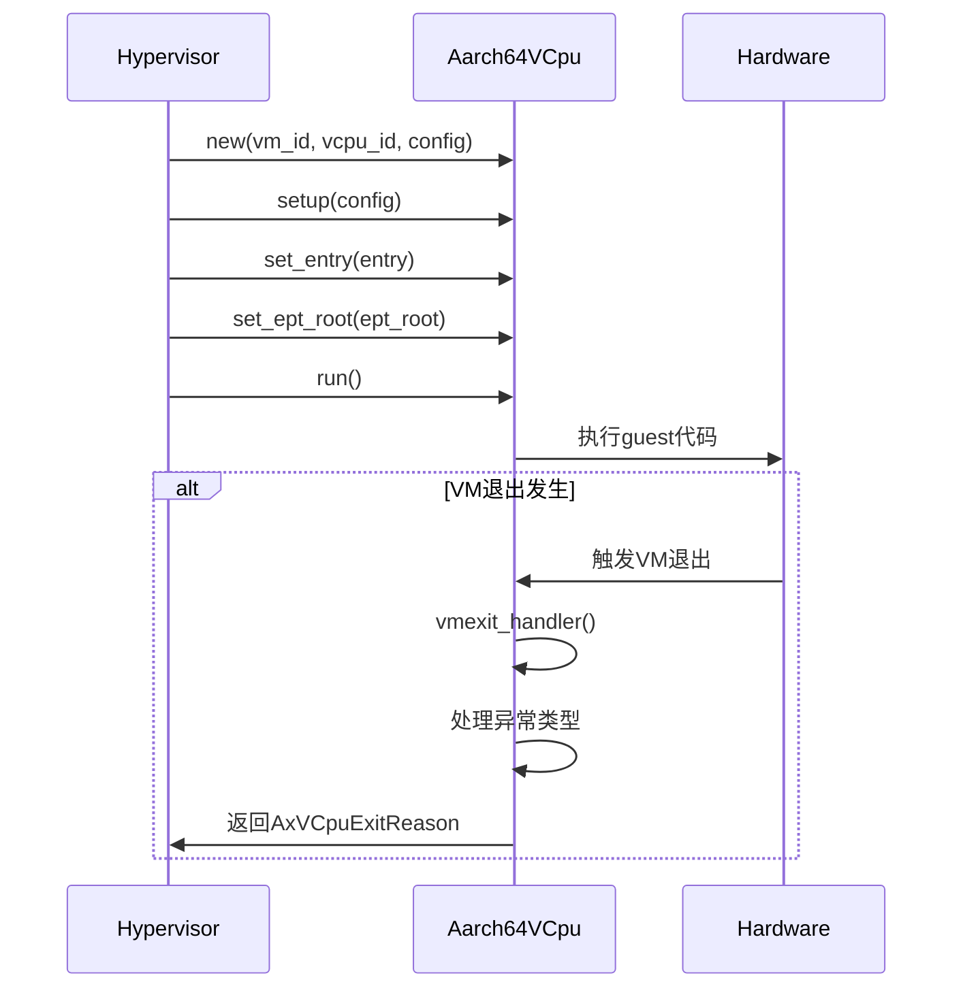
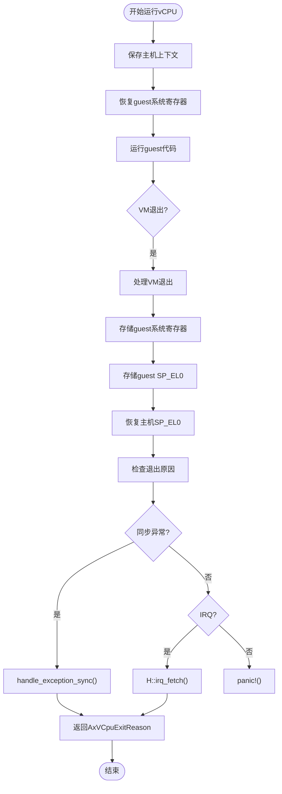
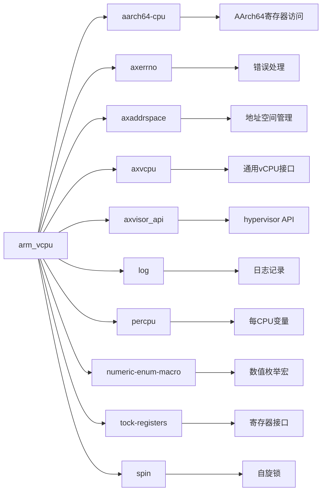

# 硬件抽象层(HAL)扩展

<cite>
**本文档中引用的文件**
- [vcpu.rs](file://src\vcpu.rs)
- [pcpu.rs](file://src\pcpu.rs)
- [context_frame.rs](file://src\context_frame.rs)
- [exception.rs](file://src\exception.rs)
- [lib.rs](file://src\lib.rs)
</cite>

## 目录
1. [引言](#引言)
2. [项目结构](#项目结构)
3. [核心组件](#核心组件)
4. [架构概述](#架构概述)
5. [详细组件分析](#详细组件分析)
6. [依赖分析](#依赖分析)
7. [性能考虑](#性能考虑)
8. [故障排除指南](#故障排除指南)
9. [结论](#结论)

## 引言
本项目为AArch64架构的虚拟CPU（vCPU）实现，专为hypervisor环境设计。它提供了完整的vCPU结构和虚拟化相关接口支持，包括异常处理、硬件虚拟化扩展支持、SMC调用处理以及高效的每CPU数据管理。

## 项目结构
该项目包含以下主要源文件：
- `context_frame.rs`：定义AArch64 CPU上下文帧结构
- `exception.rs`：同步和异步异常处理逻辑
- `exception_utils.rs`：异常处理辅助函数
- `lib.rs`：库入口点和公共API导出
- `pcpu.rs`：每CPU数据结构和管理
- `smc.rs`：安全监控调用(SMC)处理
- `vcpu.rs`：虚拟CPU核心实现

**图示来源**
- [lib.rs](file://src\lib.rs)

**节来源**
- [lib.rs](file://src\lib.rs)

## 核心组件
核心组件包括Aarch64VCpu结构体，负责管理guest执行状态；TrapFrame用于处理来自guest VM的陷阱和异常；以及各种异常处理器和支持系统寄存器虚拟化访问的功能。

**节来源**
- [vcpu.rs](file://src\vcpu.rs)
- [context_frame.rs](file://src\context_frame.rs)

## 架构概述
该crate实现了以下关键组件：

- **`Aarch64VCpu`**：管理guest执行状态的主要虚拟CPU结构
- **`TrapFrame`**：用于处理来自guest VM的陷阱和异常的上下文帧
- **异常处理器**：支持同步和异步异常处理
- **系统寄存器仿真**：对AArch64系统寄存器的虚拟化访问
- **SMC接口**：可信执行的安全监控调用处理

**图示来源**
- [vcpu.rs](file://src\vcpu.rs)
- [context_frame.rs](file://src\context_frame.rs)

## 详细组件分析
### Aarch64VCpu分析
Aarch64VCpu是AArch64 guest中虚拟CPU的核心实现。它通过AxVCpuHal trait提供硬件抽象层，允许hypervisor定制特定于平台的行为。

#### 对象导向组件

**图示来源**
- [vcpu.rs](file://src\vcpu.rs)
- [pcpu.rs](file://src\pcpu.rs)

#### API/服务组件

**图示来源**
- [vcpu.rs](file://src\vcpu.rs)

#### 复杂逻辑组件

**图示来源**
- [vcpu.rs](file://src\vcpu.rs)
- [exception.rs](file://src\exception.rs)

**节来源**
- [vcpu.rs](file://src\vcpu.rs)
- [exception.rs](file://src\exception.rs)

## 依赖分析
此项目依赖于多个外部crate来实现其功能：

**图示来源**
- [Cargo.toml](file://Cargo.toml)

**节来源**
- [Cargo.toml](file://Cargo.toml)

## 性能考虑
由于此库在EL2（hypervisor模式）下运行并处理敏感操作，性能至关重要。建议避免不必要的内存分配，并尽可能使用内联汇编直接访问硬件寄存器。对于频繁路径，应优化上下文切换开销。

## 故障排除指南
当遇到问题时，请检查以下常见情况：
- 确保正确设置了HCR_EL2寄存器以启用虚拟化功能
- 验证VTTBR_EL2指向有效的页表根
- 检查是否正确处理了所有类型的异常退出
- 确认每CPU初始化已完成且中断向量已设置

**节来源**
- [vcpu.rs](file://src\vcpu.rs)
- [pcpu.rs](file://src\pcpu.rs)

## 结论
arm_vcpu crate提供了一个完整且高效的AArch64虚拟CPU实现，适用于需要强大虚拟化能力的hypervisor应用。通过清晰的模块化设计和对硬件特性的充分利用，它能够有效地管理和控制guest操作系统执行。