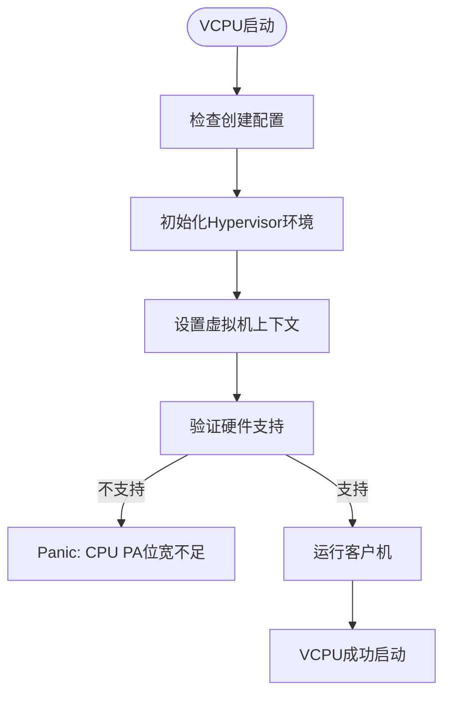
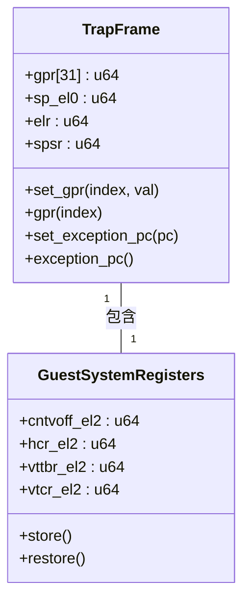
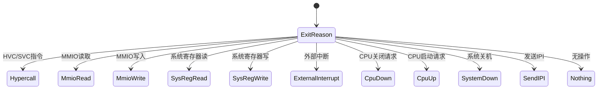

# 故障排除与调试

<cite>
**Referenced Files in This Document**
- [vcpu.rs](file://src/vcpu.rs)
- [exception.rs](file://src/exception.rs)
- [context_frame.rs](file://src/context_frame.rs)
- [smc.rs](file://src/smc.rs)
</cite>

## 目录
1. [简介](#简介)
2. [常见问题及解决方案](#常见问题及解决方案)
3. [日志与寄存器状态分析](#日志与寄存器状态分析)
4. [AxVCpuExitReason 详解](#axvcpuexitreason-详解)
5. [调试技巧与实践](#调试技巧与实践)

## 简介

本指南旨在为开发者提供一套完整的 arm_vcpu 调试方案，帮助诊断和解决在使用虚拟 CPU 时可能遇到的各种问题。通过深入分析 VCPU 的退出原因、异常处理机制和系统调用流程，开发者可以快速定位并修复故障。

**Section sources**
- [vcpu.rs](file://src/vcpu.rs#L1-L50)
- [exception.rs](file://src/exception.rs#L1-L50)

## 常见问题及解决方案

### VCPU无法启动（硬件支持缺失）

当 VCPU 启动失败时，通常与底层硬件或配置有关。检查 `Aarch64VCpu::new` 和 `setup` 方法的实现，确保所有必要的系统寄存器已正确初始化。

**Diagram sources**
- [vcpu.rs](file://src/vcpu.rs#L150-L250)

**Section sources**
- [vcpu.rs](file://src/vcpu.rs#L100-L300)

### 无限异常循环（异常处理不当）

如果发生无限异常循环，可能是由于同步异常未被正确处理。重点关注 `handle_exception_sync` 函数中的匹配逻辑，特别是对于数据中止和超管调用的处理分支。

**Section sources**
- [exception.rs](file://src/exception.rs#L50-L150)

### MMIO访问失败

MMIO 访问失败通常由内存映射配置错误引起。当出现此类问题时，检查 `handle_data_abort` 函数的执行路径，确认地址转换和权限检查是否正常工作。

**Section sources**
- [exception.rs](file://src/exception.rs#L150-L200)

### PSCI调用无响应

PSCI 调用无响应可能是因为 SMC/HVC 指令未被正确捕获或转发。分析 `handle_psci_call` 和 `handle_smc64_exception` 函数的交互逻辑，确保调用号范围判断准确。

**Section sources**
- [exception.rs](file://src/exception.rs#L200-L300)

## 日志与寄存器状态分析

### 利用日志输出进行调试

启用详细的 trace 日志可以帮助追踪 VCPU 的执行流程。关键的日志点包括：

- `vmexit_handler` 中的退出原因记录
- `handle_exception_sync` 中的异常分类信息
- 数据中止处理过程中的故障地址和指令指针

这些日志提供了关于异常发生位置和上下文的重要线索。

**Section sources**
- [vcpu.rs](file://src/vcpu.rs#L400-L420)
- [exception.rs](file://src/exception.rs#L60-L70)

### TrapFrame 寄存器状态解读

`TrapFrame` 结构保存了触发异常时的完整 CPU 上下文，是调试的核心依据。主要字段包括：

- `gpr`: 通用寄存器组，反映函数参数和局部变量状态
- `sp_el0`: EL0 栈指针，用于回溯调用栈
- `elr`: 异常返回地址，指示中断的指令位置
- `spsr`: 程序状态寄存器，包含处理器模式和中断屏蔽位

通过分析这些寄存器的值，可以重建异常发生前的执行状态。

**Diagram sources**
- [context_frame.rs](file://src/context_frame.rs#L10-L100)

**Section sources**
- [context_frame.rs](file://src/context_frame.rs#L1-L300)

## AxVCpuExitReason 详解

`AxVCpuExitReason` 枚举类型定义了 VCPU 退出的各种原因，是诊断问题的关键入口。每个变体对应特定的异常场景：

**Diagram sources**
- [vcpu.rs](file://src/vcpu.rs#L10-L20)
- [exception.rs](file://src/exception.rs#L10-L20)

**Section sources**
- [vcpu.rs](file://src/vcpu.rs#L1-L20)
- [exception.rs](file://src/exception.rs#L1-L30)

## 调试技巧与实践

### 在关键路径插入断点

建议在以下关键函数处设置断点以观察执行流程：
- `Aarch64VCpu::run`：VCPU 运行主循环
- `vmexit_handler`：VM 退出处理
- `handle_exception_sync`：同步异常分发

这有助于理解控制流转移和状态变化。

**Section sources**
- [vcpu.rs](file://src/vcpu.rs#L350-L400)

### 模拟特定异常场景进行测试

可以通过构造特殊的测试用例来模拟各种异常情况：
- 写入无效的 MMIO 地址触发数据中止
- 执行 HVC 指令测试超管调用处理
- 访问受保护的系统寄存器引发陷阱

这种方法能有效验证异常处理逻辑的健壮性。

**Section sources**
- [exception.rs](file://src/exception.rs#L50-L300)
- [smc.rs](file://src/smc.rs#L1-L20)