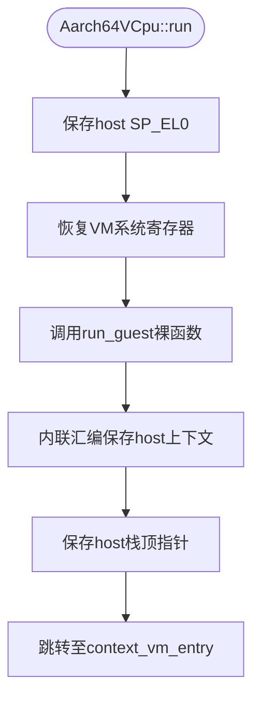
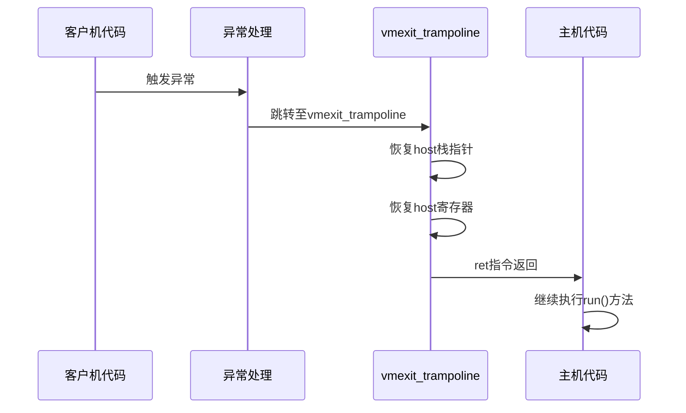

<cite>
**Referenced Files in This Document**
- [vcpu.rs](file://src/vcpu.rs)
- [exception.S](file://src/exception.S)
- [context_frame.rs](file://src/context_frame.rs)
- [pcpu.rs](file://src/pcpu.rs)
- [exception.rs](file://src/exception.rs)
- [exception_utils.rs](file://src/exception_utils.rs)
</cite>

# VM入口与出口流程

## 项目结构
本项目为Aarch64架构下的虚拟CPU（VCPU）实现，主要包含以下核心模块：
- `vcpu.rs`：VCPU核心控制流与运行逻辑
- `exception.S`：汇编级异常向量表与上下文切换
- `context_frame.rs`：寄存器上下文数据结构定义
- `pcpu.rs`：每CPU数据与硬件虚拟化使能
- `exception.rs`：异常处理逻辑分发
- `exception_utils.rs`：异常信息解析工具

## Aarch64VCpu::run()方法执行流程

`Aarch64VCpu::run()`方法是虚拟机执行的主控入口，其控制流完整实现了VM-Entry到VM-Exit的闭环管理。

**Section sources**
- [vcpu.rs](file://src/vcpu.rs#L100-L125)

### VM-Entry阶段

当调用`run()`方法时，首先通过`save_host_sp_el0()`保存当前主机上下文的SP_EL0寄存器值至per-CPU变量`HOST_SP_EL0`中。随后调用`restore_vm_system_regs()`恢复虚拟机所需的系统寄存器状态，最终触发裸函数`run_guest()`进入客户机执行模式。



**Diagram sources**
- [vcpu.rs](file://src/vcpu.rs#L100-L125)

### run_guest裸函数机制

`run_guest()`是一个使用`#[unsafe(naked)]`属性标记的裸函数，它通过内联汇编直接操作底层寄存器。该函数首先执行`save_regs_to_stack!()`宏，将x19-x30等callee-saved寄存器保存到栈上，然后获取当前栈指针sp并将其存储在`self.host_stack_top`字段中，为后续返回host上下文做准备。

**Section sources**
- [vcpu.rs](file://src/vcpu.rs#L130-L160)
- [exception_utils.rs](file://src/exception_utils.rs#L300-L310)

## HOST_SP_EL0 per-CPU变量作用机制

`HOST_SP_EL0`是一个使用`#[percpu::def_percpu]`定义的每CPU变量，用于在上下文切换时安全地保存和恢复SP_EL0寄存器。

### 保存机制
在VM-Entry前，`save_host_sp_el0()`函数通过`HOST_SP_EL0.write_current_raw(SP_EL0.get())`将当前SP_EL0值写入当前CPU实例的`HOST_SP_EL0`变量中。

### 恢复机制
在VM-Exit时，`restore_host_sp_el0()`函数通过`SP_EL0.set(unsafe { HOST_SP_EL0.read_current_raw() })`从per-CPU变量读取原始值并恢复到SP_EL0寄存器。

这种设计确保了即使在中断或异常发生时，也能正确维护每个CPU独立的栈指针状态。

**Section sources**
- [vcpu.rs](file://src/vcpu.rs#L13-L25)
- [vcpu.rs](file://src/vcpu.rs#L111)
- [vcpu.rs](file://src/vcpu.rs#L345)

## context_vm_entry汇编标签执行流程

`context_vm_entry`是定义在`exception.S`文件中的汇编标签，作为VM-Entry的最终跳转目标。

该标签接收来自`run_guest()`传递的`host_stack_top`地址（位于x0寄存器），将其加载到sp栈指针，并减去34*8字节偏移量，使sp指向`Aarch64VCpu.ctx`结构体的起始位置，即客户机的`TrapFrame`。

随后执行`.Lexception_return_el2`标签中的`RESTORE_REGS_INTO_EL1`宏，按特定顺序恢复客户机上下文寄存器，最后通过`eret`指令完成异常返回，正式进入客户机代码执行。


**Diagram sources**
- [exception.S](file://src/exception.S#L70-L85)

## vmexit_trampoline汇编跳板函数分析

`vmexit_trampoline`是处理VM-Exit的关键汇编跳板函数，其实现了从客户机异常返回到主机的平滑过渡。

### 执行流程
1. 首先将sp栈指针增加34*8字节，跳过已保存的客户机`TrapFrame`
2. 此时x9指向`Aarch64VCpu.host_stack_top`字段地址
3. 使用`ldr`指令加载原始host栈顶指针值
4. 将该值设置为当前sp栈指针
5. 调用`restore_regs_from_stack!()`宏恢复x19-x30寄存器
6. 最后通过`ret`指令返回，控制权交还给`run()`方法

该函数巧妙地利用了函数调用约定，在不破坏原有调用栈的情况下完成了上下文切换。



**Diagram sources**
- [exception.rs](file://src/exception.rs#L300-L310)
- [exception.S](file://src/exception.S#L50-L60)

## VM-Entry与VM-Exit闭环流程

整个虚拟机入口与出口流程形成了一个完整的闭环控制流：

```mermaid
graph TD
A[run()] --> B[save_host_sp_el0]
B --> C[restore_vm_system_regs]
C --> D[run_guest]
D --> E[save_regs_to_stack]
E --> F[保存host_stack_top]
F --> G[context_vm_entry]
G --> H[RESTORE_REGS_INTO_EL1]
H --> I[eret进入客户机]
I --> J{客户机执行}
J --> K[发生异常]
K --> L[SAVE_REGS_FROM_EL1]
L --> M[vmexit_trampoline]
M --> N[恢复host栈指针]
N --> O[restore_regs_from_stack]
O --> P[ret返回run]
P --> Q[vmexit_handler]
Q --> R[处理退出原因]
R --> S[返回结果]
```

**Diagram sources**
- [vcpu.rs](file://src/vcpu.rs#L100-L125)
- [exception.S](file://src/exception.S#L1-L140)
- [exception.rs](file://src/exception.rs#L1-L362)

## 寄存器保存/恢复顺序分析

### VM-Entry保存顺序
1. x29, x30 (帧指针和链接寄存器)
2. x27, x28
3. x25, x26
4. x23, x24
5. x21, x22
6. x19, x20

### VM-Exit恢复顺序
与保存顺序相反，遵循栈的LIFO原则：
1. x19, x20
2. x21, x22
3. x23, x24
4. x25, x26
5. x27, x28
6. x29, x30

客户机寄存器恢复则按照`RESTORE_REGS_INTO_EL1`宏定义的精确顺序进行。

**Section sources**
- [exception_utils.rs](file://src/exception_utils.rs#L300-L310)
- [exception.S](file://src/exception.S#L30-L60)

## 栈指针管理机制

系统采用双层栈管理策略：
- **Host栈**：由`host_stack_top`记录初始位置，用于保存host函数调用上下文
- **Guest栈**：通过`SP_EL0`寄存器管理，其值在`TrapFrame`中保存和恢复

在VM-Entry时，host栈被冻结；在VM-Exit时，通过`vmexit_trampoline`精确恢复host栈状态，确保调用链完整性。

**Section sources**
- [vcpu.rs](file://src/vcpu.rs#L13-L25)
- [exception.S](file://src/exception.S#L70-L85)