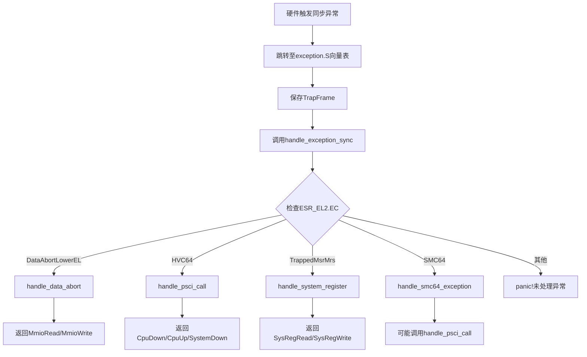
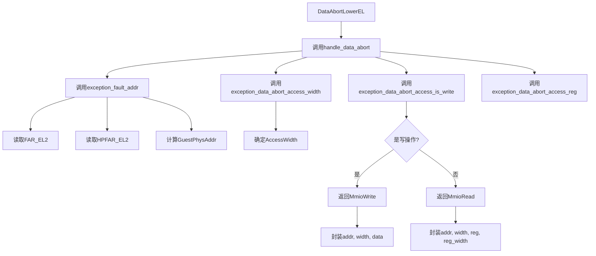
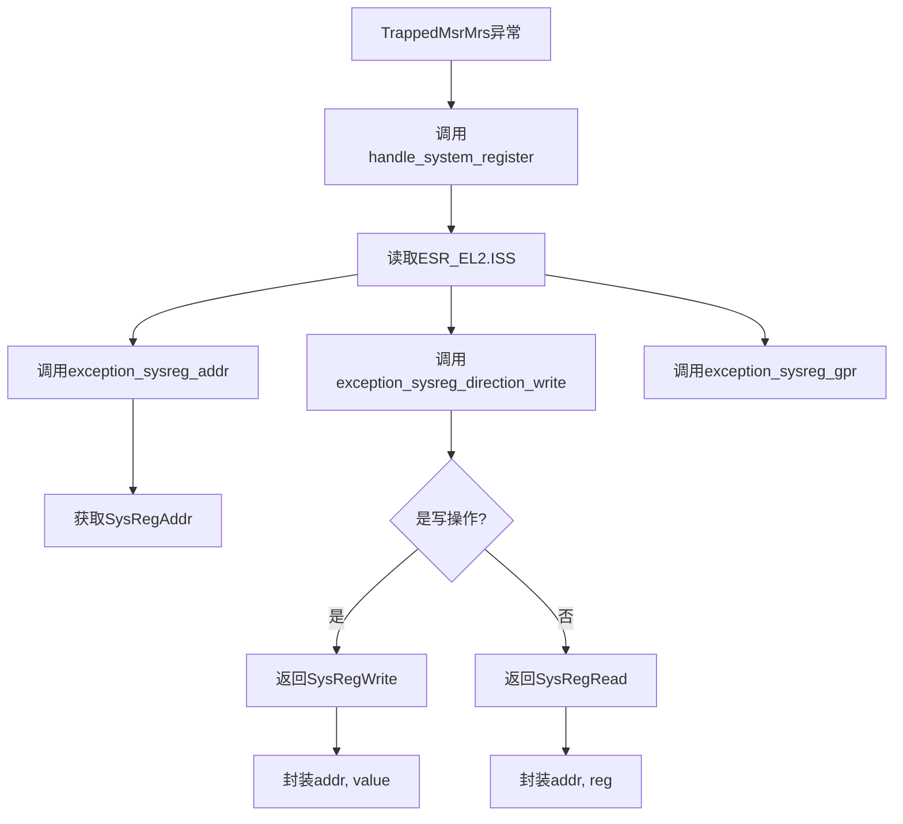

<cite>
**Referenced Files in This Document**   
- [exception.rs](file://src/exception.rs)
- [exception_utils.rs](file://src/exception_utils.rs)
- [smc.rs](file://src/smc.rs)
- [vcpu.rs](file://src/vcpu.rs)
- [context_frame.rs](file://src/context_frame.rs)
- [lib.rs](file://src/lib.rs)
</cite>

## 目录
1. [异常处理数据流](#异常处理数据流)
2. [核心组件分析](#核心组件分析)
3. [同步异常分发机制](#同步异常分发机制)
4. [数据中止异常处理流程](#数据中止异常处理流程)
5. [系统寄存器访问异常处理](#系统寄存器访问异常处理)
6. [PSCI调用识别与电源管理](#psci调用识别与电源管理)
7. [SMC安全监控调用处理](#smc安全监控调用处理)

## 异常处理数据流

本文档系统性地分析arm_vcpu中同步异常的数据处理流程。从硬件触发异常跳转至汇编层的向量表开始，描述了如何保存trap frame并调用Rust层的`handle_exception_sync`函数。深入解析了该函数根据ESR_EL2.EC值进行异常分类的逻辑，特别是对DataAbortLowerEL、HVC64、TrappedMsrMrs和SMC64等关键异常类型的分发机制。详细说明了exception_utils模块提供的各类辅助函数如何提取ISS信息并转化为AxVCpuExitReason。以数据中止为例，展示了fault address、访问宽度、读写方向等信息如何被提取并封装为MmioRead/MmioWrite退出原因。结合代码实例说明了PSCI调用识别逻辑及其在电源管理场景下的应用。

## 核心组件分析

该模块实现了ARM架构虚拟CPU的异常处理机制，主要包含异常向量表、异常处理函数、辅助工具函数和VM退出处理等核心组件。通过汇编与Rust语言的协同工作，实现了从硬件异常到虚拟机监控器的完整数据流处理。

**Section sources**
- [exception.rs](file://src/exception.rs#L1-L362)
- [exception_utils.rs](file://src/exception_utils.rs#L1-L310)
- [vcpu.rs](file://src/vcpu.rs#L1-L443)

## 同步异常分发机制



**Diagram sources**
- [exception.rs](file://src/exception.rs#L85-L175)

**Section sources**
- [exception.rs](file://src/exception.rs#L85-L175)

## 数据中止异常处理流程

当发生数据中止异常时，系统首先通过`exception_fault_addr`函数获取故障地址，该函数结合FAR_EL2和HPFAR_EL2寄存器的值来确定精确的物理地址。然后通过一系列`exception_data_abort_*`辅助函数提取访问特性，包括访问宽度、是否为写操作、涉及的寄存器等。这些信息被用于构造MmioRead或MmioWrite类型的AxVCpuExitReason，从而通知上层虚拟机监控器需要处理内存映射I/O访问。



**Diagram sources**
- [exception.rs](file://src/exception.rs#L177-L239)
- [exception_utils.rs](file://src/exception_utils.rs#L100-L150)

**Section sources**
- [exception.rs](file://src/exception.rs#L177-L239)
- [exception_utils.rs](file://src/exception_utils.rs#L100-L150)

## 系统寄存器访问异常处理

当访客尝试访问受控系统寄存器时，会触发TrappedMsrMrs类型的异常。处理函数`handle_system_register`通过解析ISS字段获取目标寄存器地址、方向（读/写）和关联的通用寄存器。这些信息被封装为SysRegRead或SysRegWrite类型的退出原因，允许虚拟机监控器模拟系统寄存器行为或执行特定操作。



**Diagram sources**
- [exception.rs](file://src/exception.rs#L241-L275)
- [exception_utils.rs](file://src/exception_utils.rs#L70-L90)

**Section sources**
- [exception.rs](file://src/exception.rs#L241-L275)
- [exception_utils.rs](file://src/exception_utils.rs#L70-L90)

## PSCI调用识别与电源管理

PSCI（Power State Coordination Interface）调用通过HVC或SMC指令实现。`handle_psci_call`函数检查x0寄存器中的函数号是否落在预定义的PSCI范围（0xC400_0000..=0xC400_001F）内。若匹配，则根据具体函数号返回相应的电源管理退出原因，如CpuDown、CpuUp或SystemDown，从而支持虚拟机的动态电源管理功能。

```mermaid
flowchart TD
A[HVC64或SMC64异常] --> B[调用handle_psci_call]
B --> C[读取ctx.gpr[0]]
C --> D{是否在PSCI_FN_RANGE_64?}
D --> |否| E[返回None]
D --> |是| F[计算fn_offset]
F --> G{fn_offset匹配?}
G --> |PSCI_FN_CPU_OFF| H[返回CpuDown]
G --> |PSCI_FN_CPU_ON| I[返回CpuUp]
G --> |PSCI_FN_SYSTEM_OFF| J[返回SystemDown]
G --> |其他| K[返回None]
H --> L[触发CPU下线]
I --> M[触发CPU上线]
J --> N[触发系统关机]
```

**Diagram sources**
- [exception.rs](file://src/exception.rs#L277-L325)

**Section sources**
- [exception.rs](file://src/exception.rs#L277-L325)

## SMC安全监控调用处理

SMC64异常的处理首先尝试将其识别为PSCI调用。如果不是PSCI调用，则通过`smc_call`内联汇编直接转发给ATF（Arm Trusted Firmware）。这种设计允许非PSCI的安全监控调用直接与底层可信固件交互，同时保持对电源管理功能的支持。

```mermaid
flowchart TD
A[SMC64异常] --> B[调用handle_smc64_exception]
B --> C[调用handle_psci_call]
C --> D{是PSCI调用?}
D --> |是| E[返回PSCI处理结果]
D --> |否| F[调用smc_call]
F --> G[执行SMC #0指令]
G --> H[获取返回值(x0-x3)]
H --> I[更新ctx.gpr[0-3]]
I --> J[返回Nothing]
```

**Diagram sources**
- [exception.rs](file://src/exception.rs#L327-L350)
- [smc.rs](file://src/smc.rs#L1-L26)

**Section sources**
- [exception.rs](file://src/exception.rs#L327-L350)
- [smc.rs](file://src/smc.rs#L1-L26)