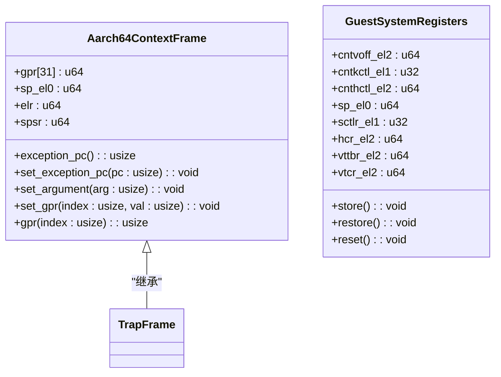
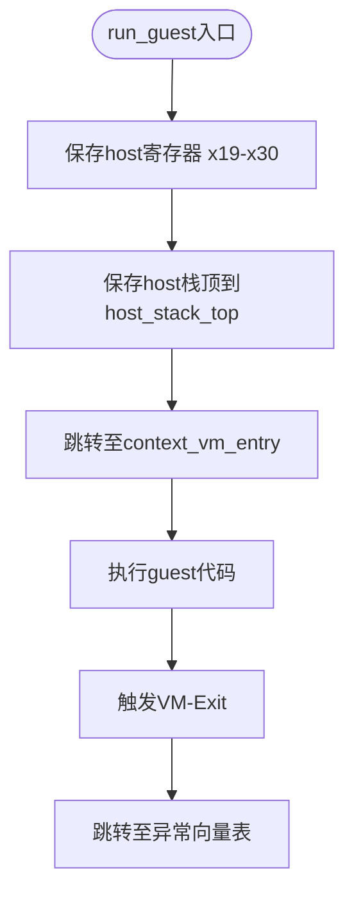
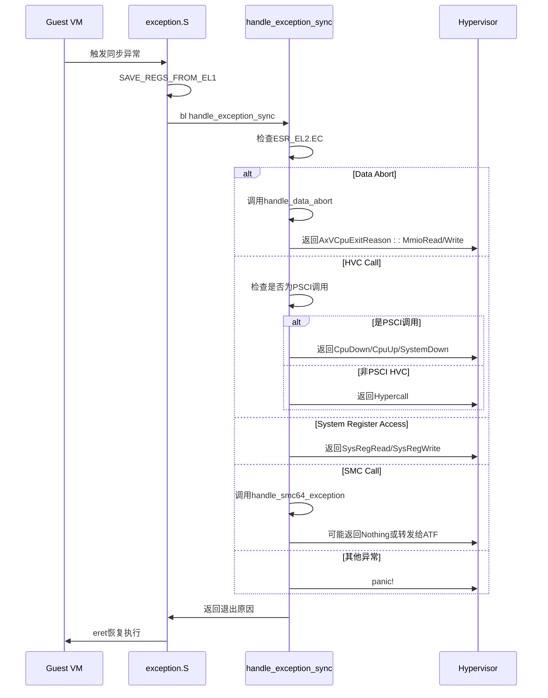
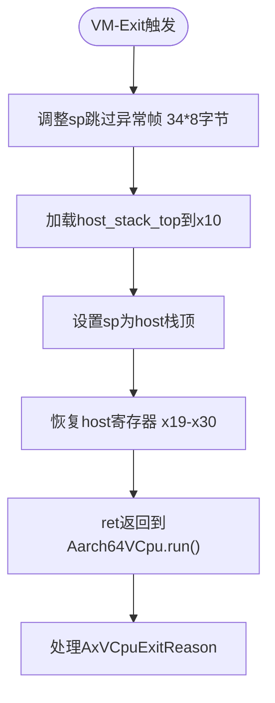
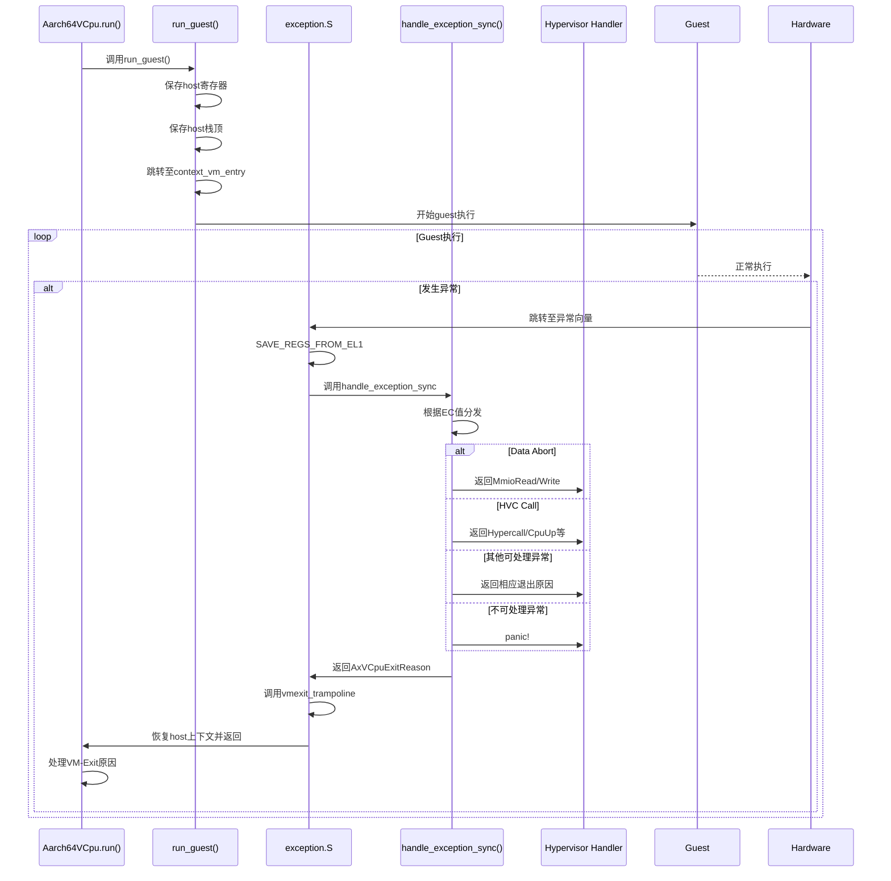

<cite>
**本文档中引用的文件**
- [vcpu.rs](file://src/vcpu.rs)
- [exception.rs](file://src/exception.rs)
- [context_frame.rs](file://src/context_frame.rs)
- [exception.S](file://src/exception.S)
</cite>

## 目录
1. [数据流与控制流概述](#数据流与控制流概述)
2. [关键数据结构分析](#关键数据结构分析)
3. [guest执行与VM-Exit生命周期](#guest执行与vm-exit生命周期)
4. [异常处理流程](#异常处理流程)
5. [上下文切换机制](#上下文切换机制)
6. [控制流转序列图](#控制流转序列图)

## 数据流与控制流概述

本节深入分析arm_vcpu中的关键数据流与控制流路径，重点描述从guest执行触发VM-Exit到hypervisor处理的完整生命周期。系统通过精心设计的汇编代码与Rust层协同工作，实现了高效的虚拟化上下文切换机制。

**Section sources**
- [vcpu.rs](file://src/vcpu.rs#L0-L444)
- [exception.rs](file://src/exception.rs#L0-L363)

## 关键数据结构分析

### TrapFrame与上下文管理

`Aarch64ContextFrame`结构体定义了AArch64架构下的CPU上下文帧，包含通用寄存器、EL0栈指针、异常链接寄存器和保存的程序状态寄存器。该结构采用C兼容内存布局，确保与硬件交互的正确性。

`GuestSystemRegisters`结构体管理虚拟机的系统寄存器状态，包括定时器、系统控制、异常和虚拟化特定寄存器。其16字节对齐保证了高效访问。

**Diagram sources**
- [context_frame.rs](file://src/context_frame.rs#L15-L302)

**Section sources**
- [context_frame.rs](file://src/context_frame.rs#L15-L302)

## guest执行与VM-Exit生命周期

### run_guest裸函数分析

`run_guest`是一个naked extern "C"函数，负责保存host上下文并切换至guest执行。该函数通过内联汇编实现，避免了编译器优化可能带来的问题。

函数首先使用`save_regs_to_stack!()`宏保存host的调用者保存寄存器（x19-x30），然后将当前host栈顶保存到`Aarch64VCpu.host_stack_top`字段，最后跳转至`context_vm_entry`标签处开始guest执行。

**Diagram sources**
- [vcpu.rs](file://src/vcpu.rs#L287-L307)

**Section sources**
- [vcpu.rs](file://src/vcpu.rs#L287-L307)
- [exception.S](file://src/exception.S#L100-L120)

## 异常处理流程

### 异常分发机制

当guest执行触发异常时，硬件跳转至汇编向量表，根据异常类型调用相应的处理程序。对于同步异常，最终会调用Rust层的`handle_exception_sync`函数进行处理。

`handle_exception_sync`函数根据ESR_EL2寄存器中的异常类（EC）值进行分发：
- **DataAbortLowerEL**: 调用`handle_data_abort`处理数据中止异常
- **HVC64**: 处理超调用，支持PSCI电源管理接口
- **TrappedMsrMrs**: 处理系统寄存器访问异常
- **SMC64**: 处理安全监控调用

**Diagram sources**
- [exception.rs](file://src/exception.rs#L45-L140)
- [exception.S](file://src/exception.S#L80-L90)

**Section sources**
- [exception.rs](file://src/exception.rs#L45-L140)

## 上下文切换机制

### vmexit_trampoline恢复流程

`vmexit_trampoline`是处理VM-Exit后恢复host上下文的关键函数。当VM-Exit发生时，控制流通过此函数恢复host栈指针和寄存器。

该函数首先调整栈指针跳过异常帧（增加34*8字节），使其指向`Aarch64VCpu.host_stack_top`，然后加载该值并设置为当前栈指针。最后通过`restore_regs_from_stack!()`宏恢复host的调用者保存寄存器，并通过`ret`指令返回到`Aarch64VCpu.run()`方法。

**Diagram sources**
- [exception.rs](file://src/exception.rs#L300-L320)
- [vcpu.rs](file://src/vcpu.rs#L200-L220)

**Section sources**
- [exception.rs](file://src/exception.rs#L300-L320)

## 控制流转序列图

以下序列图完整展示了从`run()`方法调用到VM-Exit处理的整个控制流：

**Diagram sources**
- [vcpu.rs](file://src/vcpu.rs#L200-L250)
- [exception.rs](file://src/exception.rs#L45-L140)
- [exception.S](file://src/exception.S#L0-L140)