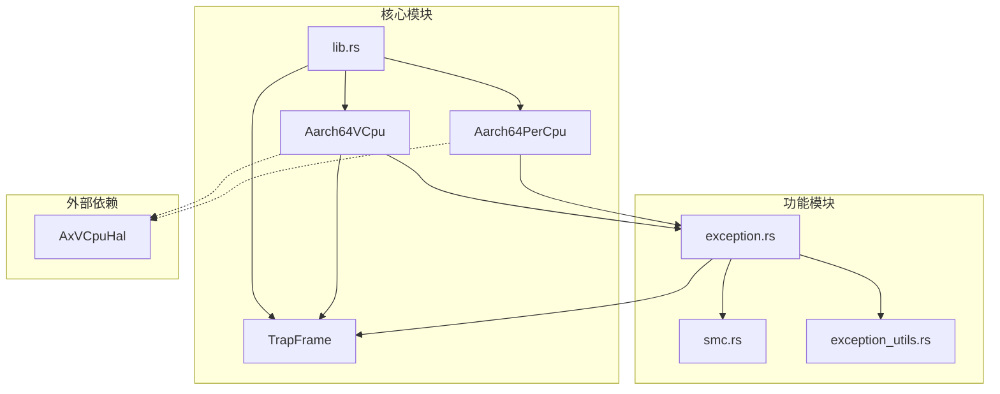
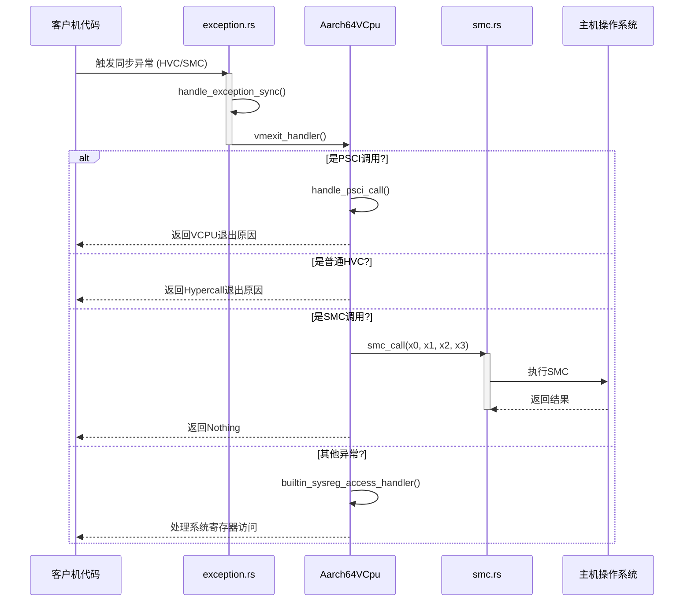
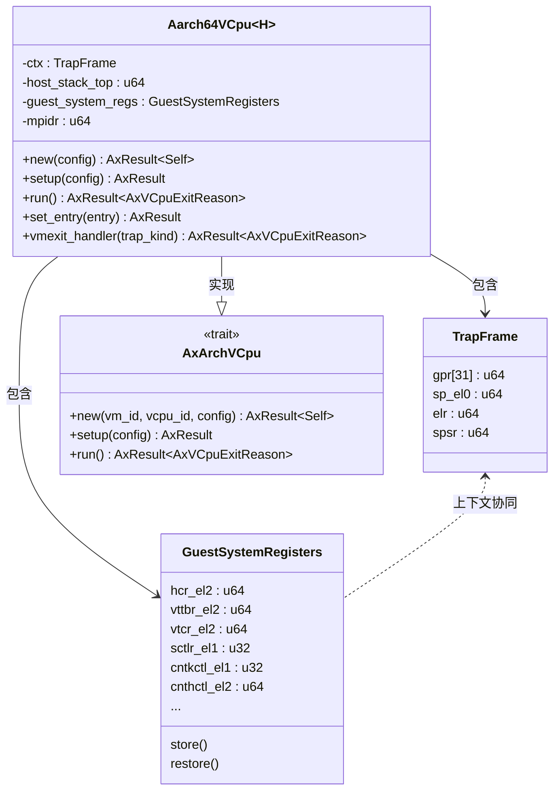
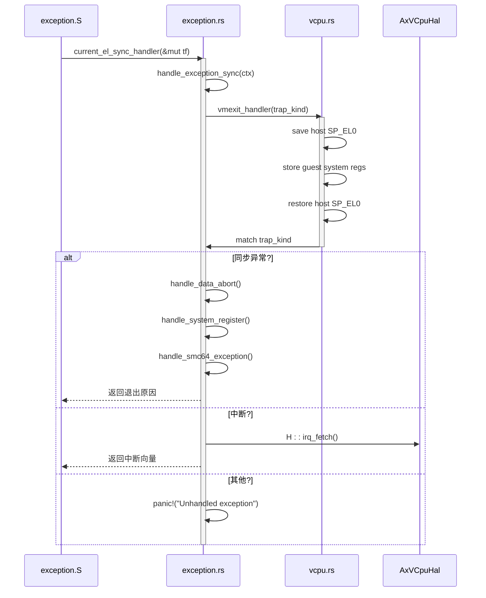
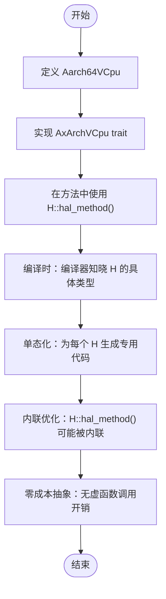
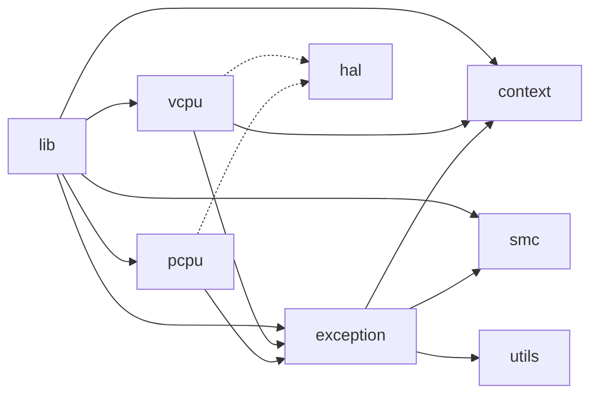

# 架构设计

<cite>
**本文档中引用的文件**  
- [lib.rs](file://src/lib.rs)
- [vcpu.rs](file://src/vcpu.rs)
- [context_frame.rs](file://src/context_frame.rs)
- [exception.rs](file://src/exception.rs)
- [smc.rs](file://src/smc.rs)
- [pcpu.rs](file://src/pcpu.rs)
- [exception_utils.rs](file://src/exception_utils.rs)
</cite>

## 目录
1. [引言](#引言)
2. [项目结构](#项目结构)
3. [核心组件](#核心组件)
4. [架构概览](#架构概览)
5. [详细组件分析](#详细组件分析)
6. [依赖关系分析](#依赖关系分析)
7. [性能考量](#性能考量)
8. [权衡与扩展方向](#权衡与扩展方向)
9. [结论](#结论)

## 引言
本设计文档旨在深入解析 `arm_vcpu` 模块的架构设计，重点阐述其高内聚、低耦合的模块化原则。文档将详细说明 AArch64 虚拟 CPU（VCPU）如何通过 TrapFrame 保存和恢复上下文，并展示异常处理机制如何协调不同模块来应对各类异常事件。同时，本文还将探讨静态分发与泛型硬件抽象层（HAL）的设计优势，解释裸函数在异常向量处理中的必要性，以及零成本抽象如何保证系统性能。

## 项目结构
`arm_vcpu` 项目采用清晰的模块化结构，每个源文件负责特定的功能域，体现了高内聚的设计思想。核心功能被划分为上下文管理、异常处理、安全监控调用（SMC）和虚拟CPU逻辑等独立模块。

**图示来源**
- [lib.rs](file://src/lib.rs#L1-L31)
- [vcpu.rs](file://src/vcpu.rs#L1-L444)
- [context_frame.rs](file://src/context_frame.rs#L1-L303)
- [exception.rs](file://src/exception.rs#L1-L363)
- [smc.rs](file://src/smc.rs#L1-L27)
- [pcpu.rs](file://src/pcpu.rs#L1-L92)

**本节来源**
- [lib.rs](file://src/lib.rs#L1-L31)
- [vcpu.rs](file://src/vcpu.rs#L1-L444)

## 核心组件
`arm_vcpu` 的核心由 `Aarch64VCpu` 结构体构成，它实现了 `AxArchVCpu` trait，是虚拟CPU的主要载体。该结构体通过 `TrapFrame` 类型别名（指向 `Aarch64ContextFrame`）来保存和恢复客户机的通用寄存器、栈指针和程序状态。`Aarch64PerCpu` 则用于管理每个物理CPU的核心状态，包括中断处理和异常向量的设置。

**本节来源**
- [lib.rs](file://src/lib.rs#L1-L31)
- [vcpu.rs](file://src/vcpu.rs#L1-L444)
- [pcpu.rs](file://src/pcpu.rs#L1-L92)

## 架构概览
整个 `arm_vcpu` 系统围绕着虚拟化异常（VM-Exit）和返回（VM-Enter）的生命周期构建。当客户机执行触发异常时，控制流会跳转到由 `pcpu.rs` 设置的异常向量表，最终进入 `exception.rs` 中定义的处理函数。这些处理函数利用 `context_frame.rs` 提供的 `GuestSystemRegisters` 来保存和恢复客户机的系统寄存器状态。

**图示来源**
- [vcpu.rs](file://src/vcpu.rs#L1-L444)
- [exception.rs](file://src/exception.rs#L1-L363)
- [smc.rs](file://src/smc.rs#L1-L27)

## 详细组件分析

### Aarch64VCpu 分析
`Aarch64VCpu` 是虚拟CPU的运行时实例，封装了所有与客户机状态相关的数据。其内部包含一个 `ctx: TrapFrame` 字段，用于保存客户机的通用寄存器上下文，以及 `guest_system_regs: GuestSystemRegisters` 字段，用于管理客户机的系统寄存器。

#### 对象导向组件

**图示来源**
- [vcpu.rs](file://src/vcpu.rs#L1-L444)
- [context_frame.rs](file://src/context_frame.rs#L1-L303)

**本节来源**
- [vcpu.rs](file://src/vcpu.rs#L1-L444)
- [context_frame.rs](file://src/context_frame.rs#L1-L303)

### 异常处理流程分析
异常处理是 `arm_vcpu` 的核心机制，它决定了虚拟机如何响应各种事件。从底层汇编代码到Rust处理函数，整个流程设计精巧。

#### API/服务组件

**图示来源**
- [exception.rs](file://src/exception.rs#L1-L363)
- [vcpu.rs](file://src/vcpu.rs#L1-L444)

**本节来源**
- [exception.rs](file://src/exception.rs#L1-L363)
- [vcpu.rs](file://src/vcpu.rs#L1-L444)

### 静态分发与泛型HAL分析
`Aarch64VCpu` 和 `Aarch64PerCpu` 均使用泛型参数 `H: AxVCpuHal`，这使得硬件抽象层（HAL）的实现可以在编译时确定。这种设计避免了动态分发的开销，实现了零成本抽象。

#### 复杂逻辑组件

**图示来源**
- [vcpu.rs](file://src/vcpu.rs#L1-L444)
- [pcpu.rs](file://src/pcpu.rs#L1-L92)

**本节来源**
- [vcpu.rs](file://src/vcpu.rs#L1-L444)
- [pcpu.rs](file://src/pcpu.rs#L1-L92)

## 依赖关系分析
各模块之间通过明确定义的接口进行交互，确保了低耦合。`vcpu.rs` 依赖于 `context_frame.rs` 提供的上下文结构，而 `exception.rs` 则作为中间协调者，调用 `vcpu.rs` 的处理逻辑和 `smc.rs` 的底层调用。

**图示来源**
- [lib.rs](file://src/lib.rs#L1-L31)
- [vcpu.rs](file://src/vcpu.rs#L1-L444)
- [exception.rs](file://src/exception.rs#L1-L363)
- [smc.rs](file://src/smc.rs#L1-L27)

**本节来源**
- [lib.rs](file://src/lib.rs#L1-L31)
- [vcpu.rs](file://src/vcpu.rs#L1-L444)
- [exception.rs](file://src/exception.rs#L1-L363)
- [smc.rs](file://src/smc.rs#L1-L27)

## 性能考量
`arm_vcpu` 的设计在性能方面进行了深度优化。首先，裸函数 (`#[unsafe(naked)]`) 的使用确保了 `run_guest` 函数不会产生任何不必要的函数序言和尾声，直接跳转到汇编入口点 `context_vm_entry`，最大限度地减少了上下文切换的开销。其次，通过 `save_regs_to_stack!` 和 `restore_regs_from_stack!` 宏精确控制需要保存的寄存器，避免了对所有寄存器的全量保存，提升了效率。最后，泛型HAL结合静态分发，使得所有硬件相关的调用都可以在编译时解析并内联，消除了运行时多态的性能惩罚，真正实现了“零成本抽象”。

在资源管理方面，由于项目使用 `#![no_std]`，它不依赖标准库的堆分配。所有的状态都存储在 `Aarch64VCpu` 和 `Aarch64PerCpu` 的结构体内，内存布局明确且可预测。这不仅减少了内存碎片的风险，也使得系统更适合在资源受限的嵌入式或固件环境中运行。

## 权衡与扩展方向
当前设计的一个主要权衡在于对裸函数和内联汇编的高度依赖。虽然这带来了极致的性能，但也显著增加了代码的复杂性和维护难度。开发者必须对AArch64的调用约定和寄存器使用有深刻理解，任何错误都可能导致难以调试的系统崩溃。

另一个权衡体现在异常处理的完整性上。目前的实现对于未处理的异常会直接 `panic!`，这在生产级hypervisor中可能过于激进。更稳健的设计可能会引入更精细的错误恢复机制或日志记录。

潜在的扩展方向包括：
1.  **增强的PSCI支持**：当前仅处理了部分PSCI调用，可以扩展以支持完整的PSCI功能集。
2.  **虚拟中断控制器集成**：`pcpu.rs` 中注释提到了虚拟GIC，未来可以在此基础上实现完整的虚拟中断注入和管理。
3.  **性能剖析钩子**：可以在关键路径（如 `run` 和 `vmexit_handler`）中添加可选的性能计数器，便于系统调优。
4.  **配置灵活性**：将一些硬编码的寄存器值（如 `sctlr_el1`）改为可配置项，以适应更多样的客户机环境。

## 结论
`arm_vcpu` 展现了一个精心设计的、面向高性能的虚拟CPU实现。其模块化架构通过 `TrapFrame` 和 `GuestSystemRegisters` 清晰地分离了上下文管理职责，并通过 `exception.rs` 作为中枢协调各类异常。静态分发和泛型HAL的应用完美诠释了Rust的零成本抽象理念，在保证类型安全的同时达到了接近手写汇编的性能。尽管裸函数的使用提高了复杂性，但这是为了追求极致性能所做出的合理取舍。总体而言，该设计为构建一个轻量级、高效的Rust版ARM虚拟化层奠定了坚实的基础。