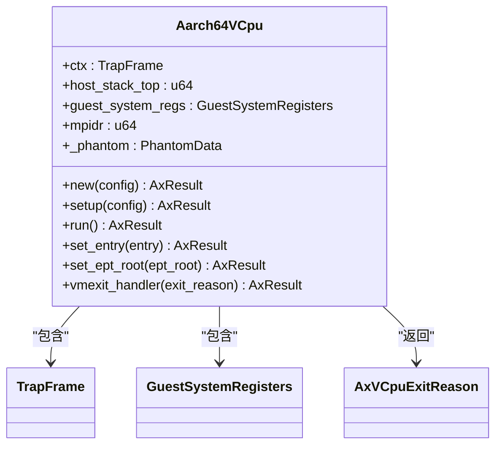
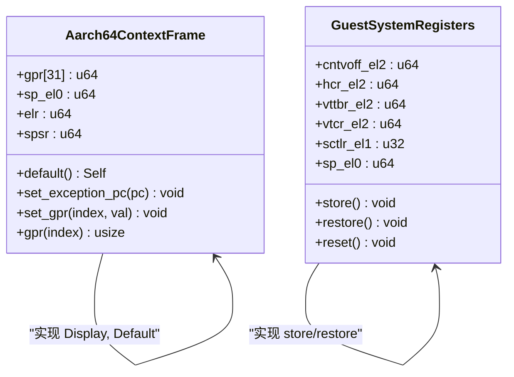
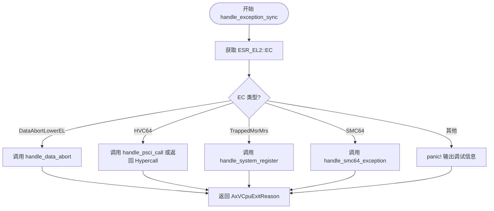
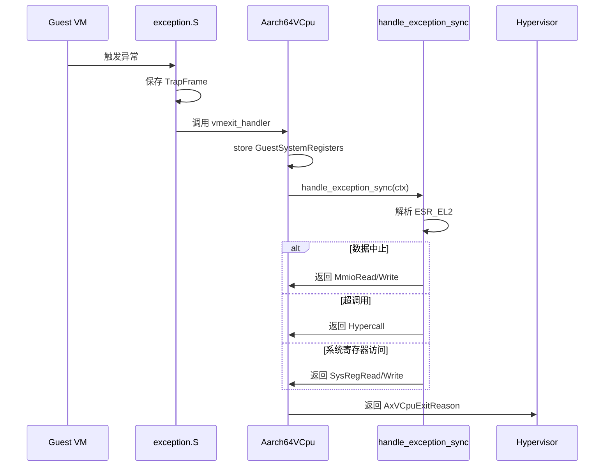

# 模块职责划分

<cite>
**本文档引用的文件**  
- [vcpu.rs](file://src/vcpu.rs)
- [context_frame.rs](file://src/context_frame.rs)
- [exception.rs](file://src/exception.rs)
- [exception_utils.rs](file://src/exception_utils.rs)
- [lib.rs](file://src/lib.rs)
</cite>

## 目录
1. [引言](#引言)
2. [核心模块概述](#核心模块概述)
3. [Aarch64VCpu 核心控制单元](#aarch64vcpu-核心控制单元)
4. [TrapFrame 与 GuestSystemRegisters 上下文管理](#trapframe-与-guestsystemregisters-上下文管理)
5. [异常处理模块设计](#异常处理模块设计)
6. [模块间协作关系](#模块间协作关系)
7. [数据传递机制](#数据传递机制)
8. [解耦设计分析](#解耦设计分析)

## 引言
本文档详细描述了 `arm_vcpu` 项目中各核心模块的职责划分，重点阐述 `Aarch64VCpu`、`TrapFrame`、`GuestSystemRegisters` 和异常处理模块之间的协作机制。通过分析代码结构和执行流程，揭示虚拟 CPU 在 AArch64 架构下的上下文保存与恢复、异常分发及系统寄存器管理的核心实现原理。

## 核心模块概述
`arm_vcpu` 项目实现了 AArch64 架构下的虚拟 CPU（vCPU）功能，主要包含以下核心模块：
- **Aarch64VCpu**：作为 vCPU 的核心控制单元，负责协调整个虚拟化环境的运行。
- **TrapFrame**：定义通用寄存器和程序状态的快照结构，用于保存和恢复 guest 的执行上下文。
- **GuestSystemRegisters**：封装 EL1/EL2 级别的系统寄存器，支持完整的状态快照与恢复。
- **exception.rs**：解析 ESR_EL2 并路由同步/异步异常，实现异常分发机制。
- **exception_utils.rs**：提供底层寄存器访问和地址转换工具函数。

这些模块共同构成了一个高效、安全的虚拟化执行环境。

**Section sources**
- [lib.rs](file://src/lib.rs#L0-L30)

## Aarch64VCpu 核心控制单元
`Aarch64VCpu` 是虚拟 CPU 的主控结构体，承担着协调上下文切换、异常处理和生命周期管理的核心职责。它通过聚合 `TrapFrame` 和 `GuestSystemRegisters` 实现对 guest 状态的全面掌控。

该模块实现了 `AxArchVCpu` trait，提供了创建、配置、运行和销毁 vCPU 的完整接口。其核心方法包括：
- `new()`：根据配置初始化新的 vCPU 实例。
- `setup()`：设置虚拟化环境参数，如中断透传和定时器行为。
- `run()`：启动 guest 执行，并在 VM Exit 后调用 `vmexit_handler` 处理退出原因。
- `set_entry()`：设置 guest 的入口地址。
- `set_ept_root()`：配置扩展页表（EPT）根地址。

`run_guest()` 方法使用裸函数（naked function）直接操作汇编代码，确保在不破坏栈帧的情况下安全地切换到 guest 上下文。



**Diagram sources**
- [vcpu.rs](file://src/vcpu.rs#L40-L76)
- [vcpu.rs](file://src/vcpu.rs#L74-L115)

**Section sources**
- [vcpu.rs](file://src/vcpu.rs#L40-L115)

## TrapFrame 与 GuestSystemRegisters 上下文管理
`context_frame.rs` 文件定义了两个关键的数据结构：`Aarch64ContextFrame`（别名为 `TrapFrame`）和 `GuestSystemRegisters`，它们分别负责用户级和系统级上下文的保存与恢复。

### TrapFrame 结构
`TrapFrame` 采用 C 兼容内存布局（`#[repr(C)]`），包含以下字段：
- `gpr[31]`：通用寄存器组 x0-x30
- `sp_el0`：EL0 栈指针
- `elr`：异常链接寄存器（返回地址）
- `spsr`：保存的程序状态寄存器

该结构支持默认初始化、寄存器读写和异常 PC 设置等操作，为异常处理提供基础支持。

### GuestSystemRegisters 结构
`GuestSystemRegisters` 封装了大量 EL1/EL2 系统寄存器，包括：
- 定时器相关：`cntvoff_el2`, `cntkctl_el1`
- 虚拟化控制：`hcr_el2`, `vttbr_el2`, `vtcr_el2`
- 内存管理：`sctlr_el1`, `ttbr0_el1`, `tcr_el1`
- 异常处理：`esr_el1`, `far_el1`, `vbar_el1`

该结构通过 `store()` 和 `restore()` 方法利用内联汇编实现所有相关寄存器的批量读取和写入，确保上下文切换的原子性和效率。



**Diagram sources**
- [context_frame.rs](file://src/context_frame.rs#L10-L45)
- [context_frame.rs](file://src/context_frame.rs#L108-L147)

**Section sources**
- [context_frame.rs](file://src/context_frame.rs#L10-L147)

## 异常处理模块设计
`exception.rs` 模块负责解析和处理来自 guest 的各种异常，是虚拟化环境中最关键的安全屏障之一。其核心功能由 `handle_exception_sync` 函数实现，该函数根据 ESR_EL2 中的异常类别（EC）进行分发处理。

### 异常类型识别
通过 `exception_class()` 函数提取 ESR_EL2 的 EC 字段，判断异常类型：
- `DataAbortLowerEL`：数据中止异常，通常由 MMIO 访问触发
- `HVC64`：超调用（Hypercall），用于 HVC 指令处理
- `TrappedMsrMrs`：被截获的 MSR/MRS 指令，涉及系统寄存器访问
- `SMC64`：安全监控调用，用于 SMC 指令处理

### 异常路由逻辑
不同类型的异常被路由至相应的处理函数：
- `handle_data_abort()`：处理内存访问异常，返回 `MmioRead` 或 `MmioWrite` 退出原因
- `handle_system_register()`：处理系统寄存器访问，返回 `SysRegRead` 或 `SysRegWrite`
- `handle_psci_call()`：处理 PSCI 电源管理调用
- `handle_smc64_exception()`：转发 SMC 调用至 ATF（ARM Trusted Firmware）

对于未处理的异常，系统将 panic 并输出详细的调试信息，包括 IPA、PC、ESR 等关键寄存器值。



**Diagram sources**
- [exception.rs](file://src/exception.rs#L39-L75)
- [exception.rs](file://src/exception.rs#L74-L99)

**Section sources**
- [exception.rs](file://src/exception.rs#L39-L132)

## 模块间协作关系
各模块通过清晰的抽象边界和标准化接口实现高效协作，形成层次分明的虚拟化执行框架。

### 控制流协作
当 guest 触发异常时，控制流按以下顺序流转：
1. 硬件陷入 EL2，跳转至汇编层 `exception.S`
2. `exception.S` 保存 guest 寄存器到 `TrapFrame`
3. 调用 `current_el_sync_handler` 进入 Rust 层
4. `vmexit_handler` 调用 `handle_exception_sync(&mut self.ctx)`
5. 根据 ESR_EL2 分发至具体处理函数
6. 返回 `AxVCpuExitReason` 给 hypervisor 处理

### 数据流协作
- `Aarch64VCpu` 在 `run()` 前调用 `restore_vm_system_regs()` 恢复 `GuestSystemRegisters`
- 发生 VM Exit 时，`vmexit_handler` 调用 `guest_system_regs.store()` 保存当前状态
- `handle_exception_sync` 接收 `&mut TrapFrame` 引用，直接操作 guest 的通用寄存器
- 特定异常处理完成后，返回 `AxVCpuExitReason` 通知上层 hypervisor

这种设计避免了不必要的数据拷贝，提升了性能。



**Diagram sources**
- [vcpu.rs](file://src/vcpu.rs#L314-L352)
- [exception.rs](file://src/exception.rs#L39-L75)

**Section sources**
- [vcpu.rs](file://src/vcpu.rs#L314-L352)
- [exception.rs](file://src/exception.rs#L39-L75)

## 数据传递机制
模块间通过引用传递和枚举返回值实现高效、类型安全的数据交互。

### TrapFrame 引用传递
`handle_exception_sync` 接收 `&mut TrapFrame` 参数，允许直接修改 guest 的寄存器状态：
```rust
pub fn handle_exception_sync(ctx: &mut TrapFrame) -> AxResult<AxVCpuExitReason>
```
这种方式避免了深拷贝开销，同时保证了对 guest 上下文的精确控制。

### AxVCpuExitReason 枚举返回
所有异常处理最终都返回 `AxVCpuExitReason` 枚举，通知 hypervisor 下一步动作：
- `MmioRead` / `MmioWrite`：需要模拟 MMIO 访问
- `Hypercall`：需要处理超调用
- `SysRegRead` / `SysRegWrite`：需要处理系统寄存器访问
- `ExternalInterrupt`：外部中断到达
- `SendIPI`：需要发送核间中断

`Aarch64VCpu` 的 `builtin_sysreg_access_handler` 还能拦截特定系统寄存器（如 ICC_SGI1R_EL1）并直接生成对应的退出原因，减少 hypervisor 干预。

**Section sources**
- [exception.rs](file://src/exception.rs#L64-L73)
- [vcpu.rs](file://src/vcpu.rs#L350-L390)

## 解耦设计分析
各模块通过明确的职责划分和接口定义实现了高度解耦，有利于维护和扩展。

### 抽象边界
- `TrapFrame` 仅关注通用寄存器和基本程序状态，不涉及系统寄存器细节
- `GuestSystemRegisters` 封装所有系统寄存器操作，对外提供统一的 `store`/`restore` 接口
- `exception.rs` 专注于异常解析和分类，不直接处理硬件模拟
- `Aarch64VCpu` 作为协调者，组合上述组件完成整体控制流

### 可扩展性
- 新增异常类型只需在 `handle_exception_sync` 中添加匹配分支
- 新增系统寄存器支持只需扩展 `GuestSystemRegisters` 结构并更新 `store`/`restore`
- 不同架构可通过实现 `AxArchVCpu` trait 进行适配

这种分层设计使得每个模块都能独立演化，降低了整体复杂度。

**Section sources**
- [vcpu.rs](file://src/vcpu.rs#L388-L422)
- [context_frame.rs](file://src/context_frame.rs#L200-L302)