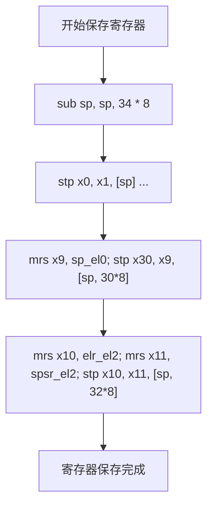
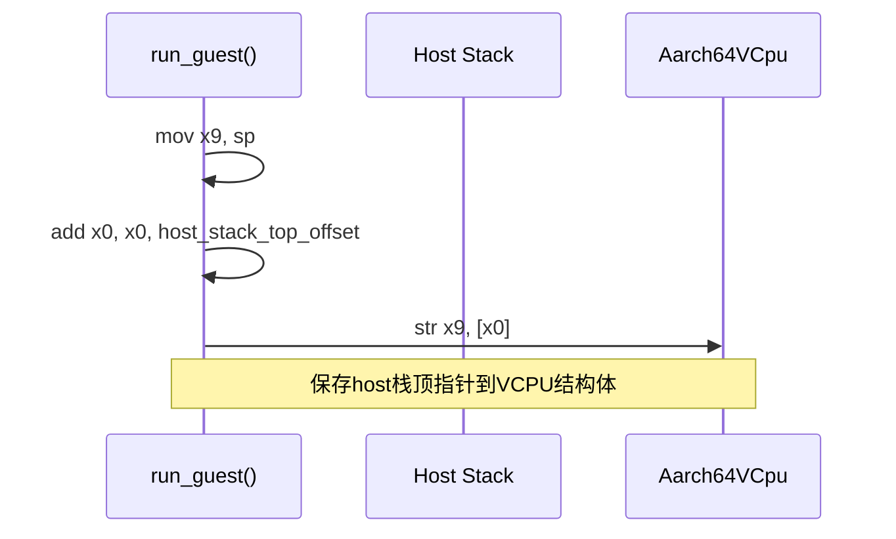
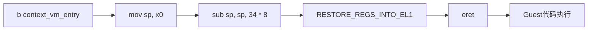
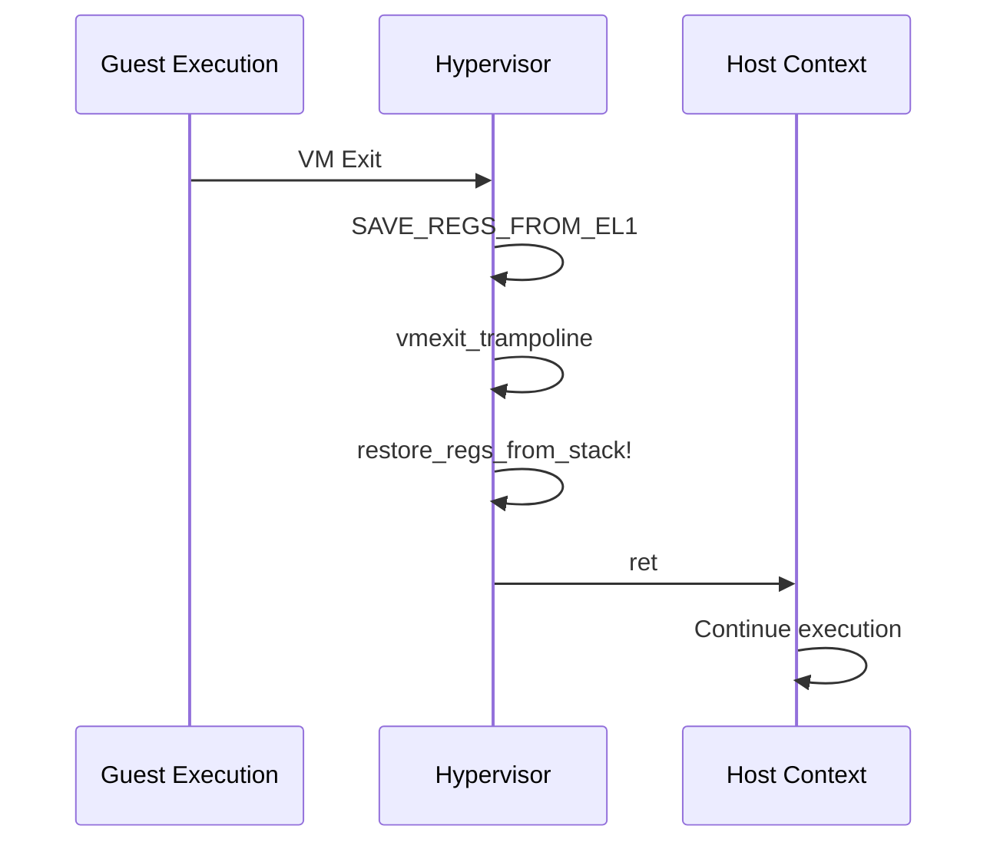

<cite>
**Referenced Files in This Document**
- [vcpu.rs](file://src/vcpu.rs)
- [context_frame.rs](file://src/context_frame.rs)
- [exception.rs](file://src/exception.rs)
- [exception.S](file://src/exception.S)
</cite>

## 目录
1. [裸函数与底层控制](#裸函数与底层控制)
2. [run_guest中的寄存器保存机制](#run_guest中的寄存器保存机制)
3. [host_stack_top的保存过程](#host_stack_top的保存过程)
4. [context_vm_entry跳转后的控制流恢复](#context_vm_entry跳转后的控制流恢复)
5. [vmexit_trampoline中的栈偏移计算](#vmexit_trampoline中的栈偏移计算)
6. [从guest到host的上下文切换](#从guest到host的上下文切换)

## 裸函数与底层控制

本文档深入解析ARM架构下虚拟化环境中`run_guest`裸函数的内联汇编指令作用，重点分析`save_regs_to_stack!`宏如何保存callee-saved寄存器、`mov x9, sp`与`str x9, [x0]`如何协作保存host栈顶指针，以及`b context_vm_entry`跳转后的控制流恢复机制。同时解释`vmexit_trampoline`中`add x9, sp, 34 * 8`为何需要偏移34个寄存器宽度，并说明`restore_regs_from_stack!`与`ret`指令如何协同完成从guest到host的上下文切换。

**Section sources**
- [vcpu.rs](file://src/vcpu.rs#L1-L444)
- [context_frame.rs](file://src/context_frame.rs#L1-L303)
- [exception.rs](file://src/exception.rs#L1-L363)
- [exception.S](file://src/exception.S#L1-L141)

## run_guest中的寄存器保存机制

在`run_guest`裸函数中，`save_regs_to_stack!`宏负责保存主机侧的callee-saved寄存器（x19-x30）。该宏通过调用汇编宏`SAVE_REGS_FROM_EL1`实现寄存器保存功能。当发生VM退出时，异常向量会执行`SAVE_REGS_FROM_EL1`宏，将当前寄存器状态保存到`Aarch64VCpu.ctx`结构体中。

该宏首先将栈指针向下移动34×8字节，为保存寄存器腾出空间。然后使用一系列`stp`指令将x0-x29寄存器对依次存储到栈上。特别地，x30（链接寄存器）和sp_el0被作为一个对存储在偏移量30×8处。最后，elr_el2和spsr_el2也被保存在偏移量32×8处。

这种设计确保了在进入guest执行前，主机的关键寄存器状态能够被完整保存，以便在VM退出后正确恢复执行环境。



**Diagram sources**
- [exception.S](file://src/exception.S#L1-L35)

**Section sources**
- [exception.S](file://src/exception.S#L1-L35)

## host_stack_top的保存过程

`mov x9, sp`与`str x9, [x0]`指令协同工作以保存host栈顶指针。在`run_guest`函数中，根据AAPCS64调用约定，参数`self`指针位于x0寄存器。首先执行`mov x9, sp`将当前主机栈顶指针保存到x9寄存器。

随后执行`add x0, x0, {host_stack_top_offset}`计算`host_stack_top`字段的地址，其中`host_stack_top_offset`等于`TrapFrame`结构体的大小。最后通过`str x9, [x0]`指令将x9中的栈顶指针值存储到`Aarch64VCpu.host_stack_top`字段中。

这一过程的关键在于精确计算`host_stack_top`在`Aarch64VCpu`结构体中的偏移量，确保主机栈顶指针能够被正确记录，为后续的上下文恢复提供基础。



**Diagram sources**
- [vcpu.rs](file://src/vcpu.rs#L200-L210)

**Section sources**
- [vcpu.rs](file://src/vcpu.rs#L200-L210)

## context_vm_entry跳转后的控制流恢复

`b context_vm_entry`指令跳转到`context_vm_entry`标签处，启动guest上下文恢复流程。该标签定义在`exception.S`文件中，首先将x0寄存器（指向`host_stack_top`）的值加载到栈指针sp中。

接着执行`sub sp, sp, 34 * 8`调整栈指针，使其指向`Aarch64VCpu.ctx`的基地址。此时栈布局与保存时一致，为后续的寄存器恢复做好准备。最后跳转到`.Lexception_return_el2`标签，执行`RESTORE_REGS_INTO_EL1`宏来恢复guest的寄存器状态。

整个过程通过精确的栈指针操作和寄存器恢复序列，实现了从host到guest的平滑过渡，确保guest能够从上次中断的地方继续执行。



**Diagram sources**
- [exception.S](file://src/exception.S#L107-L113)

**Section sources**
- [exception.S](file://src/exception.S#L107-L113)

## vmexit_trampoline中的栈偏移计算

`vmexit_trampoline`函数中`add x9, sp, 34 * 8`指令需要偏移34个寄存器宽度的原因在于`Aarch64VCpu`结构体的内存布局。当发生VM退出时，栈指针sp指向`Aarch64VCpu.ctx`的基地址。

为了访问`host_stack_top`字段，需要跨越整个`TrapFrame`结构体。`TrapFrame`包含31个通用寄存器（x0-x30）、sp_el0、elr和spsr，共34个64位值。因此需要增加34×8字节的偏移量才能到达`host_stack_top`字段的位置。

这个精确的偏移计算保证了能够正确读取之前保存的host栈顶指针，是实现上下文切换的关键步骤。

```mermaid
classDiagram
class Aarch64VCpu {
+ctx[34 * 8 bytes]
+host_stack_top[u64]
+guest_system_regs[GuestSystemRegisters]
+mpidr[u64]
}
class TrapFrame {
+gpr[31][u64]
+sp_el0[u64]
+elr[u64]
+spsr[u64]
}
Aarch64VCpu "1" *-- "1" TrapFrame : contains
note right of Aarch64VCpu
ctx占用34*8字节，
host_stack_top紧随其后
end note
```

**Diagram sources**
- [vcpu.rs](file://src/vcpu.rs#L50-L65)
- [context_frame.rs](file://src/context_frame.rs#L10-L25)

**Section sources**
- [vcpu.rs](file://src/vcpu.rs#L50-L65)
- [context_frame.rs](file://src/context_frame.rs#L10-L25)

## 从guest到host的上下文切换

`restore_regs_from_stack!`宏与`ret`指令协同完成从guest到host的上下文切换。在`vmexit_trampoline`函数中，首先通过`add x9, sp, 34 * 8`计算`host_stack_top`地址，然后用`ldr`指令加载该值并设置为当前栈指针。

接着调用`restore_regs_from_stack!`宏，该宏展开为`RESTORE_REGS_INTO_EL1`，按相反顺序恢复之前保存的寄存器值。最后执行`ret`指令，利用已恢复的链接寄存器x30返回到`Aarch64VCpu.run()`方法，模拟`run_guest`函数的正常返回。

这一系列操作实现了完整的上下文切换循环：保存host状态→进入guest→发生VM退出→恢复host状态→返回host执行流。



**Diagram sources**
- [exception.rs](file://src/exception.rs#L300-L320)
- [exception.S](file://src/exception.S#L1-L35)

**Section sources**
- [exception.rs](file://src/exception.rs#L300-L320)
- [exception.S](file://src/exception.S#L1-L35)