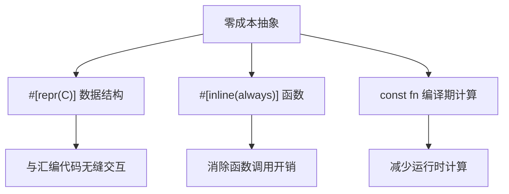
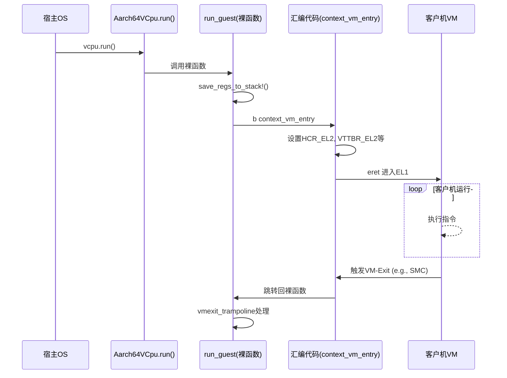

# 设计模式与范式

<cite>
**Referenced Files in This Document**   
- [vcpu.rs](file://src/vcpu.rs)
- [pcpu.rs](file://src/pcpu.rs)
- [exception.rs](file://src/exception.rs)
- [context_frame.rs](file://src/context_frame.rs)
- [exception_utils.rs](file://src/exception_utils.rs)
- [lib.rs](file://src/lib.rs)
- [smc.rs](file://src/smc.rs)
</cite>

## Table of Contents
1. [引言](#引言)
2. [核心设计原则](#核心设计原则)
3. [零成本抽象的实现机制](#零成本抽象的实现机制)
4. [基于泛型参数H: AxVCpuHal的静态分发](#基于泛型参数h-axvcpuhal的静态分发)
5. [裸函数在异常处理中的必要性](#裸函数在异常处理中的必要性)
6. [percpu宏实现每CPU数据隔离](#percpu宏实现每cpu数据隔离)
7. [Trait集成HAL组件的设计优势](#trait集成hal组件的设计优势)
8. [TrapKind枚举与ABI兼容性](#trapkind枚举与abi兼容性)
9. [结论](#结论)

## 引言

`arm_vcpu`模块为ARM架构虚拟化环境提供了一个高性能、低开销的虚拟CPU（vCPU）实现。该系统采用了一系列精心选择的设计模式和编程范式，旨在最大化性能、确保可预测性并最小化运行时开销。本文件将深入剖析其关键设计决策，包括在`no_std`环境下如何实现零成本抽象、利用Rust泛型进行静态分发以避免动态调度开销、使用裸函数（naked function）精确控制底层执行流程，以及通过`percpu`宏实现高效的每CPU数据隔离。

## 核心设计原则

`arm_vcpu`的设计围绕着几个核心原则：确定性、高性能和最小化抽象开销。它运行于`no_std`环境中，这意味着没有标准库提供的运行时支持，所有操作都必须是显式的、可预测的。系统通过编译时多态（而非运行时多态）来集成硬件抽象层（HAL），并通过内联汇编和精心设计的数据结构直接与硬件交互，从而实现了对底层资源的完全控制。

**Section sources**
- [lib.rs](file://src/lib.rs#L1-L31)
- [vcpu.rs](file://src/vcpu.rs#L1-L443)

## 零成本抽象的实现机制

`arm_vcpu`在`no_std`环境下实现了真正的零成本抽象。所谓“零成本”，意味着高级语言的抽象不会引入任何运行时性能损失。这一目标通过多种技术协同达成：

首先，所有关键数据结构，如`Aarch64ContextFrame`和`GuestSystemRegisters`，都使用`#[repr(C)]`属性标记。这保证了它们具有C语言兼容的内存布局，使其可以直接被汇编代码读写，消除了序列化/反序列化的开销。

其次，大量的辅助函数，例如`exception_esr`、`exception_fault_addr`等，都被标记为`#[inline(always)]`。这强制编译器将这些函数调用内联展开，最终生成的机器码就如同直接访问寄存器一样高效，没有任何函数调用的栈操作开销。

最后，系统广泛使用常量表达式（`const fn`）和编译期计算。例如，`exception_sysreg_addr`就是一个`const fn`，可以在编译期解析系统寄存器地址，进一步减少了运行时计算。



**Diagram sources**
- [context_frame.rs](file://src/context_frame.rs#L10-L302)
- [exception_utils.rs](file://src/exception_utils.rs#L10-L310)

**Section sources**
- [context_frame.rs](file://src/context_frame.rs#L10-L302)
- [exception_utils.rs](file://src/exception_utils.rs#L10-L310)

## 基于泛型参数H: AxVCpuHal的静态分发

`arm_vcpu`的核心设计之一是使用泛型参数`H: AxVCpuHal`来实现静态分发。`Aarch64VCpu<H>`结构体并非一个具体的类型，而是一个模板，其中`H`代表由宿主操作系统提供的硬件抽象层（HAL）的具体实现。

这种设计的关键在于，所有对`H`的调用，例如`H::irq_fetch()`或`H::irq_hanlder()`，都是在编译时解析的。当宿主系统实例化`Aarch64VCpu<MyHal>`时，编译器会为`MyHal`这个具体类型生成一份专用的`Aarch64VCpu`代码。这意味着`irq_fetch`的调用会被直接替换为对`MyHal`中对应方法的直接调用，完全避免了虚函数表查找和间接跳转的开销。

相比之下，如果使用`dyn AxVCpuHal`这样的动态调度，则每次调用都需要通过指针查表，这不仅增加了指令数量，还可能导致分支预测失败，严重影响性能。静态分发确保了每一次HAL调用都如同普通函数调用一样快速和可预测。

```mermaid
classDiagram
class AxVCpuHal {
<<trait>>
+irq_fetch() u8
+irq_hanlder() void
}
class MyHal {
+irq_fetch() u8
+irq_hanlder() void
}
class Aarch64VCpu~H~ {
-ctx : TrapFrame
-host_stack_top : u64
-_phantom : PhantomData~H~
+run() : AxResult~AxVCpuExitReason~
}
AxVCpuHal <|-- MyHal : "implements"
Aarch64VCpu --> AxVCpuHal : "requires H : "
```

**Diagram sources**
- [vcpu.rs](file://src/vcpu.rs#L1-L443)
- [pcpu.rs](file://src/pcpu.rs#L1-L91)

**Section sources**
- [vcpu.rs](file://src/vcpu.rs#L1-L443)
- [pcpu.rs](file://src/pcpu.rs#L1-L91)

## 裸函数在异常处理中的必要性

`arm_vcpu`使用了`#[unsafe(naked)]`属性定义了`run_guest`和`vmexit_trampoline`这两个关键函数。裸函数绕过了Rust默认的应用程序二进制接口（ABI），要求开发者手动编写完整的函数体，包括保存/恢复寄存器和管理堆栈。

这种做法的必要性源于对控制流的绝对精确要求。在`run_guest`函数中，它需要：
1.  **保存宿主上下文**：使用汇编宏`save_regs_to_stack!()`将宿主线程的寄存器（x19-x30）压入栈。
2.  **切换到EL1**：通过`b context_vm_entry`跳转到汇编代码，该代码负责设置必要的系统寄存器并最终进入EL1执行客户机代码。
3.  **防止意外返回**：由于从EL1返回后控制流会回到此处，但此时栈状态已改变，正常的函数返回会导致崩溃。因此，裸函数允许我们直接跳转到`vmexit_trampoline`进行处理，而不是尝试“返回”。

如果使用普通函数，编译器会自动插入序言（prologue）和尾声（epilogue）代码来管理栈帧，这会破坏由汇编代码建立的精确内存布局，导致不可预知的行为。裸函数提供了必需的底层控制能力。



**Diagram sources**
- [vcpu.rs](file://src/vcpu.rs#L120-L185)
- [exception.rs](file://src/exception.rs#L300-L330)
- [exception.S](file://src/exception.S)

**Section sources**
- [vcpu.rs](file://src/vcpu.rs#L120-L185)
- [exception.rs](file://src/exception.rs#L300-L330)

## percpu宏实现每CPU数据隔离

`arm_vcpu`使用`#[percpu::def_percpu]`宏来声明每CPU变量，如`HOST_SP_EL0`和`IRQ_HANDLER`。这些变量对于每个物理CPU核心都有独立的副本，确保了数据的隔离性和访问效率。

其工作原理如下：
1.  **链接时分配**：`percpu`宏指示链接器为每个CPU创建一个独立的内存段。所有被此宏标记的变量都会被放置在这个特殊的段中。
2.  **TPIDR_EL2索引**：在ARM64上，系统使用`TPIDR_EL2`（或`TPIDR_EL1`）寄存器作为指向当前CPU私有数据区域基址的指针。
3.  **运行时访问**：当代码需要访问一个`percpu`变量时，`read_current_raw()`或`write_current_raw()`等方法会读取`TPIDR_EL2`的值，并将其与变量的偏移量相加，从而计算出该变量在当前CPU上的实际地址。

这种方法避免了使用锁来保护共享数据，因为每个CPU都访问自己的副本。同时，由于数据位于CPU本地，访问速度极快，且不会产生缓存一致性流量，这对于高性能虚拟化至关重要。

**Section sources**
- [pcpu.rs](file://src/pcpu.rs#L16-L23)
- [vcpu.rs](file://src/vcpu.rs#L12-L13)

## Trait集成HAL组件的设计优势

选择`Trait`（`AxVCpuHal`）而非动态调度来集成HAL组件，带来了显著的性能和可预测性提升：

1.  **性能提升**：如前所述，静态分发消除了虚函数调用的间接性。每一次对`H::irq_fetch()`的调用都是一次直接的函数调用，指令流水线可以完美地预测和执行，避免了因缓存未命中或分支预测失败导致的停顿。

2.  **可预测性增强**：在实时或安全关键系统中，执行时间的可预测性至关重要。动态调度的开销是可变的，取决于虚表的位置和缓存状态。而静态分发的开销是固定的、可分析的，使得整个系统的时序行为更加确定。

3.  **编译期优化**：编译器可以看到`H`的具体实现，因此可以进行跨过程优化（Interprocedural Optimization, IPO）。例如，如果`MyHal::irq_fetch()`是一个简单的寄存器读取，编译器甚至可以将其内联到`Aarch64VCpu`的代码中，实现极致的优化。

4.  **类型安全**：Rust的Trait系统在编译期强制执行接口契约，确保了HAL实现的正确性，同时不牺牲运行时性能。

**Section sources**
- [vcpu.rs](file://src/vcpu.rs#L1-L443)
- [pcpu.rs](file://src/pcpu.rs#L1-L91)

## TrapKind枚举与ABI兼容性

`TrapKind`枚举使用`numeric_enum_macro::numeric_enum!`宏定义，其核心目的是确保与底层汇编代码的ABI兼容性。

```rust
numeric_enum! {
#[repr(u8)]
pub enum TrapKind {
    Synchronous = 0,
    Irq = 1,
    ...
}
}
```

这个宏的作用是：
1.  **指定精确的数值**：它明确地将`Synchronous`赋值为`0`，`Irq`赋值为`1`。这保证了枚举的内部表示是开发者期望的整数。
2.  **避免编译器重排**：普通的Rust枚举可能会被编译器优化或重排，其内部表示可能不是连续的整数。`numeric_enum`宏强制使用指定的数值。
3.  **与汇编代码同步**：在`exception.S`汇编文件中，会直接使用这些数值（例如`EXCEPTION_SYNC = 0`）来判断异常类型。如果Rust端的`TrapKind`和汇编端的常量不一致，就会导致逻辑错误。通过`numeric_enum`宏，可以确保两边的数值严格匹配，从而保证了跨语言边界的ABI兼容性。

**Section sources**
- [exception.rs](file://src/exception.rs#L20-L35)
- [exception.S](file://src/exception.S)