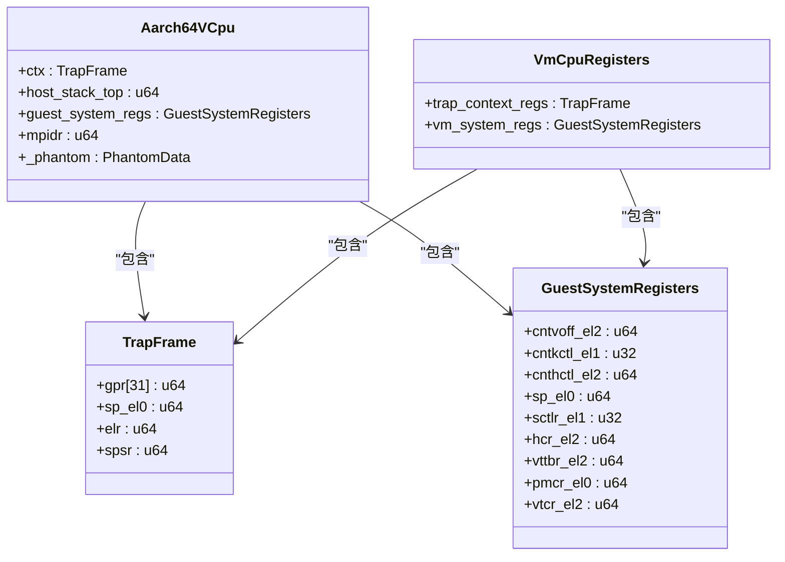
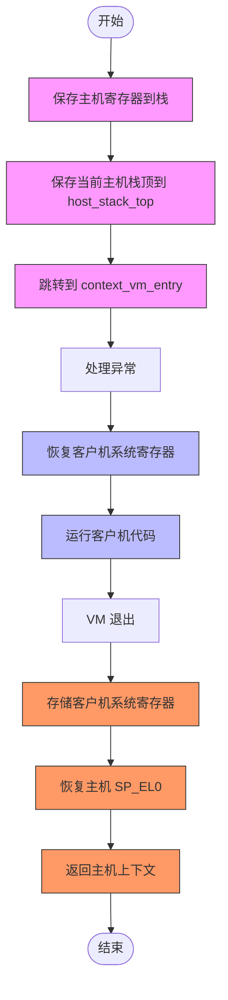
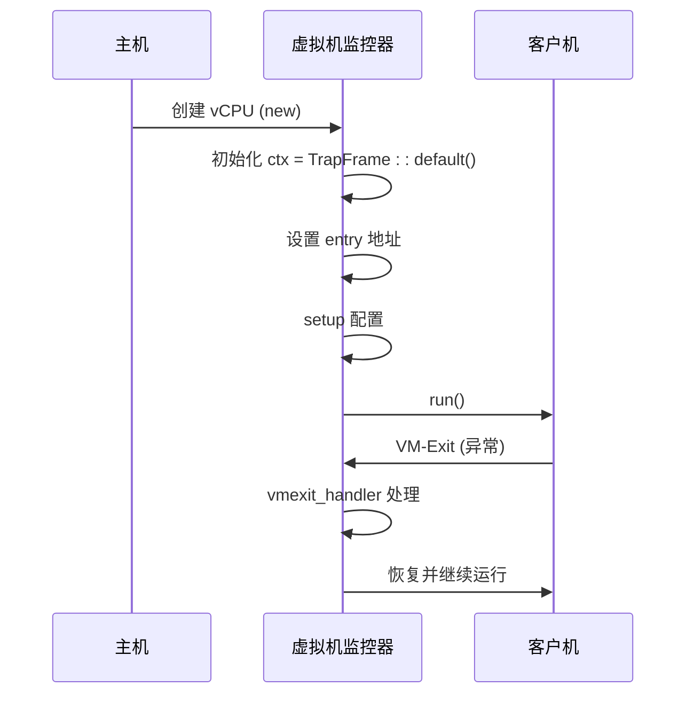

<cite>
**本文档引用的文件**
- [vcpu.rs](file://src/vcpu.rs)
- [context_frame.rs](file://src/context_frame.rs)
- [exception.rs](file://src/exception.rs)
- [lib.rs](file://src/lib.rs)
</cite>

## 目录
1. [引言](#引言)
2. [零成本抽象的核心机制](#零成本抽象的核心机制)
3. [内存布局与硬件寄存器的精确对应](#内存布局与硬件寄存器的精确对应)
4. [Default trait与安全的零初始化](#default-trait与安全的零初始化)
5. [编译时计算消除运行时开销](#编译时计算消除运行时开销)
6. [裸指针操作与host_stack_top管理](#裸指针操作与host_stack_top管理)
7. [VTTCR_EL2配置的编译期常量表达式](#vtcr_el2配置的编译期常量表达式)
8. [结论](#结论)

## 引言

在嵌入式系统和虚拟化环境中，性能与资源效率至关重要。`arm_vcpu`项目通过在`no_std`环境下实现零成本抽象，展示了如何在不牺牲性能的前提下提供高级别的抽象接口。本文深入分析其核心组件`VmCpuRegisters`和`TrapFrame`如何通过`repr(C)`保证内存布局与硬件寄存器的精确对应，并探讨`Default` trait如何实现安全的零初始化。同时，我们将阐述编译时计算（如4级EPT分页配置）如何完全消除运行时开销，以及为何选择裸指针操作而非动态分配来管理`host_stack_top`。

**Section sources**
- [lib.rs](file://src/lib.rs#L1-L32)

## 零成本抽象的核心机制

零成本抽象是Rust语言的核心理念之一，它允许开发者使用高级抽象而不引入运行时开销。在`arm_vcpu`中，这一原则被应用于虚拟CPU（vCPU）的设计，确保所有抽象在编译后生成最优的机器码。

`Aarch64VCpu`结构体封装了vCPU的所有状态，包括陷阱上下文、主机栈顶指针和客户机系统寄存器。该结构体的设计遵循严格的内存布局规则，以确保与底层硬件的无缝交互。通过使用`#[repr(C)]`属性，结构体的字段按声明顺序排列，且没有填充或重排，从而实现了对齐和偏移的可预测性。

这种设计使得`Aarch64VCpu`可以直接映射到物理内存中的特定位置，供ARM异常处理程序直接访问。整个抽象过程不涉及任何额外的间接层或元数据，因此被称为“零成本”。



**Diagram sources**
- [vcpu.rs](file://src/vcpu.rs#L30-L100)
- [context_frame.rs](file://src/context_frame.rs#L10-L50)

**Section sources**
- [vcpu.rs](file://src/vcpu.rs#L30-L100)

## 内存布局与硬件寄存器的精确对应

为了实现与ARM架构的紧密耦合，`arm_vcpu`使用`#[repr(C)]`属性确保关键数据结构具有C兼容的内存布局。这不仅保证了字段的顺序和对齐方式符合ABI规范，还允许这些结构体直接作为参数传递给汇编代码或用于内存映射I/O操作。

### TrapFrame 的内存布局

`TrapFrame`结构体代表AArch64 CPU的上下文帧，包含通用寄存器（GPRs）、EL0栈指针（SP_EL0）、异常链接寄存器（ELR）和保存的程序状态寄存器（SPSR）。由于采用了`#[repr(C)]`，该结构体的内存布局与ARM异常发生时自动保存的寄存器顺序完全一致。

当发生VM退出（VM-Exit）时，硬件会将当前的寄存器值压入栈中，形成一个连续的内存块。`TrapFrame`的布局与此内存块完全匹配，因此可以通过简单的指针转换直接将其解释为`TrapFrame`实例，无需逐个复制寄存器值。

### GuestSystemRegisters 的对齐要求

`GuestSystemRegisters`结构体除了使用`#[repr(C)]`外，还显式指定了`#[repr(align(16))]`，确保其起始地址是16字节对齐的。这对于某些需要严格对齐的系统寄存器操作尤为重要，例如TLB刷新指令可能依赖于特定的对齐边界。

此外，该结构体包含了大量与EL1和EL2相关的系统寄存器，如`SCTLR_EL1`、`HCR_EL2`、`VTTBR_EL2`等。每个字段的位置和大小都经过精心设计，以便在调用`store()`和`restore()`方法时能够高效地通过MSR/MRS指令进行批量读写。



**Diagram sources**
- [context_frame.rs](file://src/context_frame.rs#L10-L100)
- [vcpu.rs](file://src/vcpu.rs#L200-L300)

**Section sources**
- [context_frame.rs](file://src/context_frame.rs#L10-L100)

## Default trait与安全的零初始化

在`no_std`环境中，全局分配器不可用，因此不能依赖动态初始化。`arm_vcpu`通过实现`Default` trait为关键结构体提供安全的零初始化方案。

### Aarch64ContextFrame 的默认状态

`Aarch64ContextFrame`实现了`Default` trait，其`default()`方法返回一个预定义的安全初始状态：

- 所有通用寄存器（GPRs）初始化为0
- SPSR设置为屏蔽所有异常并处于EL1h模式
- ELR和SP_EL0初始化为0

这种初始化策略确保了即使在最极端的情况下（如未正确设置入口点），vCPU也不会执行非法指令或访问无效内存区域。更重要的是，这些默认值是在编译时确定的常量表达式，不会产生任何运行时开销。

### GuestSystemRegisters 的零值构造

同样，`GuestSystemRegisters`也派生了`Default`，利用编译器自动生成的零初始化逻辑。对于整数类型字段，这意味着它们都被初始化为0；而对于复杂类型，则递归应用`Default`实现。

这种方法的优势在于：
1. **确定性**：每次创建新实例时都会得到相同的结果
2. **安全性**：避免了未初始化内存带来的不确定行为
3. **效率**：编译器可以优化掉显式的赋值操作，直接使用`.bss`段的零初始化内存



**Diagram sources**
- [vcpu.rs](file://src/vcpu.rs#L100-L200)

**Section sources**
- [context_frame.rs](file://src/context_frame.rs#L50-L100)

## 编译时计算消除运行时开销

`arm_vcpu`充分利用Rust的编译时计算能力，在编译阶段完成所有配置决策，从而彻底消除运行时判断开销。

### 条件编译控制EPT分页层级

最典型的例子是4级EPT分页配置的选择。代码中使用`#[cfg(feature = "4-level-ept")]`条件编译属性，根据构建时启用的功能标志决定生成哪种`VTTCR_EL2`配置：

- 当启用`4-level-ept`功能时，生成支持48位地址空间、从第0级开始的配置
- 否则生成3级分页配置，支持39位地址空间

这种基于特征（feature）的编译时分支意味着最终二进制文件中只会包含一种配置路径，完全消除了运行时的`if-else`判断。此外，相关常量（如`T0SZ`、`SL0`等）也被内联为立即数，进一步提升了性能。

### ID_AA64MMFR0_EL1 的静态检查

在启用4级EPT时，代码还会读取`ID_AA64MMFR0_EL1`寄存器获取物理地址范围（PARange），并在编译时无法完成此检查的情况下，使用`panic!`宏在运行时早期失败。虽然这部分逻辑发生在运行时，但由于它是初始化阶段的一次性检查，且失败后立即终止，因此仍属于可接受的轻量级验证。

```mermaid
graph TB
subgraph "编译时决策"
A["#[cfg(feature = \"4-level-ept\")]"] --> B["生成4级EPT配置"]
C["#[cfg(not(feature = \"4-level-ept\"))]"] --> D["生成3级EPT配置"]
end
subgraph "运行时执行"
E["VTTCR_EL2.write()"] --> F["写入预计算的常量值"]
end
style A fill:#cfc,stroke:#333
style B fill:#cfc,stroke:#333
style C fill:#cfc,stroke:#333
style D fill:#cfc,stroke:#333
style E fill:#cf9,stroke:#333
style F fill:#cf9,stroke:#333
```

**Diagram sources**
- [vcpu.rs](file://src/vcpu.rs#L250-L300)

**Section sources**
- [vcpu.rs](file://src/vcpu.rs#L250-L300)

## 裸指针操作与host_stack_top管理

在高性能虚拟化场景中，避免任何形式的动态内存分配和间接访问是至关重要的。`arm_vcpu`通过裸指针操作直接管理`host_stack_top`，实现了极致的性能优化。

### host_stack_top 的作用

`host_stack_top`字段存储了主机上下文切换前的栈顶指针。在`run_guest`函数中，通过内联汇编将当前栈指针（SP）保存到该字段：

```rust
"mov x9, sp",
"add x0, x0, {host_stack_top_offset}",
"str x9, [x0]",
```

这段代码将`self.host_stack_top`的地址加载到`x0`，然后将当前SP写入其中。这种方式绕过了Rust的安全引用机制，直接进行内存操作，确保了最小的指令开销。

### 为什么不用动态分配？

选择裸指针而非动态分配的原因包括：

1. **确定性**：栈指针是一个纯粹的数值，不需要所有权管理
2. **性能**：避免了堆分配/释放的开销和潜在的缓存污染
3. **兼容性**：与汇编代码无缝集成，便于在异常处理程序中恢复
4. **生命周期**：`host_stack_top`的生命周期与`Aarch64VCpu`实例完全绑定，无需额外的RAII管理

此外，由于`no_std`环境缺乏标准库的分配器支持，使用裸指针成为唯一可行的选择。

**Section sources**
- [vcpu.rs](file://src/vcpu.rs#L150-L200)

## VTTCR_EL2配置的编译期常量表达式

`init_vm_context`函数展示了如何通过编译期常量表达式生成最优的`VTTCR_EL2`配置。该寄存器控制着第二阶段转换（Stage 2 Translation）的行为，其配置直接影响内存虚拟化的性能和安全性。

### 3级EPT配置

当未启用`4-level-ept`功能时，生成以下配置：

- PS: PA_40B_1TB — 物理地址空间为40位（1TB）
- TG0: Granule4KB — 使用4KB粒度
- SH0/ORGN0/IRGN0: NormalWBRAWA — 正常内存，回写策略
- SL0: 0b01 — 从第1级开始遍历页表
- T0SZ: 64 - 39 — 虚拟地址空间为39位

这些值组合成一个编译时常量，直接写入`vtcr_el2`字段。

### 4级EPT配置

当启用`4-level-ept`时，配置升级为：

- PS: PA_48B_256TB — 支持48位物理地址（256TB）
- SL0: 0b10 — 从第0级开始，充分利用4级页表
- T0SZ: 64 - 48 — 支持完整的48位虚拟地址空间

值得注意的是，4级配置还包括对`ID_AA64MMFR0_EL1`的运行时检查，确保CPU确实支持所需的PA范围。如果检测失败，则触发`panic!`，防止在不兼容的硬件上运行。

这种混合策略——编译时选择配置模板 + 运行时验证硬件能力——既保证了性能又维持了安全性。

**Section sources**
- [vcpu.rs](file://src/vcpu.rs#L250-L350)

## 结论

`arm_vcpu`项目通过一系列精心设计的技术实现了真正的零成本抽象。`repr(C)`确保了数据结构与硬件寄存器的精确对应，`Default` trait提供了安全高效的零初始化机制，而编译时计算则完全消除了运行时配置开销。裸指针操作在`no_std`环境下成为管理`host_stack_top`的最佳选择，避免了动态分配的负担。最终，`VTTCR_EL2`的配置通过编译期常量表达式生成，结合条件编译实现了灵活而高效的内存虚拟化支持。这些技术共同构成了一个高性能、低延迟的ARM虚拟CPU实现基础。