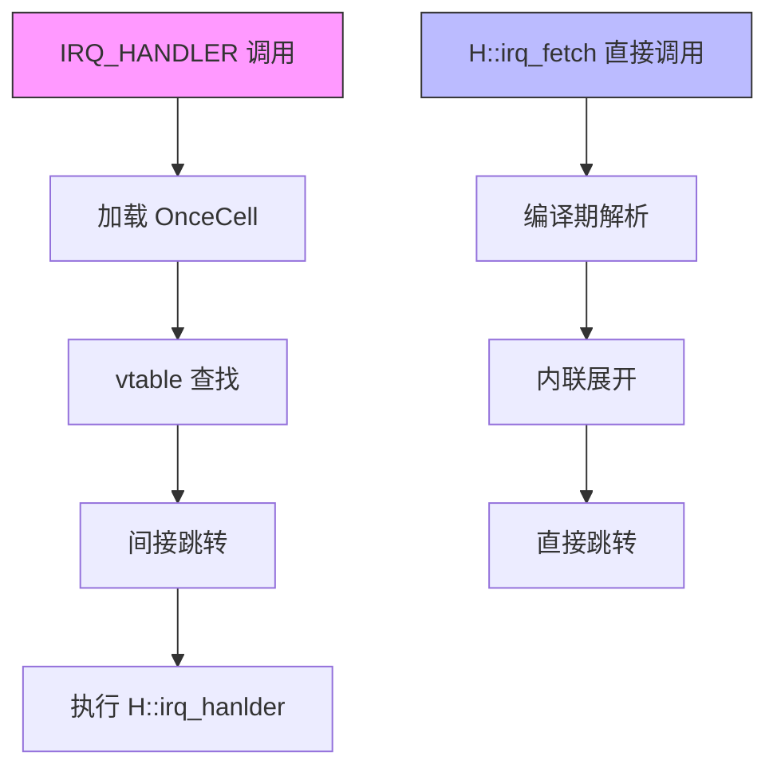
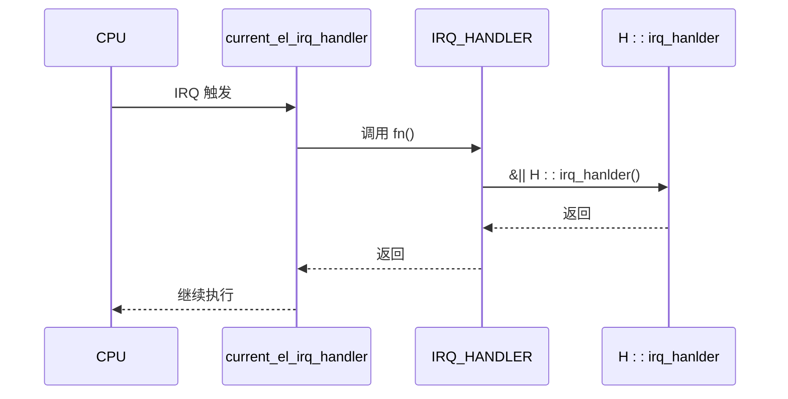

# 静态分发与HAL集成

<cite>
**本文档引用的文件**  
- [vcpu.rs](file://src/vcpu.rs)
- [pcpu.rs](file://src/pcpu.rs)
- [exception.rs](file://src/exception.rs)
</cite>

## 目录
1. [引言](#引言)  
2. [泛型参数H的静态分发机制](#泛型参数h的静态分发机制)  
3. [IRQ_HANDLER与动态调度性能对比](#irq_handler与动态调度性能对比)  
4. [编译期单态化消除间接调用开销](#编译期单态化消除间接调用开销)  
5. [中断处理路径的确定性提升](#中断处理路径的确定性提升)  
6. [总结](#总结)

## 引言
在Aarch64虚拟CPU实现中，`Aarch64VCpu<H: AxVCpuHal>`通过泛型参数`H`实现了硬件抽象层（HAL）的高度可定制性。该设计不仅支持灵活的平台适配，更重要的是利用Rust的编译期单态化机制实现了静态分发，从而避免了传统trait object带来的运行时动态调度开销。本文将深入分析这一机制如何在中断处理等关键路径上提升系统性能和确定性。

## 泛型参数H的静态分发机制
`Aarch64VCpu<H: AxVCpuHal>`中的泛型参数`H`约束于`AxVCpuHal` trait，允许不同硬件平台提供各自的中断处理、定时器管理等底层实现。由于`H`是编译期已知的具体类型，所有对`H::irq_fetch`和`H::irq_hanlder`的调用均被编译器内联展开，形成直接函数调用而非虚表查找。

这种基于泛型的静态分发机制确保了：
- 所有方法调用在编译期解析为具体符号
- 无运行时vtable跳转开销
- 全程可被LLVM优化器进行跨过程优化（如内联、常量传播）

**Section sources**  
- [vcpu.rs](file://src/vcpu.rs#L74-L115)  
- [pcpu.rs](file://src/pcpu.rs#L28-L30)

## IRQ_HANDLER与动态调度性能对比
在`pcpu.rs`中定义的`IRQ_HANDLER`是一个`OnceCell<&(dyn Fn() + Send + Sync)>`类型的per-CPU变量，用于注册主机操作系统的中断处理程序。此设计采用了trait object机制，其调用涉及以下步骤：

1. 从`OnceCell`加载函数指针
2. 通过vtable进行间接跳转
3. 执行实际的闭包体

相比之下，`H::irq_hanlder()`作为静态分发调用，其执行路径完全由编译器确定，无需任何间接寻址或虚表查询。这使得静态分发在性能敏感场景下显著优于动态调度，特别是在高频触发的中断上下文中。



**Diagram sources**  
- [pcpu.rs](file://src/pcpu.rs#L24)  
- [vcpu.rs](file://src/vcpu.rs#L350)

## 编译期单态化消除间接函数调用开销
当`Aarch64PerCpu<H>`实例化时，`new`方法中注册的闭包`&|| H::irq_hanlder()`会被单态化为针对具体`H`类型的唯一实现。这意味着：

- 每个`H`类型生成独立的函数副本
- 函数地址在链接期固定
- 调用指令直接编码目标地址

例如，在`vmexit_handler`中对`H::irq_fetch()`的调用：
```rust
TrapKind::Irq => Ok(AxVCpuExitReason::ExternalInterrupt {
    vector: H::irq_fetch() as _,
}),
```
该表达式在编译后转化为对具体`H`类型`irq_fetch`函数的直接调用，彻底消除了间接调用的成本。

**Section sources**  
- [pcpu.rs](file://src/pcpu.rs#L30)  
- [vcpu.rs](file://src/vcpu.rs#L350-L352)

## 中断处理路径的确定性提升
结合`vcpu.rs`中`handle_exception_sync`对`H::irq_fetch`的内联调用，整个中断处理链路展现出高度的可预测性：

1. **异常入口**：EL2向量表跳转至`current_el_irq_handler`
2. **分发调度**：通过`IRQ_HANDLER`调用`H::irq_hanlder`
3. **退出处理**：`vmexit_handler`内联调用`H::irq_fetch`获取中断向量

由于所有HAL接口调用均为静态分发，整个路径不存在分支预测失败、缓存未命中等不确定性因素。这对于实时虚拟化环境至关重要，确保了中断响应延迟的严格上限。



**Diagram sources**  
- [exception.rs](file://src/exception.rs#L208-L241)  
- [pcpu.rs](file://src/pcpu.rs#L30)  
- [vcpu.rs](file://src/vcpu.rs#L350)

## 总结
`Aarch64VCpu<H: AxVCpuHal>`通过泛型参数`H`实现了高效的静态分发机制，相较于`OnceCell<&(dyn Fn())>`的动态调度方案，在中断处理路径上显著降低了调用开销并提升了执行确定性。编译期单态化使所有HAL接口调用得以内联优化，形成了无间接跳转的高效执行流，为高性能虚拟化奠定了坚实基础。