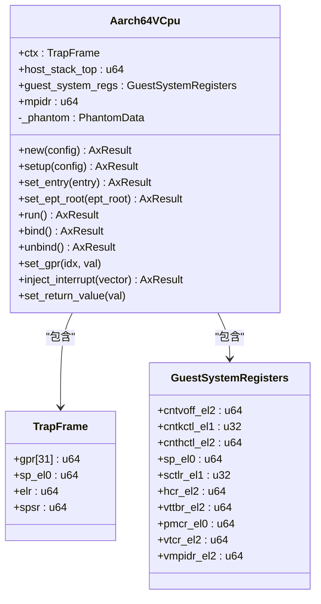
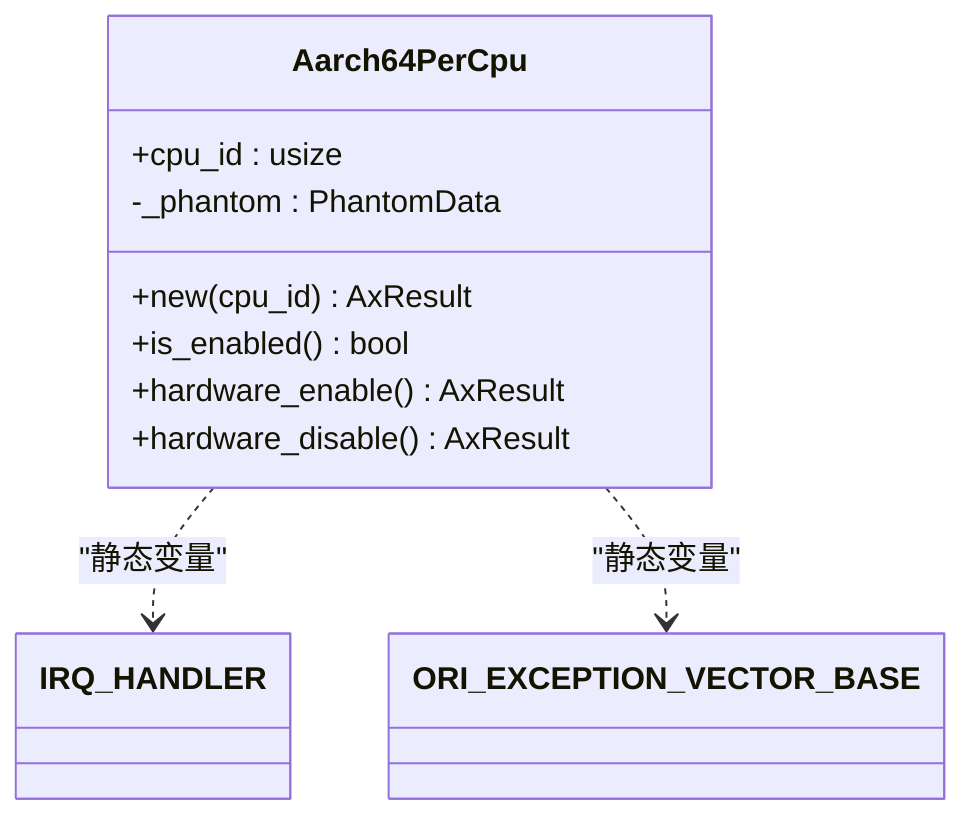
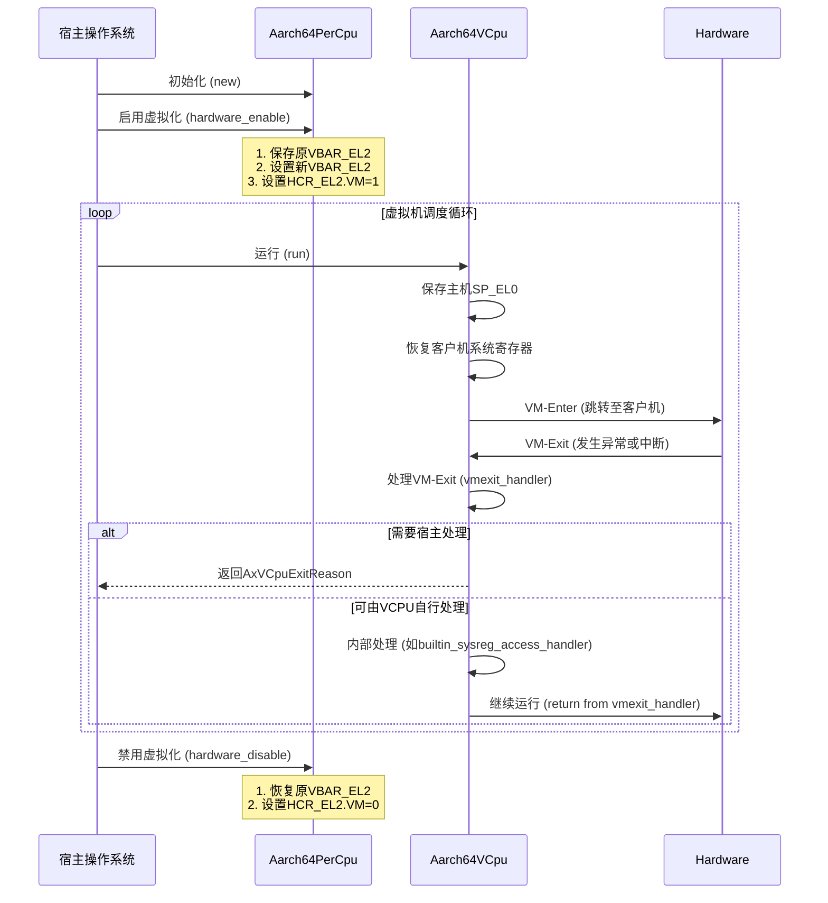
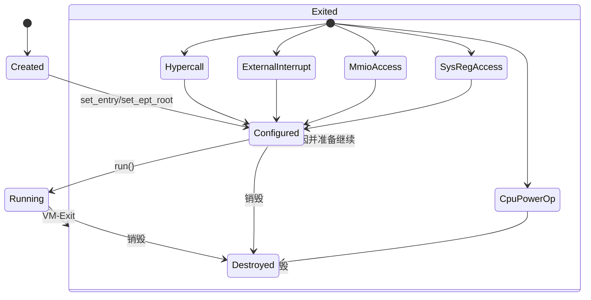
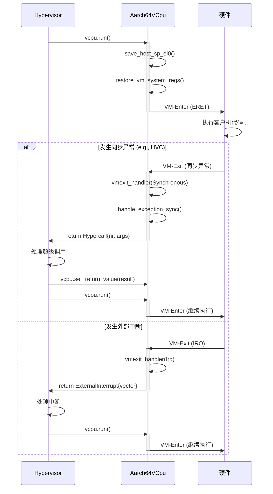

<cite>
**本文档中引用的文件**
- [vcpu.rs](file://src/vcpu.rs)
- [pcpu.rs](file://src/pcpu.rs)
- [exception.rs](file://src/exception.rs)
- [context_frame.rs](file://src/context_frame.rs)
</cite>

## 目录
1. [引言](#引言)
2. [VCPU生命周期概述](#vcpu生命周期概述)
3. [核心组件分析](#核心组件分析)
4. [状态机设计与PCPU关系](#状态机设计与pcpu关系)
5. [VM-Enter触发机制](#vm-enter触发机制)
6. [异常向量与每CPU数据结构](#异常向量与每cpu数据结构)
7. [状态转换图](#状态转换图)
8. [典型使用序列图](#典型使用序列图)
9. [销毁过程](#销毁过程)
10. [结论](#结论)

## 引言

本文档系统性地描述了Aarch64架构下虚拟CPU（VCPU）实例的完整生命周期，涵盖创建、配置、运行和销毁等关键阶段。重点解析`Aarch64VCpu`与`Aarch64PerCpu`之间的协同工作机制，阐明每次`run`调用如何触发底层硬件的VM-Enter操作，以及导致VM-Exit并返回`AxVCpuExitReason`的具体条件。通过深入分析相关源码实现，为理解ARM虚拟化环境中的上下文切换、异常处理和资源管理提供全面的技术参考。

## VCPU生命周期概述

`Aarch64VCpu`实例的生命周期遵循一个清晰的流程：首先通过`new`方法创建，随后进行必要的配置（如设置入口地址和页表根），接着通过反复调用`run`方法执行虚拟机代码，最终在任务完成后被安全销毁。这一过程紧密依赖于底层物理CPU（PCPU）的初始化状态和异常向量表的正确安装。整个生命周期的设计旨在高效地在宿主操作系统与客户机操作系统之间切换执行上下文，同时确保虚拟化功能的正确性和安全性。

**Section sources**
- [vcpu.rs](file://src/vcpu.rs#L1-L444)
- [pcpu.rs](file://src/pcpu.rs#L1-L92)

## 核心组件分析

### Aarch64VCpu 结构体

`Aarch64VCpu`是代表单个虚拟CPU的核心数据结构。它封装了客户机在运行时所需的所有寄存器状态，包括通用寄存器（`ctx: TrapFrame`）、主机栈顶指针（`host_stack_top`）以及一系列需要在VM-Enter/VM-Exit时保存和恢复的系统寄存器（`guest_system_regs`）。其内存布局经过精心设计，以确保与汇编代码的无缝交互。



**Diagram sources**
- [vcpu.rs](file://src/vcpu.rs#L70-L78)
- [context_frame.rs](file://src/context_frame.rs#L10-L302)

**Section sources**
- [vcpu.rs](file://src/vcpu.rs#L70-L78)
- [context_frame.rs](file://src/context_frame.rs#L10-L302)

### Aarch64PerCpu 结构体

`Aarch64PerCpu`代表每个物理CPU核心的私有数据。它负责管理该核心上与虚拟化相关的全局状态，例如原始的异常向量基址（`ORI_EXCEPTION_VECTOR_BASE`）和注册到该核心的中断处理程序（`IRQ_HANDLER`）。`hardware_enable`和`hardware_disable`方法用于开启和关闭该核心上的虚拟化支持。



**Diagram sources**
- [pcpu.rs](file://src/pcpu.rs#L15-L18)
- [pcpu.rs](file://src/pcpu.rs#L22-L23)

**Section sources**
- [pcpu.rs](file://src/pcpu.rs#L15-L92)

## 状态机设计与PCPU关系

`Aarch64VCpu`的状态机并非由显式的状态枚举驱动，而是隐式地体现在其方法调用序列和底层硬件行为中。其核心状态转换围绕着`run`方法的执行展开。`Aarch64PerCpu`扮演着至关重要的角色，它是`Aarch64VCpu`能够正常工作的前提。

当一个`Aarch64PerCpu`实例通过`hardware_enable`方法被激活时，它会：
1.  **保存原始异常向量**：将当前EL2的异常向量基址（VBAR_EL2）保存到`ORI_EXCEPTION_VECTOR_BASE`。
2.  **安装虚拟化异常向量**：将VBAR_EL2指向本库提供的`exception_vector_base_vcpu`，从而接管所有来自客户机的同步异常、IRQ等。
3.  **启用虚拟化模式**：通过设置HCR_EL2寄存器的VM位来开启虚拟化支持。

只有在`Aarch64PerCpu`完成这些初始化后，`Aarch64VCpu`的`run`方法才能正确地进入和退出虚拟机。两者的关系可以看作是“舞台”（PCPU）与“演员”（VCPU）的关系：PCPU搭建好虚拟化的舞台（设置好异常向量和HCR_EL2），VCPU才能在这个舞台上进行表演（执行客户机代码）。



**Diagram sources**
- [pcpu.rs](file://src/pcpu.rs#L50-L88)
- [vcpu.rs](file://src/vcpu.rs#L150-L200)

**Section sources**
- [pcpu.rs](file://src/pcpu.rs#L50-L88)
- [vcpu.rs](file://src/vcpu.rs#L150-L200)

## VM-Enter触发机制

`run`方法是触发VM-Enter的关键。其核心逻辑位于`run_guest`这个用`naked`属性标记的外部函数中。

1.  **保存主机上下文**：`run_guest`首先使用汇编宏`save_regs_to_stack!()`将主机（即宿主操作系统）的调用者保存寄存器（x19-x30）压入主机栈。
2.  **记录主机栈顶**：将当前主机栈指针（sp）的值保存到`Aarch64VCpu`实例的`host_stack_top`字段中，以便在VM-Exit后能准确恢复。
3.  **跳转至汇编入口**：最后，无条件跳转到名为`context_vm_entry`的纯汇编标签处。

`context_vm_entry`汇编代码负责执行真正的VM-Enter。它会加载之前通过`set_entry`设置的客户机入口地址到ELR_EL2，并从`guest_system_regs`中恢复客户机的系统寄存器（如SCTLR_EL1, HCR_EL2等），然后执行`eret`指令。这条`eret`指令会将处理器状态切换到EL1（客户机内核态），并将程序计数器（PC）设置为ELR_EL2的值，从而开始执行客户机代码。

```mermaid
flowchart TD
Start([run()]) --> SaveHost["保存主机上下文\n(save_regs_to_stack!)"]
SaveHost --> SaveStackTop["保存主机栈顶\n(host_stack_top = sp)"]
SaveStackTop --> JumpASM["跳转至汇编入口\n(b context_vm_entry)"]
JumpASM --> ContextEntry["context_vm_entry 汇编"]
ContextEntry --> LoadRegs["加载客户机系统寄存器\n(restore_vm_system_regs)"]
LoadRegs --> SetELR["设置ELR_EL2 = 入口地址"]
SetELR --> ERET["执行ERET指令"]
ERET --> GuestCode["开始执行客户机代码"]
```

**Diagram sources**
- [vcpu.rs](file://src/vcpu.rs#L202-L230)
- [vcpu.rs](file://src/vcpu.rs#L278-L285)

**Section sources**
- [vcpu.rs](file://src/vcpu.rs#L150-L200)

## AxVCpuExitReason 返回条件

当客户机执行过程中发生特定事件时，会触发VM-Exit，控制权交还给`Aarch64VCpu`的`run`方法。`vmexit_handler`函数负责分析退出原因，并返回相应的`AxVCpuExitReason`。主要的退出条件包括：

*   **同步异常 (Synchronous)**：由`handle_exception_sync`函数处理。常见原因有：
    *   **超空间调用 (HVC64)**：客户机执行`hvc`指令，通常用于发起超级调用（Hypercall）或PSCI电源管理请求（如`CpuUp`, `CpuDown`, `SystemOff`）。
    *   **系统寄存器访问 (TrappedMsrMrs)**：客户机尝试读写被HCR_EL2.TSC等位截获的系统寄存器，返回`SysRegRead`或`SysRegWrite`。
    *   **数据中止 (DataAbortLowerEL)**：通常是由于EPT（扩展页表）翻译失败导致的内存访问异常，返回`MmioRead`或`MmioWrite`，指示需要模拟MMIO操作。
*   **外部中断 (Irq)**：当物理中断到达且HCR_EL2.IMO位被设置时，会触发VM-Exit。此时`run`方法返回`ExternalInterrupt`，携带中断向量号。
*   **其他未处理异常**：对于不支持的异常类，代码会直接panic。

值得注意的是，某些简单的系统寄存器访问（如对ICC_SGI1R_EL1的写操作）可以在`builtin_sysreg_access_handler`中被`Aarch64VCpu`自身处理，无需返回到顶层hypervisor，处理完毕后返回`Nothing`或`SendIPI`。

**Section sources**
- [vcpu.rs](file://src/vcpu.rs#L150-L200)
- [exception.rs](file://src/exception.rs#L40-L180)

## 异常向量与每CPU数据结构

异常向量的安装是`Aarch64PerCpu`的核心职责之一。如前所述，`hardware_enable`方法会修改VBAR_EL2寄存器，使其指向本库提供的`exception_vector_base_vcpu`。这个新的异常向量表定义了当客户机发生各种异常（同步、IRQ、FIQ等）时，处理器应该跳转到的处理程序。

例如，当客户机产生一个IRQ时，处理器会根据新的VBAR_EL2找到对应的IRQ处理程序入口，最终执行`current_el_irq_handler`函数。该函数会查询存储在`IRQ_HANDLER`这个每CPU变量中的闭包，并调用它，从而将中断分发回宿主操作系统的中断处理框架。

这种设计确保了中断处理的灵活性：宿主操作系统在初始化`Aarch64PerCpu`时，可以通过`new`方法注册自己的中断处理逻辑，而`Aarch64VCpu`则完全透明地将中断传递过去。

**Section sources**
- [pcpu.rs](file://src/pcpu.rs#L50-L88)
- [exception.rs](file://src/exception.rs#L320-L330)

## 状态转换图



**Diagram sources**
- [vcpu.rs](file://src/vcpu.rs#L150-L200)
- [exception.rs](file://src/exception.rs#L40-L180)

## 典型使用序列图

以下序列图展示了一个典型的VCPU调度循环：



**Diagram sources**
- [vcpu.rs](file://src/vcpu.rs#L150-L200)
- [exception.rs](file://src/exception.rs#L40-L180)

## 销毁过程

文档中并未明确展示`Aarch64VCpu`的销毁过程。然而，根据Rust的所有权机制，当`Aarch64VCpu`实例离开作用域时，其析构函数会被自动调用。在此之前，通常应先调用`unbind`方法（目前为空实现）来解除VCPU与任何资源的绑定。更重要的是，在整个虚拟化环境关闭时，必须调用`Aarch64PerCpu`的`hardware_disable`方法来禁用该核心的虚拟化支持，恢复原始的异常向量，这是安全销毁VCPU执行环境的必要步骤。

**Section sources**
- [vcpu.rs](file://src/vcpu.rs#L145-L148)
- [pcpu.rs](file://src/pcpu.rs#L75-L88)

## 结论

`Aarch64VCpu`的生命周期管理是一个精巧的软硬件协同过程。通过`Aarch64PerCpu`对物理CPU的初始化，为虚拟化提供了基础环境。`Aarch64VCpu`实例则利用`run`方法作为统一入口，通过底层汇编代码触发VM-Enter，并在发生VM-Exit时通过`vmexit_handler`分析原因，返回标准化的`AxVCpuExitReason`供上层hypervisor决策。这种设计分离了底层上下文切换的复杂性与上层策略的灵活性，构成了一个高效、安全的ARM虚拟化执行框架。