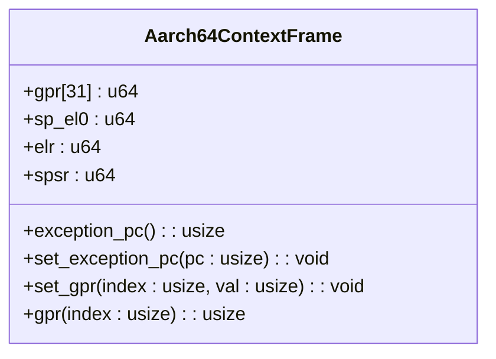
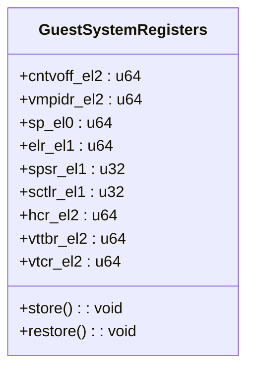
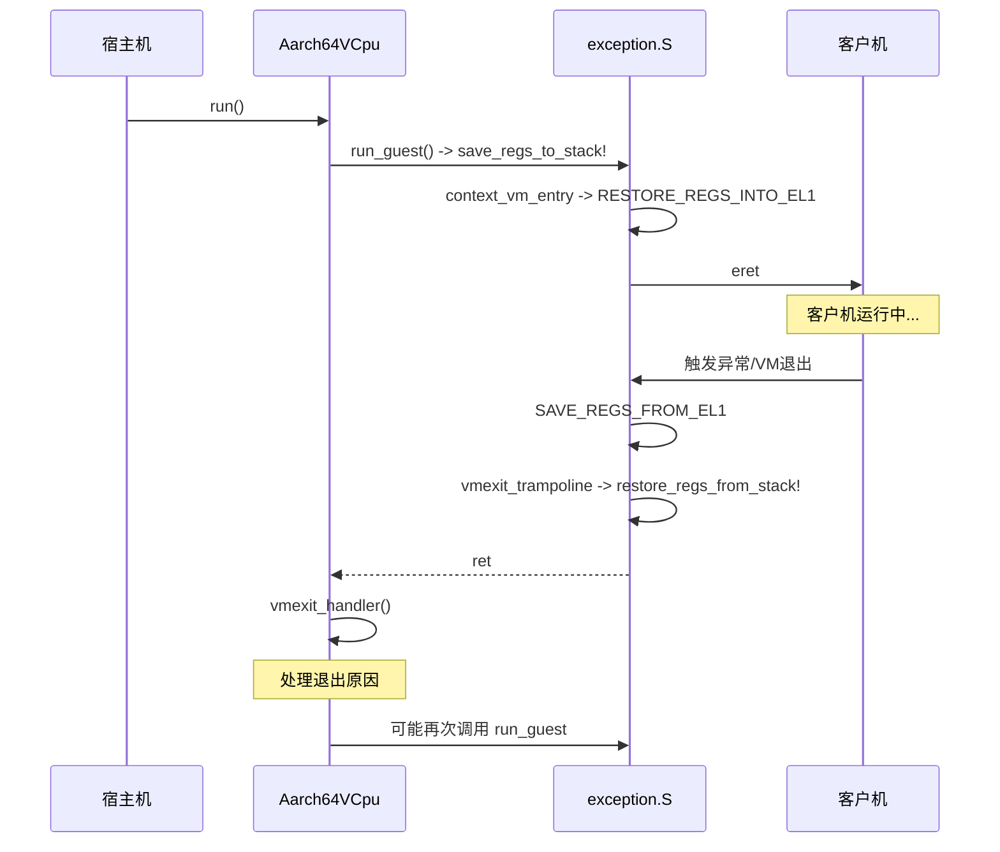
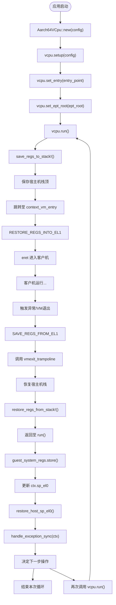

# 上下文管理

<cite>
**Referenced Files in This Document**   
- [context_frame.rs](file://src/context_frame.rs)
- [vcpu.rs](file://src/vcpu.rs)
- [exception.rs](file://src/exception.rs)
- [exception.S](file://src/exception.S)
- [lib.rs](file://src/lib.rs)
</cite>

## 目录
1. [引言](#引言)
2. [核心结构体定义](#核心结构体定义)
3. [TrapFrame 与上下文保存恢复机制](#trapframe-与上下文保存恢复机制)
4. [GuestSystemRegisters 与系统寄存器管理](#guestsystemregisters-与系统寄存器管理)
5. [vCPU 切换流程分析](#vcpu-切换流程分析)
6. [异常处理中的上下文操作](#异常处理中的上下文操作)
7. [AArch64 栈指针与异常链接寄存器原理](#aarch64-栈指针与异常链接寄存器原理)
8. [调用流程示例](#调用流程示例)

## 引言

本文档深入阐述 `arm_vcpu` 库中 `TrapFrame` 和 `GuestSystemRegisters` 的实现机制，详细解释在 vCPU 切换时如何保存和恢复关键状态寄存器，以及这些结构体如何支持虚拟化环境下的上下文隔离。通过分析底层代码和汇编逻辑，揭示其与硬件行为的一致性。

## 核心结构体定义

### TrapFrame (Aarch64ContextFrame)

`TrapFrame` 是一个类型别名，指向 `Aarch64ContextFrame` 结构体，用于表示 AArch64 CPU 的上下文帧。



**Diagram sources**
- [context_frame.rs](file://src/context_frame.rs#L15-L81)

该结构体使用 `#[repr(C)]` 确保 C 兼容的内存布局，包含以下字段：
- **gpr**: 31个通用寄存器（x0-x30）的数组。
- **sp_el0**: EL0级别的栈指针。
- **elr**: 异常链接寄存器，存储异常返回地址。
- **spsr**: 保存的程序状态寄存器，存储异常发生时的处理器状态。

**Section sources**
- [context_frame.rs](file://src/context_frame.rs#L15-L81)
- [lib.rs](file://src/lib.rs#L19)

### GuestSystemRegisters

`GuestSystemRegisters` 结构体代表了客户虚拟机（VM）的完整系统寄存器上下文。



**Diagram sources**
- [context_frame.rs](file://src/context_frame.rs#L100-L280)

该结构体对齐到16字节，并包含大量EL1和EL2级别的系统控制寄存器，例如：
- **定时器相关**: `cntvoff_el2`, `cntp_cval_el0` 等。
- **虚拟化配置**: `hcr_el2`, `vttbr_el2`, `vtcr_el2`。
- **EL1状态**: `sp_el0`, `elr_el1`, `spsr_el1`, `sctlr_el1`。
- **其他系统寄存器**: `ttbr0_el1`, `tcr_el1`, `vbar_el1` 等。

**Section sources**
- [context_frame.rs](file://src/context_frame.rs#L100-L280)

## TrapFrame 与上下文保存恢复机制

`TrapFrame` 主要负责在异常或VM退出时保存和恢复用户态及内核态的“工作”寄存器。

### 保存机制

当从客户机（Guest）发生VM退出（VM-Exit）时，硬件会自动将一些关键状态保存到EL2的物理寄存器中（如 `ELR_EL2`, `SPSR_EL2`）。随后，汇编代码 `exception.S` 中的 `SAVE_REGS_FROM_EL1` 宏负责将剩余的寄存器压入栈中。

```assembly
.macro SAVE_REGS_FROM_EL1
    sub     sp, sp, 34 * 8          // 为34个寄存器分配栈空间
    stp     x0, x1, [sp]            // 保存通用寄存器 x0-x30
    ...
    mrs     x9, sp_el0               // 读取当前的 SP_EL0
    stp     x30, x9, [sp, 30 * 8]   // 保存 x30 和 SP_EL0
    mrs     x10, elr_el2             // 读取 ELR_EL2 (即 guest 的 PC)
    mrs     x11, spsr_el2            // 读取 SPSR_EL2 (即 guest 的 PSTATE)
    stp     x10, x11, [sp, 32 * 8]  // 保存 ELR_EL2 和 SPSR_EL2
.endm
```

此宏执行后，栈上形成了一个完整的 `Aarch64ContextFrame` 结构，其中包含了客户机的所有通用寄存器、`SP_EL0`、`ELR_EL1` 和 `SPSR_EL1` 的值。

### 恢复机制

当需要恢复客户机执行时，`RESTORE_REGS_INTO_EL1` 宏负责将之前保存的上下文重新加载回处理器。

```assembly
.macro RESTORE_REGS_INTO_EL1
    ldp     x10, x11, [sp, 32 * 8]  // 加载 ELR_EL2 和 SPSR_EL2
    msr     elr_el2, x10             // 写入 ELR_EL2
    msr     spsr_el2, x11            // 写入 SPSR_EL2
    ldp     x30, x9, [sp, 30 * 8]   // 加载 x30 和 SP_EL0
    msr     sp_el0, x9               // 写入 SP_EL0
    ...
    add     sp, sp, 34 * 8           // 释放栈空间
.endm
```

最后通过 `eret` 指令，处理器根据 `ELR_EL2` 和 `SPSR_EL2` 的值跳转回客户机代码继续执行。

**Section sources**
- [exception.S](file://src/exception.S#L1-L70)

## GuestSystemRegisters 与系统寄存器管理

`GuestSystemRegisters` 负责管理那些不能或不需要在每次异常时都保存/恢复的复杂系统寄存器。

### 存储 (Store) 方法

`store()` 方法使用内联汇编 `mrs` 指令，将当前运行的客户机的各种系统寄存器的值读取并保存到 `GuestSystemRegisters` 结构体中。

```rust
impl GuestSystemRegisters {
    pub unsafe fn store(&mut self) {
        asm!("mrs {0}, CNTVOFF_EL2", out(reg) self.cntvoff_el2);
        asm!("mrs {0}, SP_EL0", out(reg) self.sp_el0);
        asm!("mrs {0}, ELR_EL1", out(reg) self.elr_el1);
        asm!("mrs {0:x}, SPSR_EL1", out(reg) self.spsr_el1);
        // ... 其他寄存器
    }
}
```

这个方法通常在VM退出处理的后期被调用，以捕获客户机完整的系统状态。

### 恢复 (Restore) 方法

`restore()` 方法则使用 `msr` 指令，将之前保存的值写回到相应的系统寄存器中。

```rust
impl GuestSystemRegisters {
    pub unsafe fn restore(&self) {
        asm!("msr SP_EL1, {0}", in(reg) self.sp_el1);
        asm!("msr ELR_EL1, {0}", in(reg) self.elr_el1);
        asm!("msr SPSR_EL1, {0:x}", in(reg) self.spsr_el1);
        asm!("msr SCTLR_EL1, {0:x}", in(reg) self.sctlr_el1);
        // ... 其他寄存器
        asm!("tlbi	alle2"); // 清除TLB
        asm!("dsb	nsh");
        asm!("isb");
    }
}
```

这个方法在进入客户机（VM-Entry）之前被调用，确保客户机看到的是它期望的系统配置。

**Section sources**
- [context_frame.rs](file://src/context_frame.rs#L180-L280)

## vCPU 切换流程分析

vCPU的切换是一个涉及多个层次的复杂过程，结合了Rust代码和汇编代码。

### 运行客户机 (run_guest)

`Aarch64VCpu::run_guest` 是一个裸函数（naked function），它首先保存宿主机（Host）的上下文，然后跳转到汇编标签 `context_vm_entry`。

```rust
unsafe extern "C" fn run_guest(&mut self) -> usize {
    core::arch::naked_asm!(
        save_regs_to_stack!(),         // 保存宿主机callee-saved寄存器
        "mov x9, sp",
        "add x0, x0, {host_stack_top_offset}",
        "str x9, [x0]",                // 保存宿主机栈顶到 self.host_stack_top
        "b context_vm_entry",          // 跳转到汇编入口
        host_stack_top_offset = const core::mem::size_of::<TrapFrame>(),
    );
}
```

### VM进入 (VM Entry)

`context_vm_entry` 标签位于 `exception.S` 中，它将 `run_guest` 中保存的宿主机栈顶作为参数，设置好栈指针后，调用 `RESTORE_REGS_INTO_EL1` 宏来恢复客户机的 `TrapFrame`，最后通过 `eret` 指令进入客户机模式。

### VM退出 (VM Exit)

当客户机触发异常或VM退出时，控制流会跳转到由 `exception_vector_base_vcpu` 定义的向量表。对于来自低特权级的同步异常，会执行 `HANDLE_LOWER_SYNC_VCPU` 宏，该宏首先调用 `SAVE_REGS_FROM_EL1` 保存客户机上下文，然后调用 `vmexit_trampoline`。

`vmexit_trampoline` 函数负责从 `Aarch64VCpu` 结构体中恢复宿主机的栈指针，并调用 `restore_regs_from_stack!()` 宏来恢复宿主机的函数调用上下文，最终通过 `ret` 指令返回到 `Aarch64VCpu::run()` 的后续代码。



**Diagram sources**
- [vcpu.rs](file://src/vcpu.rs#L281-L321)
- [exception.S](file://src/exception.S#L120-L140)

**Section sources**
- [vcpu.rs](file://src/vcpu.rs#L281-L321)
- [exception.S](file://src/exception.S#L120-L140)

## 异常处理中的上下文操作

`vmexit_handler` 方法是处理VM退出的核心逻辑。

```rust
fn vmexit_handler(&mut self, exit_reason: TrapKind) -> AxResult<AxVCpuExitReason> {
    unsafe {
        self.guest_system_regs.store();              // 1. 保存Guest系统寄存器
        self.ctx.sp_el0 = self.guest_system_regs.sp_el0; // 2. 更新TrapFrame中的sp_el0
        restore_host_sp_el0();                       // 3. 恢复Host的SP_EL0
    }

    let result = match exit_reason {
        TrapKind::Synchronous => handle_exception_sync(&mut self.ctx), // 4. 处理异常
        // ...
    };
    // ...
}
```

1.  **保存系统寄存器**: 调用 `store()` 方法捕获客户机的完整系统状态。
2.  **更新上下文帧**: 将刚从硬件读取的 `sp_el0` 值更新到 `TrapFrame` 中，确保 `TrapFrame` 包含了最完整的客户机状态。
3.  **恢复宿主机栈**: 在处理异常前，必须先恢复宿主机的 `SP_EL0`，因为后续的Rust代码执行依赖于正确的栈指针。
4.  **分发异常**: 根据异常类型，调用相应的处理函数（如 `handle_exception_sync`），并将 `TrapFrame` 作为参数传入，以便检查和修改客户机的寄存器状态。

**Section sources**
- [vcpu.rs](file://src/vcpu.rs#L323-L360)

## AArch64 栈指针与异常链接寄存器原理

### 栈指针切换 (SPSel)

AArch64架构提供了两个栈指针：`SP_EL0` 和 `SP_ELx`（其中x是当前异常级别）。`SPSel` 位（位于 `PSTATE` 寄存器中）决定了在EL0时使用哪个栈指针。

- 当 `SPSel=0` 时，即使在EL0，也使用 `SP_ELx`（通常是 `SP_EL1`）。
- 当 `SPSel=1` 时，在EL0使用专用的 `SP_EL0`。

在虚拟化场景中，hypervisor（运行在EL2）需要为每个vCPU维护独立的 `SP_EL0`，以便客户机操作系统可以在EL1安全地使用自己的栈而不会干扰hypervisor。`TrapFrame` 中的 `sp_el0` 字段正是为了保存和恢复这个关键的寄存器。

### 异常链接寄存器 (ELR)

`ELR_ELx`（Exception Link Register）是每个异常级别都有的一个寄存器。当发生异常时，硬件会自动将下一条指令的地址（即中断/异常返回地址）写入当前异常级别的 `ELR_ELx`。

- 对于从客户机（EL1）发生的VM退出，返回地址会被写入 `ELR_EL2`。
- `ERET` 指令会从 `ELR_ELx` 读取地址，并跳转到该地址继续执行，同时根据 `SPSR_ELx` 恢复处理器状态。

在 `arm_vcpu` 的实现中，`SAVE_REGS_FROM_EL1` 宏会将 `ELR_EL2` 的值保存到 `TrapFrame.elr` 中，这实际上就是客户机被中断时的程序计数器（PC）。当恢复客户机时，`RESTORE_REGS_INTO_EL1` 宏会将这个值写回 `ELR_EL2`，从而确保 `ERET` 能正确地让客户机从中断点继续执行。

## 调用流程示例

以下是创建、配置和运行一个vCPU的典型调用流程：



此流程清晰地展示了 `TrapFrame` 和 `GuestSystemRegisters` 如何协同工作，实现了高效且安全的vCPU上下文切换。