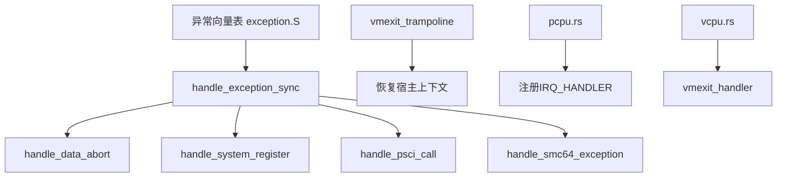
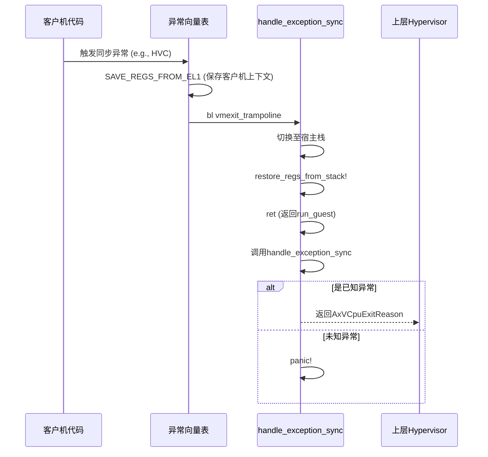
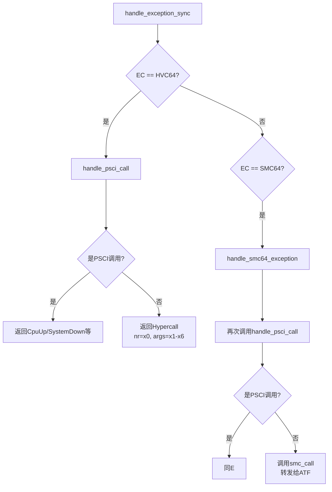

# 异常处理机制

<cite>
**本文档中引用的文件**  
- [exception.rs](file://src\exception.rs)
- [exception_utils.rs](file://src\exception_utils.rs)
- [exception.S](file://src\exception.S)
- [vcpu.rs](file://src\vcpu.rs)
- [pcpu.rs](file://src\pcpu.rs)
</cite>

## 目录
1. [项目结构](#项目结构)  
2. [同步异常处理流程](#同步异常处理流程)  
3. [异常向量表与汇编入口](#异常向量表与汇编入口)  
4. [数据中止异常处理](#数据中止异常处理)  
5. [系统调用与HVC/SMC处理](#系统调用与hvcsmc处理)  
6. [IRQ中断分发机制](#irq中断分发机制)  
7. [辅助宏与工具函数](#辅助宏与工具函数)  
8. [上下文切换与控制流转移](#上下文切换与控制流转移)  
9. [常见异常调试方法](#常见异常调试方法)

## 项目结构

ARM虚拟CPU模块的核心功能集中在`src`目录下，主要由五个Rust源文件构成：`exception.rs`负责异常处理逻辑，`exception_utils.rs`提供寄存器解析辅助函数，`vcpu.rs`实现虚拟CPU核心，`context_frame.rs`定义上下文帧结构，`pcpu.rs`管理每核状态。此外，`exception.S`作为汇编层入口，直接响应硬件异常。

**图示来源**
- [exception.S](file://src\exception.S)
- [exception.rs](file://src\exception.rs)
- [vcpu.rs](file://src\vcpu.rs)
- [pcpu.rs](file://src\pcpu.rs)

**本节来源**
- [exception.rs](file://src\exception.rs)
- [exception_utils.rs](file://src\exception_utils.rs)
- [exception.S](file://src\exception.S)
- [vcpu.rs](file://src\vcpu.rs)
- [pcpu.rs](file://src\pcpu.rs)

## 同步异常处理流程

同步异常的处理始于`handle_exception_sync`函数，该函数通过读取`ESR_EL2`寄存器中的异常类（EC）字段来判断异常来源，并据此分发到不同的处理分支。此函数是虚拟机退出（VM Exit）后进入的第一个Rust处理函数，接收一个指向`TrapFrame`的指针，其中保存了发生异常时客户机的完整CPU状态。

其核心逻辑为模式匹配`exception_class()`的返回值：
- 当EC为`DataAbortLowerEL`时，表示发生了数据中止异常，先调整程序计数器至下一条指令，再调用`handle_data_abort`。
- 当EC为`HVC64`时，表示客户机执行了HVC（超调用）指令，首先尝试将其识别为PSCI调用，若不是，则作为普通超调用返回给上层hypervisor。
- 当EC为`TrappedMsrMrs`时，表示对系统寄存器的访问被陷获，交由`handle_system_register`处理。
- 当EC为`SMC64`时，表示安全监控调用，同样先检查是否为PSCI调用，否则转发给ATF（ARM Trusted Firmware）。

对于未处理的异常类型，函数会触发panic并打印详细的寄存器信息用于调试。

**本节来源**
- [exception.rs](file://src\exception.rs#L74-L132)

## 异常向量表与汇编入口

异常向量表在`exception.S`中定义，通过`core::arch::global_asm!`宏嵌入到最终的二进制文件中。该向量表的基地址`exception_vector_base_vcpu`在`pcpu.rs`的`hardware_enable`函数中被设置为`VBAR_EL2`寄存器的值，从而将EL2的异常向量重定向至此。

向量表根据异常来源和栈指针选择分为四组，每组四个条目。对于来自较低EL（如客户机）的同步异常和IRQ，分别调用`HANDLE_LOWER_SYNC_VCPU`和`HANDLE_LOWER_IRQ_VCPU`宏。这些宏首先执行`SAVE_REGS_FROM_EL1`，将客户机的31个通用寄存器、`SP_EL0`、`ELR_EL2`和`SPSR_EL2`保存到`Aarch64VCpu.ctx`中，然后跳转到`vmexit_trampoline`进行上下文切换。

**图示来源**
- [exception.S](file://src\exception.S)
- [exception.rs](file://src\exception.rs#L307-L332)
- [vcpu.rs](file://src\vcpu.rs#L350-L390)

**本节来源**
- [exception.S](file://src\exception.S)
- [pcpu.rs](file://src\pcpu.rs#L40-L90)

## 数据中止异常处理

`handle_data_abort`函数专门处理由内存访问引发的数据中止异常。它首先调用`exception_fault_addr()`获取导致异常的客户物理地址（GPA），该函数结合`FAR_EL2`和`HPFAR_EL2`寄存器的值进行计算。接着，通过一系列`exception_utils`中的内联函数解析访问细节：
- `exception_data_abort_access_width()`确定访问宽度（1, 2, 4, 或8字节）。
- `exception_data_abort_access_is_write()`判断是读还是写操作。
- `exception_data_abort_access_reg()`和`exception_data_abort_access_reg_width()`获取参与访问的寄存器及其宽度。

函数会检查异常是否可处理（`exception_data_abort_handleable`），并区分转换错误（translation fault）和权限错误（permission fault）。目前仅支持处理由页表遍历失败引起的转换错误。处理结果以`AxVCpuExitReason::MmioRead`或`AxVCpuExitReason::MmioWrite`的形式返回，指示上层hypervisor需要模拟一次MMIO访问。

**本节来源**
- [exception.rs](file://src\exception.rs#L131-L174)
- [exception_utils.rs](file://src\exception_utils.rs#L112-L145)

## 系统调用与HVC/SMC处理

HVC（Hypercall）和SMC（Secure Monitor Call）是客户机与hypervisor或固件通信的主要方式。`handle_exception_sync`通过检查`ESR_EL2`的EC字段来捕获这两种调用。

处理流程如下：
1.  **PSCI调用识别**：`handle_psci_call`函数检查`x0`寄存器中的函数号是否落在PSCI（Power State Coordination Interface）的范围内（32位：`0x8400_0000..=0x8400_001F`，64位：`0xC400_0000..=0xC400_001F`）。如果是，则根据具体的函数号（如`PSCI_FN_CPU_ON`, `PSCI_FN_SYSTEM_OFF`）返回相应的`AxVCpuExitReason`，例如`CpuUp`或`SystemDown`。
2.  **普通HVC处理**：如果非PSCI调用，则认为是一次普通的超调用。函数从`x0`到`x6`寄存器中提取调用号和参数，并通过`AxVCpuExitReason::Hypercall`返回，等待上层hypervisor处理。
3.  **SMC处理**：`handle_smc64_exception`函数首先尝试按PSCI流程处理。若不匹配，则直接调用`crate::smc::smc_call`将调用转发给ATF（ARM Trusted Firmware），实现安全世界的功能。

**图示来源**
- [exception.rs](file://src\exception.rs#L74-L132)
- [exception.rs](file://src\exception.rs#L208-L273)

**本节来源**
- [exception.rs](file://src\exception.rs#L74-L132)
- [exception.rs](file://src\exception.rs#L208-L273)

## IRQ中断分发机制

IRQ（外部中断）的分发由两部分协作完成。首先，在`exception.S`中，来自当前EL的IRQ会被`HANDLE_CURRENT_IRQ`宏捕获，该宏保存上下文后调用`current_el_irq_handler`。

`current_el_irq_handler`是一个简单的包装函数，它直接调用存储在`pcpu.rs`中`IRQ_HANDLER`静态变量里的回调函数。这个回调函数在`Aarch64PerCpu::new()`时由上层hypervisor注册，通常指向`H::irq_hanlder()`。因此，中断被无缝地分发回宿主操作系统或hypervisor的中断处理框架。

值得注意的是，当`HCR_EL2.IMO`位被置位时（在`vcpu.rs`的`init_vm_context`中配置），来自客户机的物理IRQ会被陷入EL2，从而触发上述流程。如果该位被清除，则中断会直接透传给客户机。

**本节来源**
- [exception.rs](file://src\exception.rs#L334-L340)
- [pcpu.rs](file://src\pcpu.rs#L15-L25)
- [vcpu.rs](file://src\vcpu.rs#L350-L390)

## 辅助宏与工具函数

`exception_utils.rs`提供了大量`#[inline(always)]`的辅助函数，用于高效地解析`ESR_EL2`和`ISS`寄存器中的信息。这些函数避免了重复的位操作，提高了代码的可读性和维护性。

关键函数包括：
- `exception_class()`: 解析`ESR_EL2`的[31:26]位，获取异常类别。
- `exception_fault_addr()`: 计算精确的故障地址。
- `exception_next_instruction_step()`: 根据`ESR_EL2`的第25位判断指令长度（16或32位），从而计算下一条指令的偏移量（2或4字节）。
- `exception_sysreg_*`系列：用于解析系统寄存器访问异常的`ISS`字段，获取目标寄存器地址、方向（读/写）和涉及的通用寄存器。
- `exception_data_abort_*`系列：用于解析数据中止异常的`ISS`字段，获取访问宽度、方向、寄存器等。

此外，该文件还定义了两个重要的汇编宏`save_regs_to_stack!`和`restore_regs_from_stack!`，它们在`vmexit_trampoline`中用于保存和恢复宿主线程的调用者保存寄存器（`x19-x30`），确保控制流能正确返回到`Aarch64VCpu.run()`。

**本节来源**
- [exception_utils.rs](file://src\exception_utils.rs)

## 上下文切换与控制流转移

从客户机陷入到hypervisor再到上层处理的完整控制流转移是理解整个机制的关键。

1.  **陷入开始**：客户机执行特权指令或产生异常，CPU硬件自动跳转到`VBAR_EL2`指向的`exception_vector_base_vcpu`。
2.  **汇编层保存**：`exception.S`中的宏（如`HANDLE_LOWER_SYNC_VCPU`）执行`SAVE_REGS_FROM_EL1`，将客户机的完整上下文保存到`Aarch64VCpu.ctx`。
3.  **裸函数跳转**：汇编代码调用`vmexit_trampoline`（一个naked函数）。
4.  **栈切换与恢复**：`vmexit_trampoline`首先调整栈指针，使其指向`host_stack_top`，然后调用`restore_regs_from_stack!`恢复宿主线程的`x19-x30`寄存器。
5.  **返回Rust**：执行`ret`指令，这并非返回到`vmexit_trampoline`的调用者，而是模拟了`run_guest`函数的正常返回，将控制权交还给`Aarch64VCpu.run()`。
6.  **Rust层处理**：`run`函数继续执行，调用`vmexit_handler`，进而调用`handle_exception_sync`等函数进行具体处理。

这一精巧的设计使得底层汇编代码能够干净利落地完成上下文切换，而复杂的业务逻辑则完全在安全的Rust环境中处理。

**本节来源**
- [exception.rs](file://src\exception.rs#L307-L332)
- [vcpu.rs](file://src\vcpu.rs#L350-L390)

## 常见异常调试方法

当遇到未处理的异常时，`handle_exception_sync`中的`panic!`宏会输出极具价值的调试信息，包括：
- **异常类（EC）**: 指明异常的大致类型。
- **指令指针（PC）**: 发生异常时的程序计数器。
- **故障地址（IPA/GPA）**: 数据中止异常的地址。
- **ESR_EL2**: 完整的异常综合征寄存器，可通过手册解码详细原因。
- **关键系统寄存器**: 如`SCTLR_EL1`, `VTTBR_EL2`, `VTCR_EL2`, `HCR_EL2`，有助于分析客户机的配置状态。

开发者应首先根据EC值定位问题大类，然后结合故障地址和客户机代码进行分析。对于数据中止，需检查GPA是否映射正确；对于系统寄存器访问，需确认`ISS`字段解析出的寄存器地址是否在预期列表中。利用日志（`trace!`, `debug!`, `error!`）在关键路径上添加跟踪点，也是快速定位问题的有效手段。

**本节来源**
- [exception.rs](file://src\exception.rs#L132-L132)