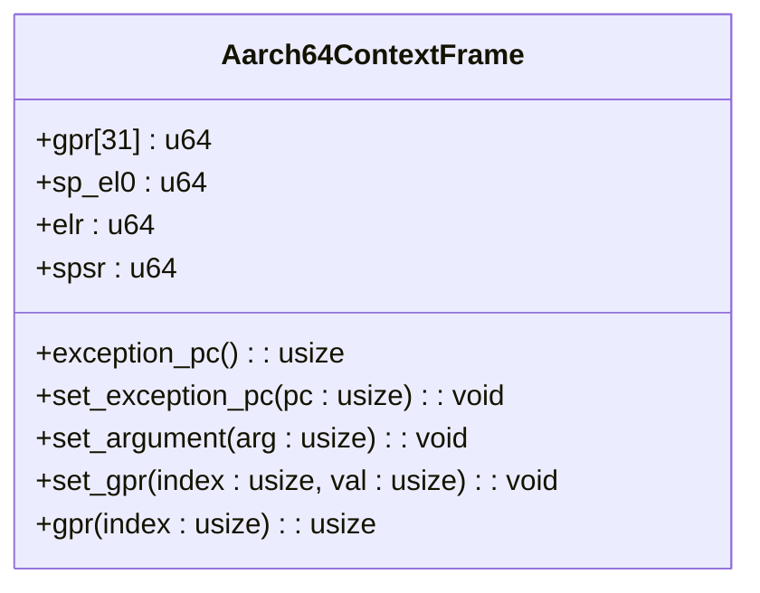
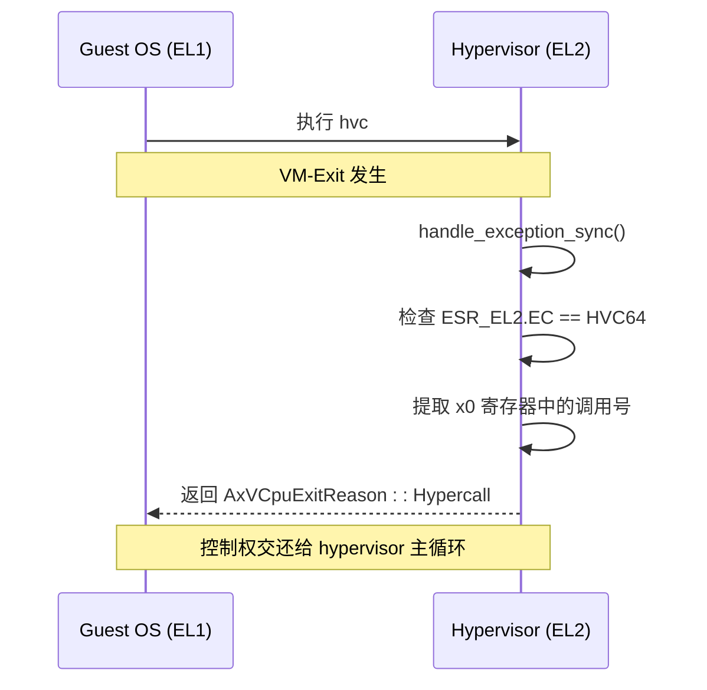
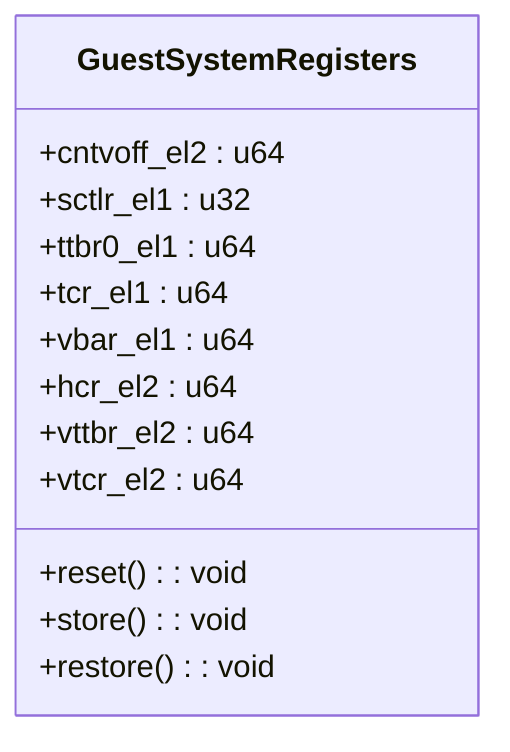
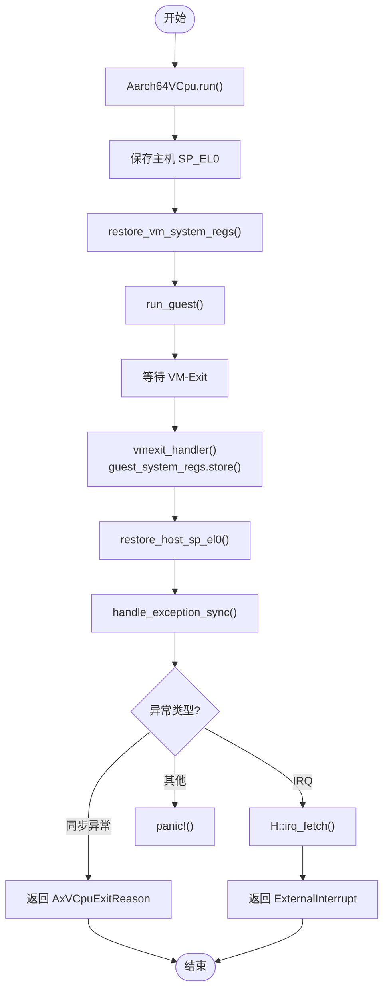

# 核心概念

<cite>
**Referenced Files in This Document**   
- [context_frame.rs](file://src/context_frame.rs)
- [exception.rs](file://src/exception.rs)
- [exception_utils.rs](file://src/exception_utils.rs)
- [vcpu.rs](file://src/vcpu.rs)
</cite>

## 目录
1. [引言](#引言)
2. [AArch64异常级别与虚拟化基础](#aarch64异常级别与虚拟化基础)
3. [上下文保存与恢复机制](#上下文保存与恢复机制)
4. [虚拟中断与系统调用拦截](#虚拟中断与系统调用拦截)
5. [系统寄存器虚拟化](#系统寄存器虚拟化)
6. [vCPU状态机与VM-Exit交互](#vcpu状态机与vm-exit交互)

## 引言

本文档旨在为不熟悉ARM虚拟化的开发者深入阐述`arm_vcpu`库中的核心概念。我们将结合代码实现，详细解释AArch64的异常级别、TrapFrame上下文保存、虚拟中断处理和系统调用（SMC/HVC）拦截等关键机制。通过分析`context_frame.rs`、`exception.rs`和`vcpu.rs`中的具体实现，帮助读者建立清晰的心理模型，理解vCPU如何与hypervisor进行交互。

## AArch64异常级别与虚拟化基础

AArch64架构定义了四个异常级别（Exception Level, EL），从EL0到EL3，权限逐级递增。在虚拟化场景中，这些级别被重新分配以支持安全的多租户环境：
- **EL0**: 用户态应用程序运行于此。
- **EL1**: 客户操作系统内核（Guest OS Kernel）在此级别运行。
- **EL2**: 由hypervisor（虚拟机监视器）独占，负责管理所有虚拟机并提供硬件虚拟化服务。
- **EL3**: 最高级别，通常用于安全监控器（Secure Monitor），处理最敏感的安全操作。

当客户机（Guest）执行特权操作或发生异常时，处理器会触发“VM-Exit”，将控制权从EL1转移到hypervisor所在的EL2。Hypervisor处理完请求后，再通过“VM-Entry”指令将控制权交还给客户机。这种设计确保了客户机无法直接访问物理硬件，所有敏感操作都必须经过hypervisor的审核和模拟。

**Section sources**
- [exception.rs](file://src/exception.rs#L1-L363)
- [vcpu.rs](file://src/vcpu.rs#L1-L444)

## 上下文保存与恢复机制

### TrapFrame结构体

当VM-Exit发生时，处理器会自动保存一部分客户机的状态。为了完整地恢复客户机的执行环境，hypervisor需要手动保存剩余的关键寄存器。`Aarch64ContextFrame`（在代码中常作为`TrapFrame`使用）正是为此目的而设计的数据结构。

该结构体包含以下关键字段：
- `gpr`: 一个包含31个`u64`值的数组，代表通用寄存器x0-x30。
- `sp_el0`: 指向EL0栈顶的栈指针。
- `elr`: 异常链接寄存器，存储了发生异常时的程序计数器（PC）值，即下一条待执行指令的地址。
- `spsr`: 保存的程序状态寄存器，记录了异常发生前的处理器状态。

**Diagram sources**
- [context_frame.rs](file://src/context_frame.rs#L15-L150)

### 上下文切换流程

上下文切换是vCPU工作的核心。其流程如下：
1.  **进入EL2 (VM-Exit)**：客户机执行特权指令（如访问系统寄存器）或发生数据中止（Data Abort）时，硬件自动跳转到EL2，并将部分状态保存到EL2的专用寄存器中。
2.  **保存客户机上下文**：Hypervisor的汇编代码（`exception.S`）首先执行`SAVE_REGS_FROM_EL1`宏，将客户机的通用寄存器（x0-x30）压入栈中。随后，Rust代码中的`vmexit_handler`函数会调用`guest_system_regs.store()`，通过一系列`mrs`指令读取并保存所有相关的系统寄存器。
3.  **恢复主机上下文**：在完成对客户机状态的保存后，hypervisor会恢复自身（主机）的执行上下文，以便继续执行其调度逻辑或其他任务。
4.  **VM-Entry**：当hypervisor决定让客户机继续运行时，它会先恢复之前保存的客户机系统寄存器（通过`restore_vm_system_regs`），然后执行`eret`指令返回到EL1，客户机从`elr`指向的地址继续执行。

**Section sources**
- [context_frame.rs](file://src/context_frame.rs#L1-L303)
- [vcpu.rs](file://src/vcpu.rs#L1-L444)
- [exception.rs](file://src/exception.rs#L1-L363)

## 虚拟中断与系统调用拦截

### 中断处理

在虚拟化环境中，物理中断不能直接传递给客户机，否则会破坏隔离性。`arm_vcpu`通过配置`HCR_EL2`寄存器来实现中断的虚拟化。
- 当`HCR_EL2.IMO`位被设置时，物理IRQ会被“陷入”（trap）到EL2的hypervisor。
- Hypervisor接收到中断后，可以评估是否应该将其注入到目标vCPU。
- 通过调用`inject_interrupt`方法，hypervisor可以向客户机发送一个虚拟中断，客户机的中断控制器会像处理真实中断一样响应它。

**Section sources**
- [vcpu.rs](file://src/vcpu.rs#L1-L444)

### 系统调用（SMC/HVC）拦截

系统调用是客户机与hypervisor通信的主要方式。`arm_vcpu`通过检查异常类（EC）来识别这些调用：
- **HVC (Hypervisor Call)**: 当客户机执行`hvc #imm`指令时，会触发EC为`HVC64`的同步异常。`handle_exception_sync`函数捕获此异常，并根据`x0`寄存器中的编号判断这是一个超调用（Hypercall），最终返回`AxVCpuExitReason::Hypercall`。
- **SMC (Secure Monitor Call)**: 类似地，`smc #imm`指令会触发EC为`SMC64`的异常。`handle_smc64_exception`函数会先尝试处理PSCI（电源状态协调接口）调用，对于其他调用，则直接转发给ATF（ARM Trusted Firmware）。

**Diagram sources**
- [exception.rs](file://src/exception.rs#L87-L119)
- [vcpu.rs](file://src/vcpu.rs#L1-L444)

## 系统寄存器虚拟化

### GuestSystemRegisters 结构体

客户机操作系统会频繁访问各种系统寄存器（如`SCTLR_EL1`, `TTBR0_EL1`, `VBAR_EL1`等）来配置内存管理单元（MMU）、中断向量表等。为了实现虚拟化，hypervisor必须为每个vCPU维护一份独立的寄存器状态副本。

`GuestSystemRegisters`结构体就是这样一个容器，它包含了客户机可能访问的所有关键系统寄存器的镜像。当vCPU运行时，其看到的寄存器值实际上是由hypervisor提供的虚拟值。

**Diagram sources**
- [context_frame.rs](file://src/context_frame.rs#L152-L303)

### 虚拟化实现

虚拟化的核心在于`store`和`restore`两个方法：
- **`store(&mut self)`**: 在VM-Exit时调用。该方法使用`unsafe`的内联汇编`mrs`指令，从物理CPU上读取当前的系统寄存器值，并将其保存到`GuestSystemRegisters`实例中。这确保了客户机的最新状态被捕获。
- **`restore(&self)`**: 在VM-Entry时调用。该方法使用`msr`指令，将`GuestSystemRegisters`中保存的虚拟值写回到物理CPU的系统寄存器中。这样，当客户机恢复运行时，它看到的就是hypervisor为其准备好的、正确的虚拟环境。

此外，对于某些特定的系统寄存器访问（如`ICC_SGI1R_EL1`，用于软件生成中断），hypervisor会在`builtin_sysreg_access_handler`中直接处理，模拟其行为，而不是让客户机直接访问硬件。

**Section sources**
- [context_frame.rs](file://src/context_frame.rs#L152-L303)
- [vcpu.rs](file://src/vcpu.rs#L1-L444)

## vCPU状态机与VM-Exit交互

### Aarch64VCpu 状态机

`Aarch64VCpu`是整个虚拟化逻辑的核心，它是一个状态机，管理着vCPU的生命周期。其主要状态转换由`run`方法驱动。

**Diagram sources**
- [vcpu.rs](file://src/vcpu.rs#L1-L444)

### VM-Exit 处理流程

`vmexit_handler`是处理所有VM-Exit事件的中心枢纽。其工作流程如下：
1.  **存储状态**：首先调用`guest_system_regs.store()`保存所有系统寄存器，并将`SP_EL0`从`guest_system_regs`复制到`ctx`中，完成完整的上下文保存。
2.  **恢复主机环境**：调用`restore_host_sp_el0()`，恢复hypervisor自身的栈指针，确保后续的Rust代码能在正确的上下文中执行。
3.  **分发异常**：根据`exit_reason`（由底层汇编代码传入）进行匹配：
    -   `Synchronous`: 调用`handle_exception_sync`处理同步异常（如HVC、SMC、数据中止）。
    -   `Irq`: 表示发生了物理中断，调用`H::irq_fetch()`获取中断向量，并返回`ExternalInterrupt`。
4.  **返回结果**：将处理结果封装成`AxVCpuExitReason`枚举返回给hypervisor主循环。这个枚举告诉hypervisor下一步该做什么，例如模拟一个I/O操作、注入一个虚拟中断，或者终止vCPU。

这个精心设计的交互机制使得hypervisor能够完全掌控vCPU的执行流，实现了安全、高效的虚拟化。

**Section sources**
- [vcpu.rs](file://src/vcpu.rs#L1-L444)
- [exception.rs](file://src/exception.rs#L1-L363)