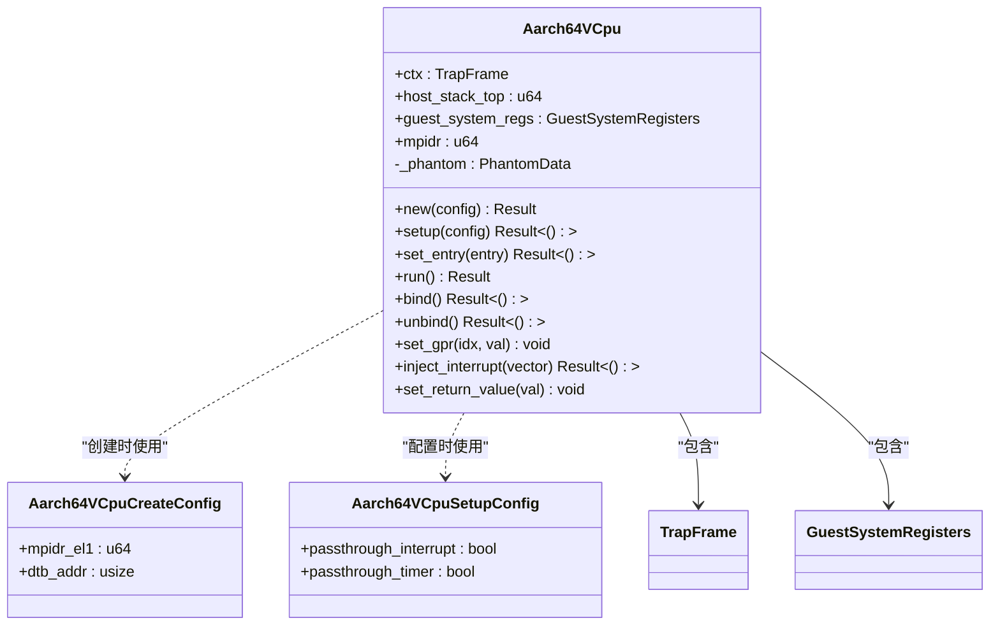
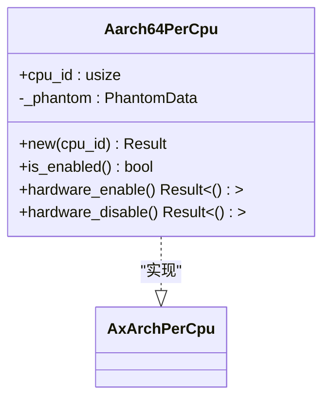
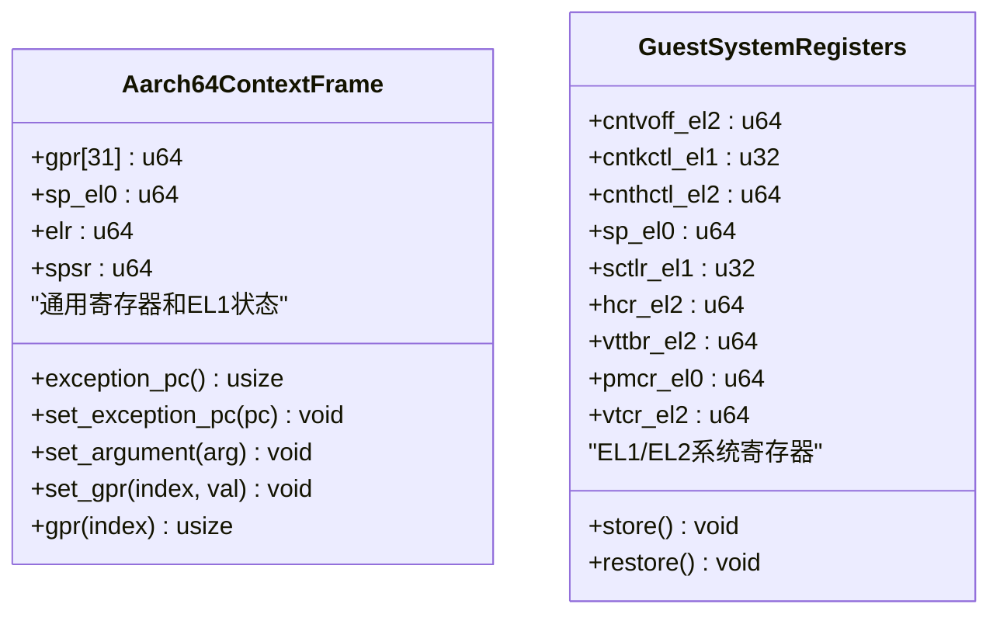
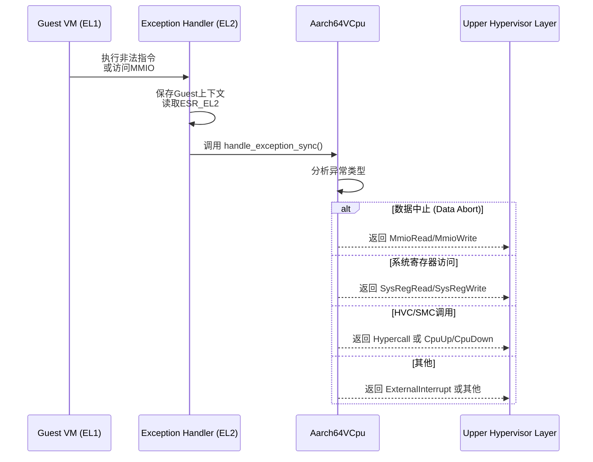
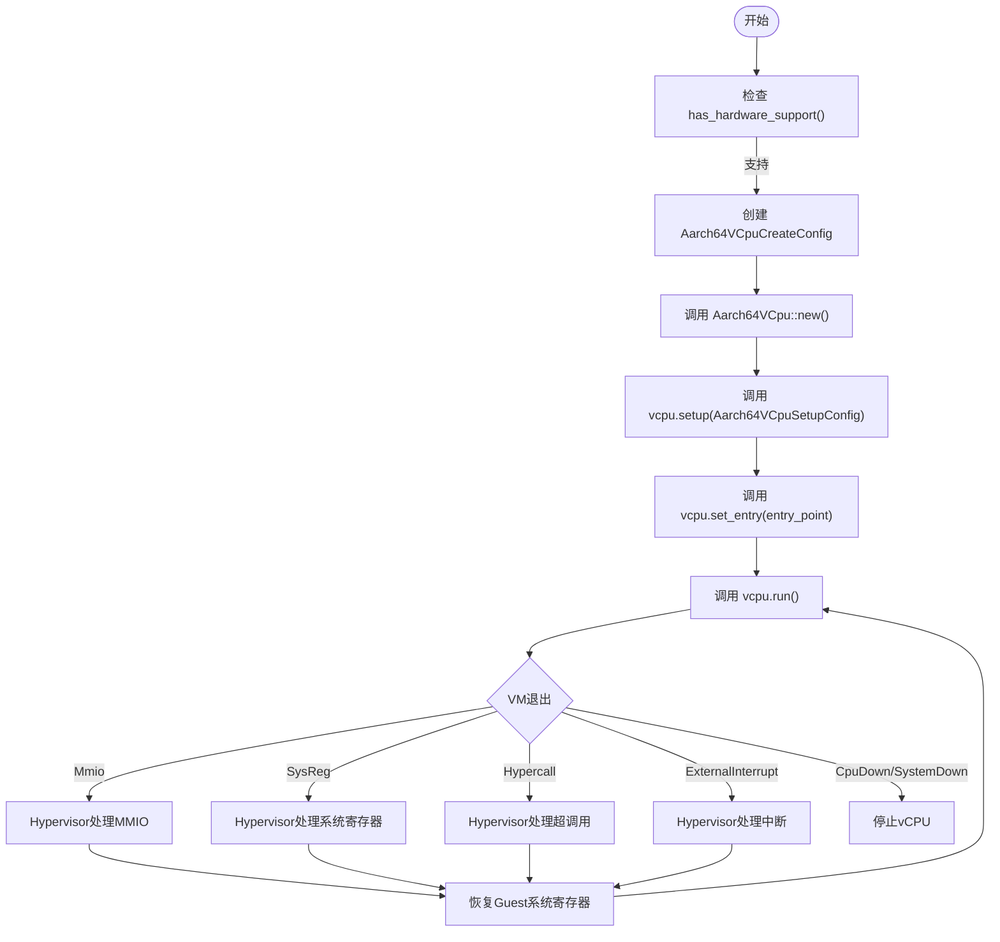

<cite>
**本文档中引用的文件**
- [README.md](file://README.md)
- [Cargo.toml](file://Cargo.toml)
- [src/lib.rs](file://src/lib.rs)
- [src/vcpu.rs](file://src/vcpu.rs)
- [src/pcpu.rs](file://src/pcpu.rs)
- [src/context_frame.rs](file://src/context_frame.rs)
- [src/exception.rs](file://src/exception.rs)
- [src/smc.rs](file://src/smc.rs)
</cite>

## 目录
1. [项目概述](#项目概述)
2. [设计目标与技术架构](#设计目标与技术架构)
3. [核心组件分析](#核心组件分析)
4. [硬件虚拟化扩展原理](#硬件虚拟化扩展原理)
5. [VCPU生命周期管理](#vcpu生命周期管理)
6. [使用模式与依赖关系](#使用模式与依赖关系)

## 项目概述

`arm_vcpu` 是 Arceos 虚拟化平台中的一个关键组件，专门用于实现 AArch64 架构下的虚拟 CPU（vCPU）。该项目为运行在 ARMv8-A 或更高版本处理器上的虚拟机提供完整的 vCPU 结构和虚拟化接口支持。其主要功能包括异常处理、硬件虚拟化扩展支持、安全监控调用（SMC）处理以及高效的每 CPU（per-CPU）数据结构管理。

作为一个专为嵌入式和裸机环境设计的 `no-std` 兼容库，`arm_vcpu` 不依赖于 Rust 标准库，使其能够直接在底层系统上运行，适用于对资源和性能有严格要求的场景。它在 EL2 特权级（Hypervisor 模式）下运行，这是实现完整虚拟化功能所必需的。

**Section sources**
- [README.md](file://README.md#L1-L68)
- [Cargo.toml](file://Cargo.toml#L1-L35)

## 设计目标与技术架构

`arm_vcpu` 的设计旨在为 Arceos Hypervisor 提供一个高效、安全且可扩展的 AArch64 vCPU 实现。其核心设计目标是通过利用现代 ARM 处理器的硬件虚拟化扩展，在 EL2 特权级精确地控制和模拟客户操作系统（Guest OS）的执行。

该库的技术架构围绕几个核心概念构建：
1.  **上下文切换**：在宿主机（Host）和客户机（Guest）之间快速、安全地切换 CPU 状态。
2.  **异常拦截与处理**：捕获从客户机发出的所有同步和异步异常，并根据需要进行模拟或转发。
3.  **系统寄存器虚拟化**：为客户机提供对其所需系统寄存器的受控访问，同时保护宿主机的完整性。
4.  **模块化集成**：作为 Arceos 生态系统的一部分，与其他组件（如内存管理、设备模型）紧密协作。

整个架构由多个协同工作的模块组成，包括 `vcpu`（主虚拟 CPU 逻辑）、`pcpu`（每物理 CPU 管理）、`context_frame`（CPU 上下文保存）和 `exception`（异常处理）等。

**Section sources**
- [README.md](file://README.md#L10-L29)
- [src/lib.rs](file://src/lib.rs#L1-L31)

## 核心组件分析

### VCPU 主体 (`Aarch64VCpu`)

`Aarch64VCpu` 结构体是整个项目的中心，代表了分配给单个虚拟机的一个虚拟 CPU 核心。它封装了客户机执行所需的全部状态信息。



**Diagram sources**
- [src/vcpu.rs](file://src/vcpu.rs#L70-L443)

**Section sources**
- [src/vcpu.rs](file://src/vcpu.rs#L70-L443)

### 每物理CPU管理 (`Aarch64PerCpu`)

`Aarch64PerCpu` 结构体负责管理每个物理 CPU 核心的特定状态和行为。它在物理 CPU 启动时被加载到线程指针（TP）寄存器中，是初始化和启用虚拟化功能的关键。



**Diagram sources**
- [src/pcpu.rs](file://src/pcpu.rs#L15-L91)

**Section sources**
- [src/pcpu.rs](file://src/pcpu.rs#L15-L91)

### CPU上下文框架 (`TrapFrame` 和 `GuestSystemRegisters`)

为了实现上下文切换，`arm_vcpu` 定义了两个关键的数据结构来保存 CPU 状态。



**Diagram sources**
- [src/context_frame.rs](file://src/context_frame.rs#L15-L302)

**Section sources**
- [src/context_frame.rs](file://src/context_frame.rs#L15-L302)

## 硬件虚拟化扩展原理

`arm_vcpu` 的核心能力来源于对 ARMv8 架构硬件虚拟化扩展的利用。这些扩展允许 EL2 作为 Hypervisor 来控制和监视运行在 EL1 的客户操作系统。

### 关键系统寄存器

-   **`HCR_EL2` (Hypervisor Configuration Register)**：这是最重要的虚拟化控制寄存器。`arm_vcpu` 在 `init_vm_context` 函数中对其进行配置，以启用虚拟化（`VM` 位），指定客户机为 AArch64（`RW` 位），并决定是否将中断（`IMO`）和 SMC 调用（`TSC`）陷阱到 EL2 进行处理。
-   **`VTTBR_EL2` (Virtualization Translation Table Base Register)**：此寄存器指向第二阶段地址转换（即客户机物理地址到宿主机物理地址的映射）的页表基址。`arm_vcpu` 通过 `set_ept_root` 方法设置此寄存器，从而为每个 vCPU 配置独立的内存视图。
-   **`VTCR_EL2` (Virtualization Translation Control Register)**：此寄存器定义了第二阶段地址转换的参数，例如页表粒度（`TG0`）、地址空间大小（`T0SZ`）和起始页表级别（`SL0`）。代码中通过条件编译支持 3 级和 4 级分页。

### 异常处理流程

当客户机执行触发异常的指令（如访问 MMIO 设备、执行 HVC/SMC 调用）时，CPU 会自动陷入 EL2。`arm_vcpu` 的汇编代码（`exception.S`）会捕获这个异常，并将其分发到 `handle_exception_sync` 函数。该函数根据异常综合征寄存器（`ESR_EL2`）的内容判断异常类型，并返回相应的 `AxVCpuExitReason`，通知上层 Hypervisor 如何处理。



**Diagram sources**
- [src/exception.rs](file://src/exception.rs#L50-L362)
- [src/vcpu.rs](file://src/vcpu.rs#L200-L250)

**Section sources**
- [src/exception.rs](file://src/exception.rs#L50-L362)
- [src/vcpu.rs](file://src/vcpu.rs#L200-L250)

## VCPU生命周期管理

`arm_vcpu` 提供了一个清晰的 API 来管理 vCPU 的整个生命周期。



1.  **创建**：通过 `Aarch64VCpu::new` 创建一个新的 vCPU 实例，传入 `Aarch64VCpuCreateConfig` 来指定 MPIDR 和设备树地址。
2.  **配置**：使用 `setup` 方法配置 vCPU 行为，例如是否将中断和定时器透传给客户机。
3.  **设置入口点**：通过 `set_entry` 设置客户机操作系统的启动地址。
4.  **运行**：调用 `run` 方法进入客户机执行。此时，控制权交给客户机，直到发生 VM 退出。
5.  **VM退出处理**：当发生异常时，`run` 方法返回一个 `AxVCpuExitReason`。Hypervisor 必须处理这个原因（如模拟 MMIO 访问），然后再次调用 `run` 以恢复客户机执行。
6.  **终止**：当收到 `CpuDown` 或 `SystemDown` 等退出原因时，可以安全地终止 vCPU。

**Diagram sources**
- [src/vcpu.rs](file://src/vcpu.rs#L100-L200)

**Section sources**
- [src/vcpu.rs](file://src/vcpu.rs#L100-L200)

## 使用模式与依赖关系

### 基本使用模式

根据 README 中的示例，使用 `arm_vcpu` 的基本流程如下：

```rust
use arm_vcpu::{Aarch64VCpu, Aarch64VCpuCreateConfig, has_hardware_support};

// 1. 检查硬件支持
if has_hardware_support() {
    // 2. 创建配置
    let config = Aarch64VCpuCreateConfig::default();
    
    // 3. 创建vCPU
    let mut vcpu = Aarch64VCpu::new(0, 0, config)?;
    
    // 4. 配置vCPU
    vcpu.setup(Aarch64VCpuSetupConfig::default())?;
    
    // 5. 设置入口点
    vcpu.set_entry(guest_entry_point)?;
    
    // 6. 运行并处理循环
    loop {
        match vcpu.run()? {
            AxVCpuExitReason::MmioRead { addr, reg, .. } => {
                // 读取真实硬件或RAM
                let data = read_mmio(addr);
                vcpu.set_gpr(reg, data as usize);
            }
            AxVCpuExitReason::MmioWrite { addr, data, .. } => {
                // 写入真实硬件或RAM
                write_mmio(addr, data);
            }
            AxVCpuExitReason::SystemDown => break,
            _ => unimplemented!(),
        }
    }
}
```

### 技术栈依赖关系

`arm_vcpu` 的功能建立在一系列精心选择的外部 crate 之上，形成了其技术栈。

**Table of Dependencies**

| 依赖项 | 版本 | 用途 |
| :--- | :--- | :--- |
| `aarch64-cpu` | 10.0 | 提供对 AArch64 系统寄存器的安全、类型化的访问。 |
| `axaddrspace` | 0.1 | 提供地址空间抽象，用于处理客户机物理地址（GPA）和宿主机物理地址（HPA）。 |
| `axvcpu` | 0.1.0 | 定义了跨架构的 vCPU 抽象接口（`AxArchVCpu`, `AxArchPerCpu`），`arm_vcpu` 实现了这些接口。 |
| `axvisor_api` | 0.1.0 | 提供与 Hypervisor 底层服务（如中断注入）交互的 API。 |
| `tock-registers` | 0.9 | 用于生成对系统寄存器进行读写操作的宏。 |
| `numeric-enum-macro` | 0.2 | 用于将数值枚举（如 `TrapKind`）与整数进行相互转换。 |
| `log` | 0.4 | 用于日志记录。 |
| `spin` | 0.10 | 提供自旋锁等同步原语。 |
| `percpu` | 0.2.0 | 提供每 CPU 变量的支持，对于管理每个物理 CPU 的状态至关重要。 |

**Section sources**
- [README.md](file://README.md#L50-L68)
- [Cargo.toml](file://Cargo.toml#L1-L35)